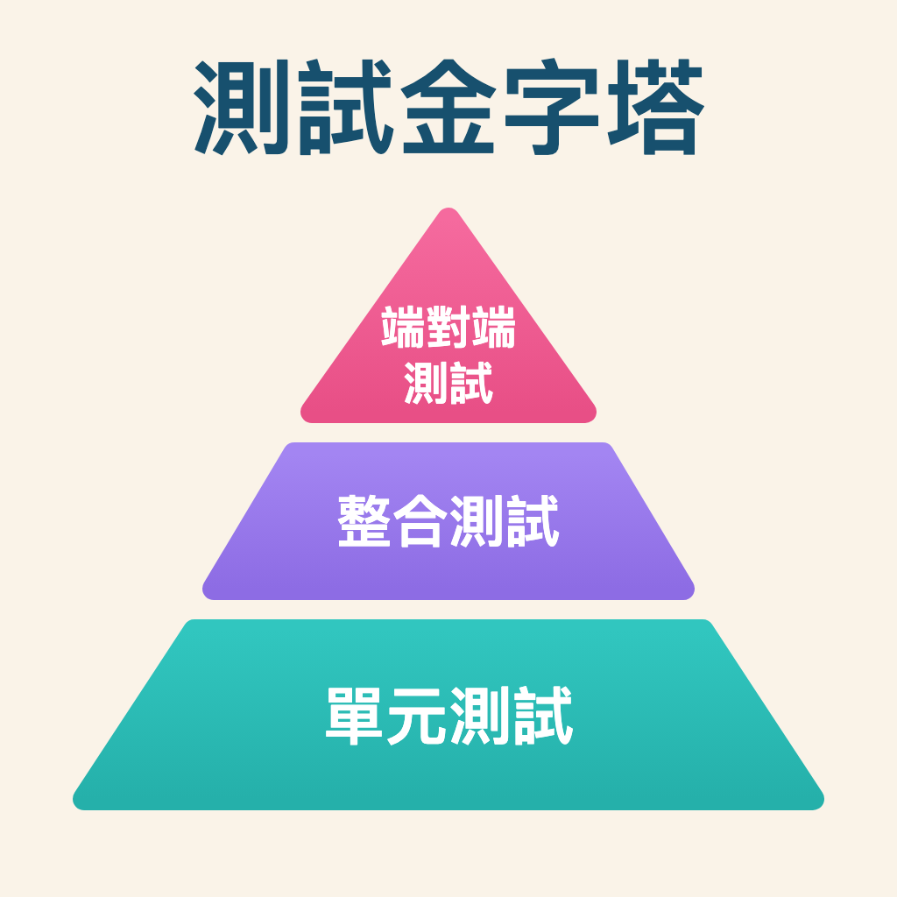

# Day 01 - 老派工程師的測試啟蒙 - 為什麼我們需要測試？

<!-- toc -->

- [前言：AI 時代，為什麼還要談測試？](#前言ai-時代為什麼還要談測試)
- [今日目標](#今日目標)
- [老派工程師的自白](#老派工程師的自白)
- [測試的本質：信心與品質的保證](#測試的本質信心與品質的保證)
- [FIRST 原則：優質單元測試的五大支柱](#first-原則優質單元測試的五大支柱)
- [測試的三個層次：3A Pattern](#測試的三個層次3a-pattern)
- [AI 時代的測試思維](#ai-時代的測試思維)
- [今日實作：建立你的第一個 FIRST 測試](#今日實作建立你的第一個-first-測試)
- [今日思考題](#今日思考題)
- [今日重點回顧](#今日重點回顧)
- [明日預告](#明日預告)
- [老派工程師的心得](#老派工程師的心得)
- [本日後記](#本日後記)

<!-- /toc -->

## 前言：AI 時代，為什麼還要談測試？

ChatGPT、GitHub Copilot、Claude 已經是多數開發工程師的日常工具。於是有人會問：「既然 AI 都能自動產生測試程式碼了，為什麼還要花時間學習怎麼寫測試呢？」

我看到不少工程師從沒實作過單元測試，直接讓 AI 把實作和測試一起生出來。他們知道的只有兩件事：測試有產生、跑起來是綠的。至於這些測試在驗證什麼情境、結構長什麼樣子，一概不管。

但真的出現程式 Bug 或需求調整時，他們仍只輸入 Prompt，讓 AI 繼續修改。幾輪下來，再問這些程式碼做了什麼、是否符合情境、測試又驗證了哪些行為，得到的答案往往只有：「這都是 AI 產生的，我不知道。」

**AI 可以幫你寫程式碼，但不能幫你思考。**

生成式 AI 讓測試程式碼變得很好生，跟著來的是新的問題：

- **表面的涵蓋率**：測試看起來很多，但實際價值不高
- **缺乏理解**：不知道為什麼要這樣測試
- **無法判斷**：分不清楚好測試和壞測試
- **策略迷失**：不清楚在什麼層級進行什麼測試

在這行打滾二十多年，我的結論是：**理解測試的本質，比會寫測試程式碼更重要。**

這個系列不教你寫程式碼。重點是測試思維、策略規劃，以及怎麼善用 AI 又不被它誤導。

> 這一系列將主要是以 C# 及 .NET 為開發環境

---

## 今日目標

- 理解測試在軟體開發中的重要性與真正價值
- 掌握測試金字塔：單元測試、整合測試、E2E 測試的策略分配
- 認識 FIRST 原則：優質單元測試的五大特質
- 學習 3A Pattern 和單元測試命名規範
- 建立測試思維：從「能跑就好」到「可靠品質」的轉變
- 瞭解 AI 時代的測試挑戰與正確使用方式
- 實作第一個符合 FIRST 原則的單元測試程式

---

## 老派工程師的自白

身為一個在軟體開發領域打滾多年的工程師，我必須承認：在職業生涯的前幾年，我對所開發程式碼的態度就是「能跑就好」。當時的我認為，只要程式能正常執行、使用者能正常操作，就算是成功的軟體了。

而所謂的 `測試` 就是將環境執行起來，然後將各種可能的使用情境都操作過一遍，盡可能地把程式可能發生錯誤的情況給找出來，然後修改程式碼之後，前面的步驟與流程再走一遍，如此一直到功能交付的期限都是這樣的循環。

直到某一天……

當系統推上線並開始正式服務後，各種未預期的狀況隨之而來。各種錯誤的情況都是之前那些 `測試` 都沒有碰到過的狀況，各種錯誤的狀況越來越多，最後導致服務出現了中斷甚至影響的營運。

很多人說出口的永遠都是那些話：

- 不是都測試過了嗎？
- 為什麼沒有測試到這些 Bug？
- 你們上線前都沒做測試嗎？
- 規格不是都有寫清楚，怎麼還會有這些錯誤出現？

那一刻我才意識到：**沒有測試的程式碼，就像是沒有安全網的高空走鋼絲。**

這裡談的是 `單元測試` 與 `自動化測試`，不是人工、手動又繁瑣的流程。

---

## 測試的本質：信心與品質的保證

### 測試不只是找 Bug

很多人以為測試的目的就是找 bug，但其實測試的真正價值在於：

1. **建立信心**：支撐後續的重構與功能擴充
2. **文件化行為**：測試本身就是活的文件，說明程式應該如何運作
3. **設計回饋**：好測試會迫使我們寫出更好的程式碼架構
4. **迴歸保護**：確保新功能不會破壞既有功能

### 測試金字塔：測試策略的藍圖

寫測試之前，先認識**測試金字塔**。



這是在接觸測試時，第一個必須要理解的概念：

#### 金字塔的三個層級

1. **端對端測試（E2E Tests）** - 金字塔的頂端
   - **數量最少**：佔 5-10%
   - **測試完整流程**：從使用者介面到資料庫的完整路徑
   - **執行最慢**：分鐘級執行
   - **最脆弱**：容易因環境變化而失敗

2. **整合測試（Integration Tests）** - 金字塔的中層
   - **適量**：佔 15-25%
   - **測試元件間的互動**：資料庫、API、外部服務
   - **執行較慢**：秒級執行
   - **更真實的環境**：接近實際使用情境

3. **單元測試（Unit Tests）** - 金字塔的基座
   - **數量最多**：應該佔所有測試的 70-80%
   - **執行最快**：毫秒級執行，可以頻繁執行
   - **範圍最小**：測試個別方法或類別
   - **維護成本最低**：簡單、穩定、易懂

#### 為什麼是金字塔形狀？

測試金字塔的形狀反映了測試的投資報酬率：

> 註：以下「FIRST 原則」各節的測試範例，刻意採用 **MSTest** 語法（`[TestClass]` / `[TestMethod]`）作為框架對照；自「測試的三個層次：3A Pattern」一節起，範例改用本系列的主角 **xUnit** 撰寫。

```csharp
// 單元測試：快速、可靠、容易除錯（<100ms）
[TestMethod]
public void Calculate_輸入有效金額和折扣率_應回傳正確折扣金額()
{
    var calculator = new DiscountCalculator();
    var result = calculator.Calculate(100, 0.1);
    Assert.AreEqual(10, result); // 通常 1-5ms 完成
}

// 整合測試：測試真實互動，但較慢（1-10秒）
[TestMethod]
public void Save_輸入有效訂單資料_應成功儲存至資料庫()
{
    var repository = new OrderRepository(_connectionString);
    var order = new Order { Amount = 100, CustomerId = 1 };
    
    var id = repository.Save(order); // 需要 1-2 秒
    
    Assert.IsTrue(id > 0);
}

// E2E 測試：完整流程，但最慢且最脆弱（30秒-幾分鐘）
[TestMethod]
public void PlaceOrder_完整下單流程_應成功完成訂單()
{
    // 啟動瀏覽器、登入、選擇商品、結帳...
    // 可能需要 30 秒到幾分鐘
    // 任何一個環節出問題都會失敗
}
```

#### 老派工程師的金字塔經驗談

自動化工具都做到 AI 這一步了，還是有不少公司和開發團隊在做同一件事：過度仰賴 `人工、手動、繁瑣` 的傳統測試。

結果是：

- 測試相當耗費時間
- 經常因為環境問題失敗
- 除錯困難，一個失敗可能有 N 種原因
- 團隊對測試甚至於實作程式碼失去信心

現在我的建議是：**從底部開始建立，穩固基礎再往上層發展。**

### AI 時代的測試挑戰

GitHub Copilot、ChatGPT 這類工具普及之後，產生測試程式碼幾乎不花力氣。問題也跟著來：

```csharp
// X - AI 可能會產生這樣的測試：表面看起來正確
[TestMethod]
public void TestCalculateTotal()
{
    var calculator = new Calculator();
    var result = calculator.CalculateTotal(100, 0.1);
    Assert.AreEqual(110, result);
}

// O - 經過思考的測試：遵循 FIRST 原則和 3A Pattern
[TestMethod]
public void CalculateTotal_輸入有效金額和稅率_應回傳正確總額()
{
    // Arrange
    var calculator = new Calculator();
    var amount = 100m;
    var taxRate = 0.1m;
    var expected = 110m;
    
    // Act
    var result = calculator.CalculateTotal(amount, taxRate);
    
    // Assert
    Assert.AreEqual(expected, result);
}
```

第一個測試能跑，問題在於：

- 測試名稱不明確（TestCalculateTotal 說明了什麼？）
- 沒有清楚的 3A 結構
- 魔術數字（110 是怎麼來的？）
- 不符合 FIRST 原則的 Self-Validating

**AI 可以幫你寫程式碼，但不能幫你思考測試策略。**

---

## FIRST 原則：優質單元測試的五大支柱

要寫出有價值的測試，先照著 **FIRST 原則**。這也是我在公司裡推動測試文化時，第一個教給團隊的東西：

### F - Fast (快速)

每個單元測試的執行時間要很短

- 每個單元測試的執行時間單位都是毫秒
- 如果有某個單元測試所執行的時間超過數秒，就要做檢查

```csharp
// X - 慢速測試：每次都連接資料庫
[TestMethod]
public void SaveUser_ShouldReturnId()
{
    var connection = new SqlConnection("...");
    var repository = new UserRepository(connection);
    var user = new User { Name = "John" };
    
    var id = repository.Save(user); // 實際 DB 操作，慢！
    
    Assert.IsTrue(id > 0);
}

// O - 快速測試：使用 NSubstitute
[TestMethod]
public void SaveUser_輸入有效使用者資料_應回傳使用者ID()
{
    var mockRepository = Substitute.For<IUserRepository>();
    mockRepository.Save(Arg.Any<User>()).Returns(123);
    var service = new UserService(mockRepository);
    
    var result = service.CreateUser("John");
    
    Assert.AreEqual(123, result.Id);
}
```

### I - Independent (獨立)

每個單元測試都是獨立的，不會和其他單元測試相依，也不會和外部資源相依

- 不會相依外部資源（檔案、資料庫、網路、服務、元件等）
- 單元測試都是個別獨立、無順序性、執行結果不會影響其他測試

```csharp
// X - 相依的測試：順序很重要
[TestClass]
public class OrderTests
{
    private static Order _testOrder;
    
    [TestMethod]
    public void CreateOrder_ShouldSucceed()
    {
        _testOrder = new Order { Amount = 100 };
        Assert.IsNotNull(_testOrder);
    }
    
    [TestMethod]
    public void ProcessOrder_ShouldUpdateStatus()
    {
        _testOrder.Process(); // 依賴前一個測試！
        Assert.AreEqual(OrderStatus.Processed, _testOrder.Status);
    }
}

// O - 獨立的測試：每個測試都自給自足
[TestClass]
public class OrderTests
{
    [TestMethod]
    public void CreateOrder_輸入有效金額_應成功建立訂單()
    {
        var order = new Order { Amount = 100 };
        Assert.IsNotNull(order);
    }
    
    [TestMethod]
    public void ProcessOrder_輸入有效訂單_應更新訂單狀態()
    {
        var order = new Order { Amount = 100 }; // 自己建立需要的資料
        order.Process();
        Assert.AreEqual(OrderStatus.Processed, order.Status);
    }
}

// X - 相依外部資源：依賴檔案系統、資料庫、網路服務
[TestClass]
public class UserServiceTests
{
    [TestMethod]
    public void SaveUser_ShouldReturnUserId()
    {
        // 依賴真實資料庫連線
        var connectionString = "Server=localhost;Database=TestDB;";
        var repository = new UserRepository(connectionString);
        var service = new UserService(repository);
        
        // 依賴檔案系統
        var configFile = @"C:\config\settings.json";
        var config = File.ReadAllText(configFile);
        
        // 依賴外部 API
        var httpClient = new HttpClient();
        var response = httpClient.GetAsync("https://api.example.com/validate").Result;
        
        var user = new User { Name = "John", Email = "john@example.com" };
        var result = service.SaveUser(user);
        
        Assert.IsTrue(result > 0);
    }
}

// O - 獨立於外部資源：使用 Mock 物件和測試替身
[TestClass]
public class UserServiceTests
{
    [TestMethod]
    public void SaveUser_輸入有效使用者_應回傳使用者ID()
    {
        // 使用 Mock 取代真實資料庫
        var mockRepository = Substitute.For<IUserRepository>();
        mockRepository.SaveUser(Arg.Any<User>()).Returns(123);
        
        // 使用 Mock 取代檔案讀取
        var mockFileService = Substitute.For<IFileService>();
        mockFileService.ReadConfig().Returns("test-config");
        
        // 使用 Mock 取代 HTTP 呼叫
        var mockHttpService = Substitute.For<IHttpService>();
        mockHttpService.ValidateUser(Arg.Any<string>()).Returns(true);
        
        var service = new UserService(mockRepository, mockFileService, mockHttpService);
        var user = new User { Name = "John", Email = "john@example.com" };
        
        var result = service.SaveUser(user);
        
        Assert.AreEqual(123, result);
    }
}
```

### R - Repeatable (可重複)

每個單元測試不論在任何環境都可以重複執行

- 無論在哪個環境被執行多少次，測試的結果都必須是一樣的
- 不會因為環境的不同或執行次數的多寡，讓測試執行出現不同結果

```csharp
// X - 不可重複：相依現在時間
[TestMethod]
public void IsBusinessDay_TodayShould_ReturnTrue()
{
    var service = new DateService();
    var result = service.IsBusinessDay(DateTime.Now); // 週末會失敗！
    Assert.IsTrue(result);
}

// O - 可重複：明確指定測試資料
[TestMethod]
public void IsBusinessDay_輸入星期一_應回傳True()
{
    var service = new DateService();
    var monday = new DateTime(2024, 1, 1); // 2024/1/1 是星期一
    var result = service.IsBusinessDay(monday);
    Assert.IsTrue(result);
}

// X - 不可重複：依賴環境變數和隨機數
[TestMethod]
public void ProcessOrder_ShouldGenerateOrderNumber()
{
    // 依賴環境變數，不同環境會有不同結果
    var environment = Environment.GetEnvironmentVariable("ORDER_PREFIX") ?? "ORDER";
    
    // 依賴隨機數，每次執行結果都不同
    var random = new Random();
    var orderNumber = $"{environment}-{random.Next(1000, 9999)}";
    
    var order = new Order { Number = orderNumber };
    var service = new OrderService();
    
    var result = service.ProcessOrder(order);
    
    // 這個測試會因為環境不同或執行次數而失敗
    Assert.AreEqual("ORDER-1234", result.OrderNumber);
}

// X - 不可重複：依賴全域狀態和執行順序
[TestClass]
public class CounterTests
{
    private static int _globalCounter = 0;
    
    [TestMethod]
    public void IncrementCounter_ShouldReturnOne()
    {
        _globalCounter++; // 依賴全域狀態
        Assert.AreEqual(1, _globalCounter); // 第二次執行會失敗
    }
    
    [TestMethod]
    public void IncrementCounter_ShouldReturnTwo()
    {
        _globalCounter++; // 執行順序會影響結果
        Assert.AreEqual(2, _globalCounter); // 順序改變就會失敗
    }
}

// O - 可重複：使用固定值和隔離的測試資料
[TestMethod]
public void ProcessOrder_輸入固定前綴_應產生正確訂單編號()
{
    // 使用固定的測試資料，不依賴環境
    var orderPrefix = "TEST";
    var orderNumber = "12345";
    var expectedOrderNumber = $"{orderPrefix}-{orderNumber}";
    
    var order = new Order { Prefix = orderPrefix, Number = orderNumber };
    var service = new OrderService();
    
    var result = service.ProcessOrder(order);
    
    // 每次執行都會得到相同結果
    Assert.AreEqual(expectedOrderNumber, result.OrderNumber);
}

// O - 可重複：每個測試都有獨立的資料
[TestClass]
public class CounterTests
{
    [TestMethod]
    public void IncrementCounter_從0開始_應回傳1()
    {
        var counter = new Counter(); // 每個測試都建立新的執行個體
        counter.Increment();
        Assert.AreEqual(1, counter.Value);
    }
    
    [TestMethod]
    public void IncrementCounter_從0開始_應回傳2()
    {
        var counter = new Counter(); // 獨立的執行個體，不受其他測試影響
        counter.Increment();
        counter.Increment();
        Assert.AreEqual(2, counter.Value);
    }
}
```

### S - Self-Validating (自我驗證)

當單元測試執行完之後就能得知測試結果

- 單元測試執行失敗時，都應該能夠從測試報告裡取得失敗的原因

```csharp
// X - 需要人工檢查
[TestMethod]
public void GenerateReport_ShouldCreateFile()
{
    var generator = new ReportGenerator();
    generator.GenerateReport();
    // 需要手動檢查檔案是否存在和內容是否正確
}

// O - 自動驗證
[TestMethod]
public void GenerateReport_輸入有效資料_應建立包含正確內容的檔案()
{
    var generator = new ReportGenerator();
    var result = generator.GenerateReport();
    
    Assert.IsTrue(File.Exists(result.FilePath));
    Assert.IsTrue(result.Content.Contains("Total Sales"));
    Assert.IsTrue(result.Content.Length > 0);
}

// X - 驗證錯誤時訊息不明確
[TestMethod]
public void CalculatePrice_ShouldBeCorrect()
{
    var calculator = new PriceCalculator();
    var result = calculator.Calculate(100, 0.1);
    
    Assert.IsTrue(result > 0); // 失敗時只顯示：Expected: True, Actual: False
}

// O - 驗證錯誤時提供清楚的錯誤訊息
[TestMethod]
public void CalculatePrice_輸入100元和10%折扣_應回傳90元()
{
    var calculator = new PriceCalculator();
    var basePrice = 100m;
    var discount = 0.1m;
    var expected = 90m;
    
    var result = calculator.Calculate(basePrice, discount);
    
    // 失敗時顯示：Expected: 90, Actual: 85，清楚知道期望值和實際值
    Assert.AreEqual(expected, result, 
        $"計算價格錯誤。基礎價格: {basePrice}, 折扣: {discount:P}, 期望: {expected}, 實際: {result}");
}

// O - 提供具體的驗證訊息和檢查多個條件
[TestMethod]
public void CreateUser_輸入有效資料_應建立完整使用者物件()
{
    var service = new UserService();
    var userName = "john.doe";
    var email = "john@example.com";
    
    var result = service.CreateUser(userName, email);
    
    // 每個驗證都有明確的錯誤訊息
    Assert.IsNotNull(result, "建立的使用者物件不應為 null");
    Assert.AreEqual(userName, result.UserName, $"使用者名稱應為 '{userName}'");
    Assert.AreEqual(email, result.Email, $"Email 應為 '{email}'");
    Assert.IsTrue(result.Id > 0, "使用者 ID 應大於 0");
    Assert.IsTrue(result.CreatedDate <= DateTime.Now, "建立時間不應晚於現在");
    
    // 測試失敗時會顯示類似：
    // Expected: john.doe, Actual: john_doe
    // 使用者名稱應為 'john.doe'
}

// X - 複雜的驗證邏輯，失敗時難以理解原因
[TestMethod]
public void ValidateOrder_ShouldPassAllRules()
{
    var order = new Order 
    { 
        Amount = 50, 
        CustomerType = "Regular", 
        Items = new[] { "Item1", "Item2" }
    };
    var validator = new OrderValidator();
    
    var isValid = validator.Validate(order);
    
    Assert.IsTrue(isValid); // 失敗時無法知道違反了哪個規則
}

// O - 分別驗證各個條件，提供清楚的錯誤訊息
[TestMethod]
public void ValidateOrder_輸入有效訂單_應通過所有驗證規則()
{
    var order = new Order 
    { 
        Amount = 150, 
        CustomerType = "VIP", 
        Items = new[] { "Item1", "Item2", "Item3" }
    };
    var validator = new OrderValidator();
    
    var result = validator.ValidateDetailed(order);
    
    Assert.IsTrue(result.IsValid, $"訂單驗證失敗：{string.Join(", ", result.Errors)}");
    Assert.IsTrue(result.AmountValid, $"金額驗證失敗：最低金額為100，實際金額為{order.Amount}");
    Assert.IsTrue(result.CustomerTypeValid, $"客戶類型驗證失敗：'{order.CustomerType}' 不在允許的類型中");
    Assert.IsTrue(result.ItemCountValid, $"商品數量驗證失敗：最少需要2項商品，實際為{order.Items.Length}項");
    
    // 失敗時會顯示具體違反的規則和相關數值
}
```

### T - Timely (及時)

單元測試應該在產品程式碼完成的當下就可以驗證執行結果是否符合預期

- **及時開發**：測試應該隨著程式碼的開發同步進行，而不是事後補齊
- **即時驗證**：完成實作後，立即就能執行測試來驗證功能的正確性
- **無須額外準備**：測試執行不需要複雜的環境設定、部署步驟或外部資源準備
- **專注當下功能**：針對目前開發的功能測試，不需要啟動整個系統

#### 及時測試的實際意義

測試要「及時」，不等於只能採用 TDD（測試驅動開發），還包括：

**立即可測試性**：

- 當你完成一個方法的實作後，應該能夠立即寫出測試並執行
- 不需要等待其他模組完成、不需要複雜的環境準備
- 測試執行應該是「按一下就能跑」的體驗

**無相依執行**：

- 不需要啟動資料庫服務
- 不需要設定特定的環境變數
- 不需要準備外部測試資料檔案
- 不需要先執行其他程式或初始化腳本

**專注性驗證**：

- 能夠針對單一方法或功能測試
- 不需要整個系統都運作才能測試某個小功能
- 可以快速驗證剛寫好的邏輯是否正確

**開發流程的順暢性**：

```text
寫程式碼 → 寫測試 → 執行測試 → 立即知道結果 → 繼續開發
```

而不是：

```text
寫程式碼 → 部署到測試環境 → 設定資料庫 → 準備測試資料 → 啟動服務 → 手動測試 → 發現問題再回頭找原因
```

範例程式碼：

```csharp
// X - 不及時：需要複雜環境才能測試
public class OrderService
{
    public void ProcessOrder(Order order)
    {
        // 需要連接真實資料庫
        // 需要外部 API 服務執行
        // 需要特定的設定檔
        // 需要預先準備測試資料
        
        // 要測試這個方法，需要：
        // 1. 啟動資料庫服務
        // 2. 設定連線字串
        // 3. 建立測試用的客戶資料
        // 4. 確保外部 API 可用
        // 5. 部署到測試環境
        // 光是準備測試環境就需要很多時間
    }
}

// O - 及時：完成實作後立即可測試
public class OrderService
{
    private readonly IOrderRepository _repository;
    private readonly IPaymentService _paymentService;
    
    public OrderService(IOrderRepository repository, IPaymentService paymentService)
    {
        _repository = repository;
        _paymentService = paymentService;
    }
    
    public OrderResult ProcessOrder(Order order)
    {
        if (order == null) return OrderResult.Invalid("Order cannot be null");
        if (order.Amount <= 0) return OrderResult.Invalid("Amount must be positive");
        
        var paymentResult = _paymentService.ProcessPayment(order.Amount);
        if (!paymentResult.Success) return OrderResult.Failed("Payment failed");
        
        var savedOrder = _repository.Save(order);
        return OrderResult.Success(savedOrder.Id);
    }
}

// 立即可測試：不需要任何外部相依
[TestMethod]
public void ProcessOrder_輸入有效訂單_應成功處理()
{
    // 使用 Mock，不需要真實資料庫或外部服務
    var mockRepository = Substitute.For<IOrderRepository>();
    var mockPaymentService = Substitute.For<IPaymentService>();
    
    mockPaymentService.ProcessPayment(100).Returns(PaymentResult.Success());
    mockRepository.Save(Arg.Any<Order>()).Returns(new Order { Id = 123 });
    
    var service = new OrderService(mockRepository, mockPaymentService);
    var order = new Order { Amount = 100 };
    
    // 立即執行測試，馬上知道結果
    var result = service.ProcessOrder(order);
    
    Assert.IsTrue(result.IsSuccess);
    Assert.AreEqual(123, result.OrderId);
    // 整個測試過程不到 1 秒，不需要任何外部準備
}
```

#### 及時測試 vs 延遲測試的實際體驗

**延遲測試的痛點**：

- 累積太多未測試的程式碼，不知道從哪裡開始
- 測試執行需要複雜的環境準備
- 一個測試失敗可能有多種原因，除錯困難
- 修改程式碼後需要重新部署才能測試

**及時測試的優勢**：

- 每個功能完成後立即驗證，問題早發現
- 測試環境簡單，執行速度快
- 測試失敗原因明確，容易定位問題
- 修改程式碼後立即就能重新測試

---

## 測試的三個層次：3A Pattern

> 註：從本節起，測試範例改用本系列的主角 **xUnit** 撰寫（`[Fact]` / `Assert.Equal`）；前面各節作為框架對照的 MSTest 語法到此為止。

除了 FIRST 原則，測試案例也常用 **3A Pattern** 整理結構：

一個單元測試方法裡所包含的三個行為

- Arrange (準備)：準備物件、建立物件和必要的設定
- Act (操作)：操作物件
- Assert (驗證)：驗證某件事符合預期

### Arrange - Act - Assert

```csharp
[Fact]
public void CalculateTotal_WithTax_ShouldAddTaxToAmount()
{
    // Arrange：準備測試資料
    var calculator = new TaxCalculator();
    var amount = 100m;
    var taxRate = 0.1m;
    
    // Act：執行要測試的動作
    var result = calculator.CalculateTotal(amount, taxRate);
    
    // Assert：驗證結果
    Assert.Equal(110m, result);
}
```

Arrange：

- 先建立測試的目標物件 `sut (system under test)`
- 設定輸入的變數
- 設定預期的執行結果 (expected)

Act：

- 執行目標物件的方法，以變數 `actual` 存放回傳值

Assert：

- 使用測試框架或驗證工具所提供的方法去驗證 expected 是否與 actual 相等

結構固定下來，別人接手時看得出這個測試想驗證什麼。

### 單元測試方法的命名規範

除了測試的結構要清晰，測試方法的命名也同樣重要。**單元測試本質上就是程式碼的使用說明書**，它記錄了程式碼應該如何被使用、在什麼情境下會產生什麼結果。

好的測試方法名稱像說明書一樣，光看名字就知道在驗證什麼。測試失敗的時候更有感：測試報告一列出來，馬上知道是哪個功能出事。

#### 測試命名的使用說明書原則

使用者通常會先確認幾件事：

- 這個方法接受什麼參數？
- 在什麼情況下會回傳什麼結果？
- 什麼情況下會拋出例外？
- 邊界條件是什麼？

測試方法的名稱就應該回答這些問題。

**推薦的命名規範：`被測試方法名稱_測試情境_預期行為`**

- **被測試方法名稱**：將被測試的方法名稱寫在開頭
- **測試情境**：這個測試使用的條件，例如「輸入 1 和 2」、「傳入 null 值」
- **預期行為**：在目前的測試情境下，預期得到什麼結果，例如「應回傳3」、「應拋出例外」

```csharp
public class CalculatorTests
{
    // 這個測試告訴使用者：Add 方法接受兩個整數，會回傳它們的和
    [Fact]
    public void Add_輸入1和2_應回傳3()
    {
        // Arrange
        var calculator = new Calculator();
        var a = 1;
        var b = 2;
        var expected = 3;
        
        // Act
        var result = calculator.Add(a, b);
        
        // Assert
        Assert.Equal(expected, result);
    }
    
    // 這個測試告訴使用者：Divide 方法遇到除數為0時會拋出例外
    [Fact]
    public void Divide_輸入10和0_應拋出DivideByZeroException()
    {
        // Arrange
        var calculator = new Calculator();
        var dividend = 10;
        var divisor = 0;
        
        // Act & Assert
        Assert.Throws<DivideByZeroException>(() => calculator.Divide(dividend, divisor));
    }
}
```

#### 測試名稱作為使用說明書的優點

1. **自說明**：看方法名稱就知道這個測試在驗證什麼，不必翻進去讀程式碼
2. **好定位**：測試失敗時，是哪個功能、哪個情境出事一目了然
3. **活的文件**：測試名稱記錄了系統該有的行為，比註解可靠，因為它會被執行
4. **CI/CD 報告可讀**：一整排測試結果跑出來，名稱清楚的那幾個才看得出失敗在哪

#### 測試名稱：好的說明書 vs 壞的說明書

```csharp
// X - 糟糕的說明書：無法理解使用方式
[Fact]
public void Test1() { }  // 這告訴使用者什麼？

[Fact]
public void TestCalculator() { }  // 測試計算機的什麼功能？

[Fact]
public void ShouldWork() { }  // 什麼應該要工作？

// O - 優秀的說明書：清楚的使用指南
[Fact]
public void Add_輸入正數1和2_應回傳3() 
{ 
    // 使用者立即知道：Add方法接受正數，會回傳正確的和
}

[Fact]
public void Add_輸入負數和正數_應回傳正確結果() 
{ 
    // 使用者知道：Add方法也能處理負數
}

[Fact]
public void GetUser_輸入不存在的ID_應回傳null() 
{ 
    // 使用者知道：當ID不存在時，GetUser會回傳null
}

[Fact]
public void SaveUser_輸入null物件_應拋出ArgumentNullException() 
{ 
    // 使用者知道：SaveUser不接受null物件，會拋出例外
}
```

#### 測試失敗時的診斷價值

當測試失敗時，好的命名讓你立即知道：

```text
❌ Test Failed: SaveUser_輸入null物件_應拋出ArgumentNullException
```

這一行訊息就交代了四件事：

- 哪個方法有問題：`SaveUser`
- 什麼情境：`輸入null物件`
- 預期什麼行為：`應拋出ArgumentNullException`
- 實際問題：可能是沒有拋出例外，或拋出了錯誤的例外類型

相對於：

```text
❌ Test Failed: Test1
```

這個訊息什麼也沒說，你得打開程式碼才知道它原本想測什麼。

測試名稱就是留給未來自己與團隊的使用說明。名稱越清楚，之後定位失敗原因的成本越低。

---

## AI 時代的測試思維

AI 接手一部分寫程式的工作之後，測試的價值要重新算一次：

### AI 的優勢

- 快速產生基本的測試程式碼
- 涵蓋常見的測試案例
- 提供測試程式碼的範本

### AI 的限制

- 看不懂你們家的業務邏輯有多繞
- 會產生看起來對、實際上什麼都沒驗證到的測試
- 邊界條件和例外情況常常漏掉

最麻煩的是第二項。測試全綠，你以為有保護網，其實那張網是畫上去的。

### 老派工程師的建議

1. **用 AI 當起點，不是終點**：讓它產出骨架，剩下的用你的經驗補
2. **測試的價值在思考，不在程式碼**：知道該測什麼，比會寫測試程式碼難得多
3. **保持懷疑**：AI 產生的每一行測試都值得你問一句「這在驗證什麼？」

---

## 今日實作：建立你的第一個 FIRST 測試

以下用一個簡單的例子實作今天談到的概念：

```csharp
using System.Text.RegularExpressions;

// 要測試的類別（以 Regex 驗證 Email 格式）
public class EmailHelper
{
    private static readonly Regex EmailRegex = new(
        @"^[a-zA-Z0-9._%+-]+@[a-zA-Z0-9.-]+\.[a-zA-Z]{2,}$",
        RegexOptions.Compiled | RegexOptions.IgnoreCase);

    public bool IsValidEmail(string? email)
    {
        if (string.IsNullOrWhiteSpace(email))
        {
            return false;
        }
            
        return EmailRegex.IsMatch(email);
    }
}

// 遵循 FIRST 原則的測試 (使用 xUnit)
public class EmailHelperTests
{
    private readonly EmailHelper _helper;
    
    public EmailHelperTests()
    {
        _helper = new EmailHelper(); // 每個測試都有新的執行個體
    }
    
    [Fact] // Fast: 不依賴外部資源
    public void IsValidEmail_輸入有效Email_應回傳True()
    {
        // Arrange
        var email = "test@example.com";
        
        // Act
        var result = _helper.IsValidEmail(email);
        
        // Assert
        Assert.True(result); // Self-Validating
    }
    
    [Fact] // Independent: 不依賴其他測試
    public void IsValidEmail_輸入null值_應回傳False()
    {
        // Arrange
        string? email = null;
        
        // Act
        var result = _helper.IsValidEmail(email);
        
        // Assert
        Assert.False(result);
    }
    
    [Fact] // Repeatable: 每次執行結果都一樣
    public void IsValidEmail_輸入空字串_應回傳False()
    {
        // Arrange
        var email = "";
        
        // Act
        var result = _helper.IsValidEmail(email);
        
        // Assert
        Assert.False(result);
    }
    
    [Theory] // 使用 xUnit Theory 測試多個案例
    [InlineData("invalid-email")]
    [InlineData("@example.com")]
    [InlineData("test@")]
    [InlineData("test.example.com")]
    [InlineData(" ")]
    public void IsValidEmail_輸入無效Email格式_應回傳False(string invalidEmail)
    {
        // Arrange & Act
        var result = _helper.IsValidEmail(invalidEmail);
        
        // Assert
        Assert.False(result);
    }
    
    [Theory] // 使用 Theory 測試多個有效案例
    [InlineData("test@example.com")]
    [InlineData("user.name@domain.org")]
    [InlineData("admin@company.co.uk")]
    public void IsValidEmail_輸入有效Email格式_應回傳True(string validEmail)
    {
        // Arrange & Act
        var result = _helper.IsValidEmail(validEmail);
        
        // Assert
        Assert.True(result);
    }
}
```

---

## 今日思考題

在開始明天的 xUnit 實作之前，請思考：

1. **回顧你目前的專案**：測試金字塔的比例是否合理？
2. **檢視現有測試**：是否符合 FIRST 原則？
3. **評估 AI 使用**：你是否曾經不假思索地接受 AI 產生的測試程式碼？

**老派工程師的挑戰**：找出你專案中最慢的一個測試，思考如何用單元測試來替代它的核心驗證邏輯。

---

## 今日重點回顧

1. **測試的本質**：找出缺陷，並為修改程式碼提供信心
2. **測試金字塔**：單元測試為基座（70-80%），整合測試為中層（15-25%），E2E 測試為頂端（5-10%）
3. **FIRST 原則**：Fast、Independent、Repeatable、Self-Validating、Timely - 優質單元測試的五大支柱
4. **3A Pattern**：Arrange、Act、Assert 讓測試結構清晰易懂
5. **測試命名規範**：`被測試方法名稱_測試情境_預期行為` - 讓測試自說明
6. **AI 時代的測試思維**：要有能力判斷和改善 AI 產生的測試程式碼，理解測試策略比寫程式碼更重要
7. **單元測試的實作**：建立第一個符合 FIRST 原則的單元測試

---

## 明日預告

明天進入 **xUnit 框架的實戰應用**，內容包括：

- .NET 測試框架生態系統深度比較
- xUnit 設計哲學與核心優勢解析
- Fact vs Theory 的完整應用指南
- 測試生命週期管理最佳實務
- 從零建立完整的測試專案
- xUnit Assert 方法完整掌握
- 實戰演練與常見陷阱避免

---

## 老派工程師的心得

完整的測試涵蓋能降低重構與擴充功能的風險，需求變動時也比較不會綁手綁腳。

AI 可以幫忙寫測試程式碼，但要測什麼、該放在測試金字塔的哪一層，仍然要由開發者判斷。

測試策略先從穩固的金字塔基座開始。

---

## 本日後記

對於程式開發的單元測試，在我開始以 C# 進行系統開發的時候就一直聽到，甚至於當時候的工作環境也一直想要推行，但是在 20 年前的那個時候，一堆人用 C# 程式語言然後建立好多類別就以為有在使用 `物件導向開發` 的那個時候，一堆人聽到說要做單元測試就直接皺眉頭，甚至於是說 `你是時間太多、太閒嗎？`

### 啟蒙

到了 2013 年 11 月 29 日這一天，twMVC 邀請了 91 哥以主題 `如何在實務上使用 TDD 來開發` 用生動、活潑的方式來講述 TDD，並且直接用 Living Demo 的方式演示了怎麼在一個 ASP.NET WebForm 的程式碼上，逐步地重構、抽介面、加入單元測試，一連串的操作行雲流水並且帶上說明，在此刻我才瞭解到什麼是重構舊程式與使用單元測試讓重構後的系統有了 `保護`。

- [twMVC # 12 - 如何在實務上使用 TDD 來開發 by 91](https://mvc.tw/event/2013/11/29)
- [如何在實務上使用 TDD 來開發 - twMVC#12 | Youtube](https://www.youtube.com/watch?v=dZ_uZmoO2Aw)

### 學習單元測試

而後 2014 年開始 91 哥在 SkillTree 開了好幾個梯次的 `自動測試與 TDD 實務開發(使用C#)` 課程，我連上了五個梯次，每次上課都是滿滿的收穫，雖然每次的課程內容都是一樣，但是每個梯次上課的學員都不同，每次所提出來的問題也都不相同，但是 91 哥還是能夠一一地詳實回答，這都是累積難能可貴的實務經驗，尤其是下課後學員排隊等著向 91 哥提出課堂上的問題或是工作上所遇到的問題，我光是在旁邊站著聽都能夠學到好多。

這就是對測試的最開始的啟蒙學習過程。而之後如何在工作專案上使用，以及怎麼在公司裡慢慢推廣，都有好多可以講，就留待之後的每日主題的最後來慢慢分享。

相關連結：

- [91 敏捷開發之路 | Facebook](https://www.facebook.com/91agile/)
- [最好的 TDD 學習資源 - 敏捷開發軍火庫](https://tdd.best/)
- [關於我 - 91 - 最好的 TDD 學習資源](https://tdd.best/about/)

範例程式碼：

- <https://github.com/kevintsengtw/30days-in-testing-net10/tree/main/samples/day01>

> 註：範例專案的測試框架使用 `xunit.v3.mtp-v2`——這是 xUnit v3 的 Microsoft Testing Platform（MTP）模式套件。
> 為什麼選這個套件？ MTP 是什麼？
> 會在 Day 02 建立測試專案時完整說明，這裡先知道範例用的就是它即可。

---

**這是「重啟挑戰：老派軟體工程師的測試修練」的第一天。明天會介紹 Day 02：建立測試專案 - 上手 xUnit 測試框架。**
