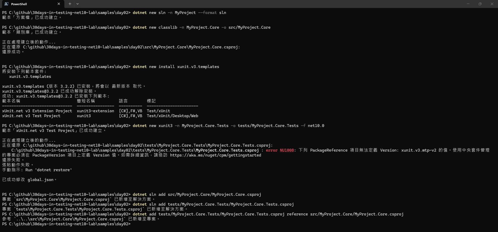
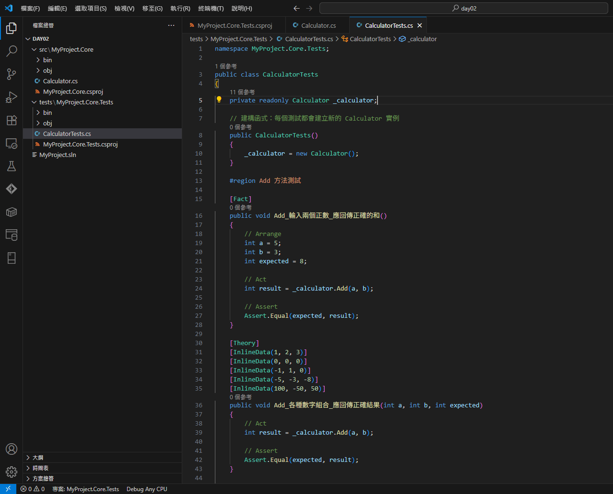
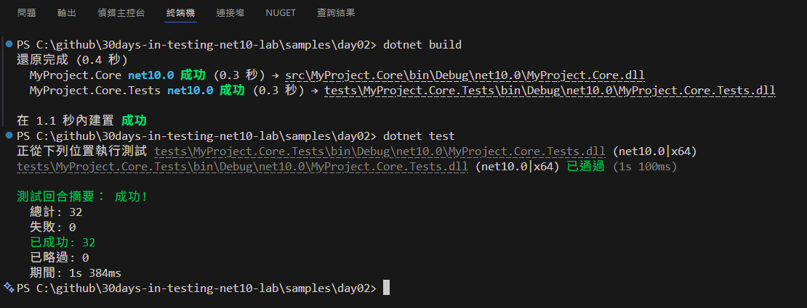
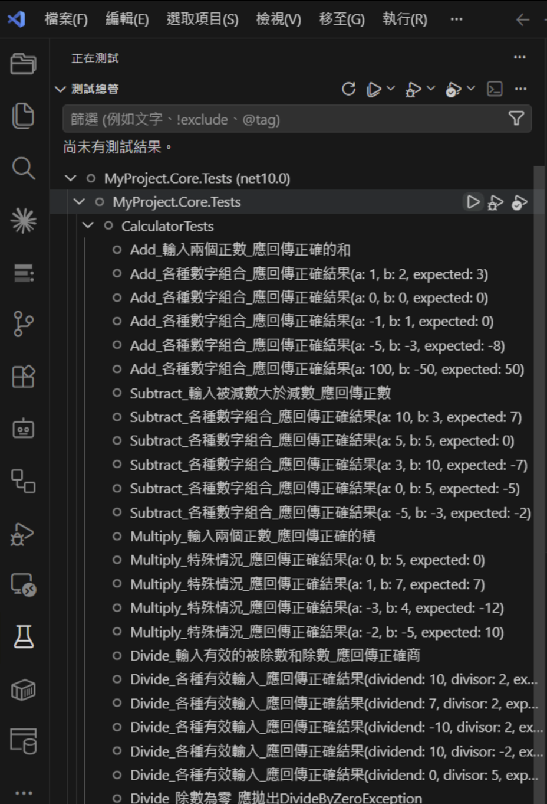
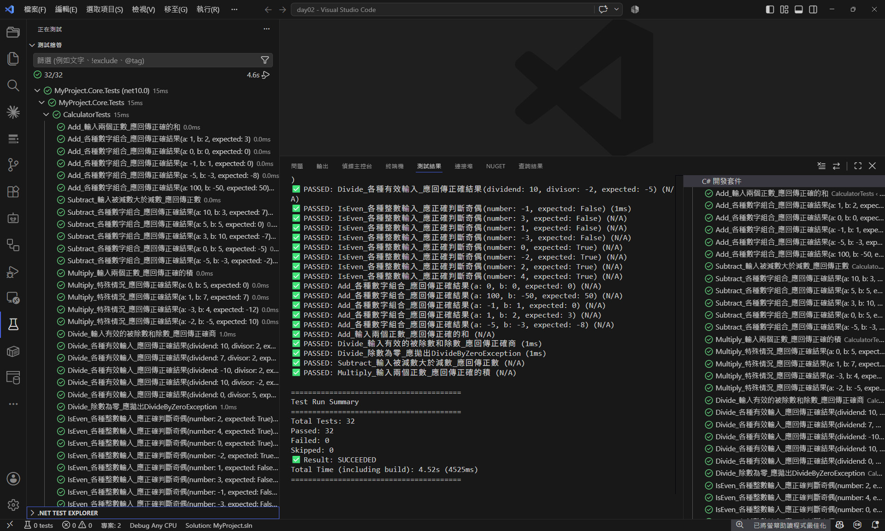

# Day 02 - xUnit 框架深度解析 - 從生態概觀到實戰專案

## 前言：選擇測試框架的重要性

Day 01 談過：即使 AI 工具進步很快，軟體工程師仍得理解測試基礎、FIRST 原則與測試金字塔。

原因很直接。我們得有「識讀」測試程式碼的能力，看得出它涵蓋哪些情境、功能與預期結果。

AI 產生的測試全部綠燈，不代表驗證完整。這和「編譯成功就表示程式沒錯」是同一種誤判。

Day 02 我們要進入實戰階段：選擇合適的測試框架並建立第一個真正的測試專案。

在 .NET 生態系統中，測試框架會跟著專案好幾年。除了語法是否順手，也要看套件生態、社群維護，以及開發工具的整合程度。

**為什麼我推薦 xUnit？**

我一開始寫測試就是用 MSTest，而且一路堅持很久。理由很單純：好上手，在團隊裡推廣、教學都省事。

後來情況慢慢變了。在 StackOverflow 上搜測試相關的問答，MSTest 的內容越來越少，看到的幾乎都是 xUnit 或 NUnit。.NET Core 發佈之後，.NET 團隊自己的測試就是用 xUnit，多數開源套件也跟著。我才覺得該換了，於是跟著多數人改用 xUnit。

換過之後回頭看，xUnit 的設計確實比較貼合現在的開發方式。

> 今天的內容較多，可以先依「框架選擇、核心概念、專案實作」三段閱讀。

---

## 今日目標

- 認識 .NET 測試框架生態系統
- 掌握 xUnit 的設計哲學與核心優勢
- 理解 Fact、Theory 與傳統 Test 的差異
- 建立第一個完整的 xUnit 測試專案
- 實作涵蓋測試生命週期管理的完整範例
- 介紹 xUnit 的基本 Assert 方法

---

## .NET 測試框架生態概觀

### 主流測試框架比較

在 .NET 生態系統中，主要有三大測試框架：

| 特性               | xUnit             | NUnit    | MSTest             |
| ------------------ | ----------------- | -------- | ------------------ |
| **建立時間**       | 2007 年           | 2002 年  | 2005 年            |
| **設計概念**       | 簡潔、現代        | 功能豐富 | Visual Studio 整合 |
| **測試隔離**       | 預設隔離          | 需要設定 | 需要設定           |
| **並行執行**       | 原生支援          | 支援     | 支援               |
| **參數化測試**     | Theory/InlineData | TestCase | DataRow            |
| **社群活躍度**     | 非常活躍          | 活躍     | 一般               |
| **開源狀況**       | 完全開源          | 完全開源 | 部分開源           |
| **現代 .NET 支援** | 優秀              | 良好     | 良好               |

> **關於測試隔離**：這是挑測試框架時很重要的一項。xUnit 預設就給你完整的測試隔離，NUnit 和 MSTest 要自己額外設定。詳細的測試隔離說明和實際範例，請參考本文後面的「[測試隔離深度解析](#測試隔離深度解析)」章節。

### 為什麼選擇 xUnit？

#### 1. 設計概念：簡潔而強大

```csharp
// xUnit：清晰、直接
[Fact]
public void Add_輸入1和2_應回傳3()
{
    var calculator = new Calculator();
    var result = calculator.Add(1, 2);
    Assert.Equal(3, result);
}

// NUnit：功能豐富但較複雜
[Test]
public void Add_輸入1和2_應回傳3()
{
    var calculator = new Calculator();
    var result = calculator.Add(1, 2);
    Assert.AreEqual(3, result);
}

// MSTest：與 Visual Studio 深度整合
[TestMethod]
public void Add_輸入1和2_應回傳3()
{
    var calculator = new Calculator();
    var result = calculator.Add(1, 2);
    Assert.AreEqual(3, result);
}
```

#### 2. 測試隔離：預設就是最佳實務

xUnit 的每個測試方法都會建立新的測試類別執行個體。每個測試拿到的環境都是乾淨的，不會被其他測試汙染。

```csharp
public class CalculatorTests
{
    private readonly Calculator _calculator;
    
    // 每個測試都會執行這個建構函式，獲得全新的執行個體
    public CalculatorTests()
    {
        _calculator = new Calculator();
    }
    
    [Fact]
    public void Test1_會有新的_calculator執行個體()
    {
        // 這裡的 _calculator 是全新的
    }
    
    [Fact]
    public void Test2_也會有新的_calculator執行個體()
    {
        // 這裡的 _calculator 也是全新的，與 Test1 完全無關
    }
}
```

**為什麼這很重要？**

- **符合 FIRST 原則的 Independent**：每個測試都是獨立的
- **避免測試間的相互影響**：Test1 的執行不會影響 Test2
- **並行執行安全**：多個測試可以安全地並行執行

**老派工程師的實務經驗**：
用 MSTest 那幾年，最常踩的坑就是測試類別的共用狀態沒設計好，測試之間互相影響。一個測試失敗，牽連一整串，專案越大越難查。xUnit 從設計上就把這個陷阱堵掉了。

#### 3. 現代化的參數化測試

```csharp
// xUnit Theory：優雅且強大
[Theory]
[InlineData(1, 2, 3)]
[InlineData(-1, 1, 0)]
[InlineData(0, 0, 0)]
public void Add_各種輸入組合_應回傳正確結果(int a, int b, int expected)
{
    var calculator = new Calculator();
    var result = calculator.Add(a, b);
    Assert.Equal(expected, result);
}

// 對比 NUnit TestCase
[TestCase(1, 2, 3)]
[TestCase(-1, 1, 0)]
[TestCase(0, 0, 0)]
public void Add_各種輸入組合_應回傳正確結果(int a, int b, int expected)
{
    // 類似的語法，但 xUnit 的 Theory 概念更清晰
}
```

#### 4. 生態系統支援

xUnit 在現代 .NET 開發中的支援度：

- **.NET Core**：官方推薦的測試框架
- **ASP.NET Core**：官方範本預設使用 xUnit
- **Entity Framework Core**：官方測試都使用 xUnit
- **Visual Studio**：原生支援，測試探索和執行
- **JetBrains Rider**：完整支援
- **CI/CD 工具**：Azure DevOps、GitHub Actions 等都有良好支援

目前常見的 .NET 測試框架有三個：

- **MSTest** - 微軟官方推出，容易入門和上手，但功能、靈活度都不及 NUnit 和 xUnit
- **NUnit** - JUnit 的 .NET 版本，發展相當早，也是許多開發者選用的測試工具
- **xUnit** - .NET 官方自己也在使用的測試工具，靈活度與多樣性的擴充功能是越來越多人使用的主因

### 老派工程師的框架選擇經驗談

我在不同專案中使用過的測試框架：

**MSTest 時期 (2014-2022)**：

- Visual Studio 整合良好，容易入門
- 但功能相對簡單，擴充性有限
- 在跨平台開發時有限制
- 社群生態相對較小

**xUnit 時期 (2022 - 現在)**：

- 簡潔的 API，學習曲線平緩
- 預設的最佳實務，減少犯錯機會
- 跟現代 .NET 整合得很順
- 活躍的開源社群

**結論**：新專案我推薦 xUnit。

---

## xUnit 基本結構

以下是一個使用 xUnit 的基本測試類別

```csharp
using NSubstitute;
using xUnitSample.Misc;

namespace xUnitSample
{
    public class FactTests : IDisposable
    {
        private readonly IRepository _sut;

        public FactTests()
        {
            // 建構式
            // 初始化相依物件
            
            _sut = Substitute.For<IRepository>(); // NSubstitute ... 之後會講到
        }

        public void Dispose()
        {
            // 想要清除的東西
            // 非必要
            // 如果不需要的話，可以不用繼承 IDisposable
        }

        [Fact]
        public void TestMethod()
        {
            // Fact 範例

            Assert.True(true);
        }

        [Fact]
        [Trait("Category", "FactTests.TestMethodTrait")]
        public void TestMethodTrait()
        {
            Assert.True(true);
        }

        [Fact(Skip = "忽略的理由")]
        public void TestMethodSkip()
        {
            // Skip 範例

            Assert.True(true);
        }
    }
}
```

### 測試類別的建構式

在 xUnit 測試框架中，測試類別的建構式（Constructor）主要用於初始化測試所需的資源和狀態。每次執行測試方法時，xUnit 都會建立一個新的測試類別執行個體，因此建構式會在每個測試方法執行前被呼叫。

主要用途

- 初始化資源：在建構式中初始化測試所需的資源，例如建立資料庫連接、初始化模擬物件等。
- 設定測試狀態：設定測試所需的初始狀態，確保每個測試方法在相同的初始條件下執行。

### 測試類別的 Dispose 方法

Dispose 方法負責在每個測試方法跑完之後做清理，靠實作 `IDisposable` 介面來啟用。測試類別一旦實作了 `IDisposable`，xUnit 會在每個測試方法結束後自動呼叫 Dispose。

主要用途

- 釋放資源：釋放在測試過程中分配的資源，例如關閉資料庫連線、釋放檔案控制代碼等。
- 清理狀態：清理測試過程中修改的狀態，確保不會影響後續的測試。

> 注意：每個單元測試方法的執行都是獨立的
> 單元測試都是個別獨立、無順序性、執行結果不會影響其他測試
> 所以當執行一個單元測試方法的時候，都會先去執行建構式，然後執行測試方法，最後再去執行 Dispose 方法

## xUnit 核心概念深度解析

### 測試相關標籤 (Attribute)

xUnit 用 attribute 來標示和組織單元測試，常用的有這幾個：

- [Fact]
- [Fact(Skip = "Reason")]
- [Theory]
  - [InlineData]
  - [MemberData]
  - [ClassData]
- [Trait]

### Fact vs Theory：測試的兩種基本形式

#### Fact：固定的測試案例

```csharp
[Fact]
public void Calculate_固定輸入_應回傳預期結果()
{
    // Arrange
    var calculator = new Calculator();
    
    // Act
    var result = calculator.Add(5, 3);
    
    // Assert
    Assert.Equal(8, result);
}
```

**Fact 適用於**：

- 固定的輸入輸出
- 單一情境的驗證
- 不需要參數化的測試

#### Theory：參數化的測試案例

```csharp
[Theory]
[InlineData(1, 2, 3)]
[InlineData(5, 7, 12)]
[InlineData(-1, 1, 0)]
[InlineData(0, 0, 0)]
public void Add_多組輸入_應回傳正確結果(int a, int b, int expected)
{
    // Arrange
    var calculator = new Calculator();
    
    // Act
    var result = calculator.Add(a, b);
    
    // Assert
    Assert.Equal(expected, result);
}
```

**Theory 適用於**：

- 多組測試資料
- 邊界值測試
- 等價類別劃分測試

#### 理解 Theory 的強大之處

Theory 讓你把「同一個行為、不同輸入」寫成一組測試：

```csharp
// 單一 Theory 實際上執行了 4 個測試案例
[Theory]
[InlineData("test@example.com", true)]           // 有效 email
[InlineData("invalid-email", false)]             // 無效格式
[InlineData("", false)]                          // 空字串
[InlineData(null, false)]                        // null 值
public void IsValidEmail_各種輸入_應回傳正確驗證結果(string email, bool expected)
{
    var validator = new EmailValidator();
    var result = validator.IsValidEmail(email);
    Assert.Equal(expected, result);
}
```

測試結果會顯示：

```text
通過 IsValidEmail_各種輸入_應回傳正確驗證結果(email: "test@example.com", expected: True)
通過 IsValidEmail_各種輸入_應回傳正確驗證結果(email: "invalid-email", expected: False)
通過 IsValidEmail_各種輸入_應回傳正確驗證結果(email: "", expected: False)
通過 IsValidEmail_各種輸入_應回傳正確驗證結果(email: null, expected: False)
```

#### Theory 的進階用法：MemberData 與 ClassData

除了 InlineData，xUnit 還有幾種資料提供機制：

##### MemberData：使用靜態屬性或方法提供測試資料

```csharp
public class CalculatorAdvancedTests
{
    private readonly Calculator _calculator;
    
    public CalculatorAdvancedTests()
    {
        _calculator = new Calculator();
    }
    
    // 使用靜態屬性提供測試資料
    public static IEnumerable<object[]> AddTestData =>
        new List<object[]>
        {
            new object[] { 1, 2, 3 },
            new object[] { -1, 1, 0 },
            new object[] { 0, 0, 0 },
            new object[] { 100, 200, 300 },
            new object[] { -5, -3, -8 }
        };
    
    [Theory]
    [MemberData(nameof(AddTestData))]
    public void Add_使用MemberData_應回傳正確結果(int a, int b, int expected)
    {
        // Act
        var result = _calculator.Add(a, b);
        
        // Assert
        Assert.Equal(expected, result);
    }
}
```

##### ClassData：使用專門的類別提供測試資料

```csharp
public class DivisionTestData : IEnumerable<object[]>
{
    public IEnumerator<object[]> GetEnumerator()
    {
        yield return new object[] { 10, 2, 5.0 };
        yield return new object[] { 7, 2, 3.5 };
        yield return new object[] { -10, 2, -5.0 };
        yield return new object[] { 0, 5, 0.0 };
    }

    IEnumerator IEnumerable.GetEnumerator() => GetEnumerator();
}

[Theory]
[ClassData(typeof(DivisionTestData))]
public void Divide_使用ClassData_應回傳正確結果(int dividend, int divisor, double expected)
{
    // Act
    var result = _calculator.Divide(dividend, divisor);
    
    // Assert
    Assert.Equal(expected, result, precision: 1);
}
```

**什麼時候使用哪種方式？**

- **InlineData**：簡單的測試資料，數量不多時
- **MemberData**：測試資料較複雜，需要動態產生，或在同一類別內重複使用
- **ClassData**：測試資料非常複雜，需要跨類別重複使用，或需要特殊的資料產生邏輯

### 其他實用的 xUnit 屬性

#### Trait：測試分類與標籤

Trait 用於標記測試的分類或特性，便於篩選和組織測試：

```csharp
[Fact]
[Trait("Category", "Unit")]
[Trait("Priority", "High")]
public void Add_基本功能_應正確執行()
{
    // 測試邏輯
}

[Fact]
[Trait("Category", "Integration")]
[Trait("Component", "Database")]
public void SaveUser_整合測試_應成功儲存()
{
    // 整合測試邏輯
}
```

在 Visual Studio 的測試總管中，你可以使用 Trait 來過濾測試，例如只執行 Category 為 "Unit" 的測試。

#### Skip：暫時忽略測試

當你需要暫時忽略某個測試時：

```csharp
[Fact(Skip = "等待外部 API 修復後再啟用")]
public void CallExternalApi_應回傳正確資料()
{
    // 這個測試會被跳過，但會在測試報告中顯示跳過原因
}

[Theory(Skip = "重構中，暫時停用")]
[InlineData(1, 2, 3)]
public void MethodUnderRefactoring_測試案例(int a, int b, int expected)
{
    // 暫時停用的測試
}
```

被 Skip 的測試會在測試總管中以黃色警告圖示顯示，並顯示跳過的原因。

### 測試生命週期管理

xUnit 提供了三種層級的生命週期管理，每種都有不同的適用情境：

#### 建構函式：每個測試的初始化

```csharp
public class OrderServiceTests
{
    private readonly OrderService _orderService;
    private readonly IRepository<Order> _mockRepository;
    
    // 每個測試方法執行前都會呼叫
    public OrderServiceTests()
    {
        _mockRepository = Substitute.For<IRepository<Order>>();
        _orderService = new OrderService(_mockRepository);
        
        // 可以在這裡設定共用的測試資料
        Console.WriteLine("測試開始：建立新的服務執行個體");
    }
}
```

**生命週期**：

- **初始化**：每個測試執行前
- **清理**：如果實作 IDisposable，每個測試執行後

**重要概念**：每個單元測試方法的執行都是獨立的。單元測試都是個別獨立、無順序性、執行結果不會影響其他測試。所以當執行一個單元測試方法的時候，都會先去執行建構式，然後執行測試方法，最後再去執行 Dispose 方法。

#### IDisposable：測試後的清理

```csharp
public class DatabaseTests : IDisposable
{
    private readonly TestDatabase _testDatabase;
    
    public DatabaseTests()
    {
        _testDatabase = new TestDatabase();
        _testDatabase.Initialize();
    }
    
    [Fact]
    public void SaveUser_應成功儲存到資料庫()
    {
        // 測試邏輯
    }
    
    // 每個測試方法執行後都會呼叫
    public void Dispose()
    {
        _testDatabase?.Cleanup();
        Console.WriteLine("測試結束：清理測試資料");
    }
}
```

#### 集合級的生命週期：IClassFixture

有些資源 (如資料庫連線、外部服務) 的建立成本很高，不適合每個測試都重新建立：

```csharp
// 共享的測試資源
public class DatabaseFixture : IDisposable
{
    public string ConnectionString { get; private set; }
    
    public DatabaseFixture()
    {
        // 建立測試資料庫(只會執行一次)
        ConnectionString = CreateTestDatabase();
    }
    
    public void Dispose()
    {
        // 清理測試資料庫(所有測試完成後執行一次)
        CleanupTestDatabase();
    }
    
    private string CreateTestDatabase() => "test-connection-string";
    private void CleanupTestDatabase() { /* 清理邏輯 */ }
}

// 使用共享資源的測試類別
public class UserRepositoryTests : IClassFixture<DatabaseFixture>
{
    private readonly DatabaseFixture _databaseFixture;
    
    public UserRepositoryTests(DatabaseFixture databaseFixture)
    {
        _databaseFixture = databaseFixture;
    }
    
    [Fact]
    public void SaveUser_應儲存到共享的測試資料庫()
    {
        var repository = new UserRepository(_databaseFixture.ConnectionString);
        // 測試邏輯
    }
}
```

---

## 建立第一個 xUnit 測試專案

### 專案結構規劃

先把專案結構擺好：

```text
MyProject/
├── src/
│   └── MyProject.Core/
│       ├── MyProject.Core.csproj
│       ├── Calculator.cs
│       ├── EmailValidator.cs
│       └── OrderService.cs
├── tests/
│   └── MyProject.Core.Tests/
│       ├── MyProject.Core.Tests.csproj
│       ├── CalculatorTests.cs
│       ├── EmailValidatorTests.cs
│       └── OrderServiceTests.cs
└── MyProject.sln
```

### 步驟一：建立解決方案和專案

#### 使用 .NET CLI

以下步驟請在**全新的空目錄**執行，不要在既有 repo 或範例專案的目錄裡操作——範本會建立同名檔案，與現有專案或 `Directory.Packages.props` 之類的設定互相干擾。

```powershell
# 建立解決方案（.NET 10 SDK 預設產生新版 .slnx 格式，加 --format sln 維持傳統 .sln）
dotnet new sln -n MyProject --format sln

# 建立主專案
dotnet new classlib -n MyProject.Core -o src/MyProject.Core

# 安裝 xUnit v3 專案範本（SDK 內建的 xunit 範本仍是 v2，v3 需另裝範本套件）
dotnet new install xunit.v3.templates

# 建立測試專案（xunit3 範本，預設即為 MTP 的 xUnit v3 專案）
# 注意：範本預設的 TargetFramework 是 net8.0，用 -f net10.0 對齊主專案，
# 否則最後一步加入專案參考會因目標框架不相容而失敗
dotnet new xunit3 -n MyProject.Core.Tests -o tests/MyProject.Core.Tests -f net10.0

# 將專案加入解決方案
dotnet sln add src/MyProject.Core/MyProject.Core.csproj
dotnet sln add tests/MyProject.Core.Tests/MyProject.Core.Tests.csproj

# 建立專案參考關係
dotnet add tests/MyProject.Core.Tests/MyProject.Core.Tests.csproj reference src/MyProject.Core/MyProject.Core.csproj
```

> 註：`xunit3` 範本建立專案時，會自動在方案目錄建立（或修改）`global.json`，加入 `"test": { "runner": "Microsoft.Testing.Platform" }`——這正是稍後「global.json 設定」一節需要的內容，看到「已成功修改 global.json」訊息屬正常行為。

操作畫面



#### 使用 Visual Studio

1. **建立新的解決方案**
   - File → New → Project
   - 選擇 "Blank Solution"
   - 命名為 "MyProject"

2. **加入主專案**
   - 右鍵解決方案 → Add → New Project
   - 選擇 "Class Library (.NET)"
   - 命名為 "MyProject.Core"

3. **加入測試專案**
   - 右鍵解決方案 → Add → New Project
   - 選擇 "xUnit.net v3 Test Project"（若選單中沒有，先於命令列執行 `dotnet new install xunit.v3.templates` 安裝 v3 範本；VS 內建的 "xUnit Test Project" 仍是 v2）
   - 命名為 "MyProject.Core.Tests"，目標框架選 .NET 10（範本預設為 .NET 8）

4. **設定專案參考**
   - 右鍵測試專案 → Add → Project Reference
   - 選擇 MyProject.Core

### 步驟二：設定測試專案的相依套件

使用 `xunit3` 範本建立的測試專案，預設就會帶入 xUnit v3（MTP）所需的套件。本 repo 另外做了三件事：採用 Central Package Management（CPM），套件版本統一寫在 `Directory.Packages.props`，因此 `csproj` 裡的 `PackageReference` 不寫 `Version`；加入 `Microsoft.Testing.Extensions.TrxReport` 以便輸出 TRX 報告；再加入 `Microsoft.NET.Test.Sdk` 與 `xunit.runner.visualstudio` 讓 Visual Studio 與 Rider 的測試總管能正常探索測試（原因見下方 MTP 說明）。查看 `MyProject.Core.Tests.csproj`：

```xml
<Project Sdk="Microsoft.NET.Sdk">

  <PropertyGroup>
    <TargetFramework>net10.0</TargetFramework>
    <OutputType>Exe</OutputType>
    <ImplicitUsings>enable</ImplicitUsings>
    <Nullable>enable</Nullable>
    <IsPackable>false</IsPackable>
    <!-- 關閉 Microsoft.CodeCoverage 的 source root mapping:它每次建置都重寫檔案,會讓 IDE 專案系統反覆重新評估 -->
    <DisableMsCoverageReferencedPathMaps>true</DisableMsCoverageReferencedPathMaps>
  </PropertyGroup>

  <ItemGroup>
    <PackageReference Include="xunit.v3.mtp-v2" />
    <!-- IDE 測試總管相容:Rider 的 xUnit 探索需要 Microsoft.NET.Test.Sdk,VSTest 路徑另需 xunit.runner.visualstudio -->
    <PackageReference Include="Microsoft.NET.Test.Sdk" />
    <PackageReference Include="xunit.runner.visualstudio" />
    <PackageReference Include="Microsoft.Testing.Extensions.TrxReport" />
  </ItemGroup>

  <ItemGroup>
    <Using Include="Xunit" />
  </ItemGroup>

  <ItemGroup>
    <ProjectReference Include="..\..\src\MyProject.Core\MyProject.Core.csproj" />
  </ItemGroup>

</Project>
```

> 若你的專案沒有採用 CPM，也可以直接把版本寫在 `PackageReference` 上，例如 `<PackageReference Include="xunit.v3.mtp-v2" Version="3.2.2" />`；本 repo 為了讓所有範例的套件版本一致，才統一改用 `Directory.Packages.props` 管理。

> **關於 Microsoft Testing Platform（MTP）**
> xUnit v3 原生建構在 **Microsoft Testing Platform（MTP）** 之上。MTP 是微軟新一代的測試執行平台，用來取代自 Visual Studio 2010 以來驅動 `dotnet test` 與 Test Explorer 的舊引擎 VSTest。要留意的是，測試框架（xUnit）與執行平台（MTP）是兩件不同的事：前者決定你「怎麼寫測試」，後者決定「誰把測試跑起來、收集結果」。MTP 帶來的最明顯改變，就是**測試專案從類別庫變成獨立的可執行檔**，因此上面的 `csproj` 需要 `<OutputType>Exe</OutputType>`。
>
> 不過 IDE 的支援還在過渡期：Visual Studio 與 Rider 的**測試總管**探索測試時仍走 VSTest 路徑，缺少 `Microsoft.NET.Test.Sdk` 與 `xunit.runner.visualstudio` 的純 MTP 專案，測試總管會顯示不出任何測試。所以範例採取雙軌設定：命令列的 `dotnet test` 依 `global.json` 的 `"test": { "runner": "Microsoft.Testing.Platform" }` 走 MTP，IDE 測試總管則靠上面兩個套件走 VSTest 探索，兩邊互不干擾。

### 步驟三：建立要測試的類別

在 `MyProject.Core` 專案中建立 `Calculator.cs`：

```csharp
namespace MyProject.Core;

public class Calculator
{
    public int Add(int a, int b)
    {
        return a + b;
    }
    
    public int Subtract(int a, int b)
    {
        return a - b;
    }
    
    public int Multiply(int a, int b)
    {
        return a * b;
    }
    
    public double Divide(int dividend, int divisor)
    {
        if (divisor == 0)
        {
            throw new DivideByZeroException("除數不能為零");
        }
            
        return (double)dividend / divisor;
    }
    
    public bool IsEven(int number)
    {
        return number % 2 == 0;
    }
}
```

### 步驟四：建立完整的測試類別

在 `MyProject.Core.Tests` 專案中建立 `CalculatorTests.cs`：

```csharp
using MyProject.Core;

namespace MyProject.Core.Tests;

public class CalculatorTests
{
    private readonly Calculator _calculator;
    
    // 建構函式：每個測試都會建立新的 Calculator 執行個體
    public CalculatorTests()
    {
        _calculator = new Calculator();
    }
    
    #region Add 方法測試
    
    [Fact]
    public void Add_輸入兩個正數_應回傳正確的和()
    {
        // Arrange
        int a = 5;
        int b = 3;
        int expected = 8;
        
        // Act
        int result = _calculator.Add(a, b);
        
        // Assert
        Assert.Equal(expected, result);
    }
    
    [Theory]
    [InlineData(1, 2, 3)]
    [InlineData(0, 0, 0)]
    [InlineData(-1, 1, 0)]
    [InlineData(-5, -3, -8)]
    [InlineData(100, -50, 50)]
    public void Add_各種數字組合_應回傳正確結果(int a, int b, int expected)
    {
        // Act
        int result = _calculator.Add(a, b);
        
        // Assert
        Assert.Equal(expected, result);
    }
    
    #endregion
    
    #region Subtract 方法測試
    
    [Fact]
    public void Subtract_輸入被減數大於減數_應回傳正數()
    {
        // Arrange
        int minuend = 10;
        int subtrahend = 3;
        int expected = 7;
        
        // Act
        int result = _calculator.Subtract(minuend, subtrahend);
        
        // Assert
        Assert.Equal(expected, result);
    }
    
    [Theory]
    [InlineData(10, 3, 7)]
    [InlineData(5, 5, 0)]
    [InlineData(3, 10, -7)]
    [InlineData(0, 5, -5)]
    [InlineData(-5, -3, -2)]
    public void Subtract_各種數字組合_應回傳正確結果(int a, int b, int expected)
    {
        // Act
        int result = _calculator.Subtract(a, b);
        
        // Assert
        Assert.Equal(expected, result);
    }
    
    #endregion
    
    #region Multiply 方法測試
    
    [Fact]
    public void Multiply_輸入兩個正數_應回傳正確的積()
    {
        // Arrange
        int a = 4;
        int b = 5;
        int expected = 20;
        
        // Act
        int result = _calculator.Multiply(a, b);
        
        // Assert
        Assert.Equal(expected, result);
    }
    
    [Theory]
    [InlineData(0, 5, 0)]        // 零乘以任何數都是零
    [InlineData(1, 7, 7)]        // 一乘以任何數都是該數
    [InlineData(-3, 4, -12)]     // 負數乘以正數
    [InlineData(-2, -5, 10)]     // 負數乘以負數
    public void Multiply_特殊情況_應回傳正確結果(int a, int b, int expected)
    {
        // Act
        int result = _calculator.Multiply(a, b);
        
        // Assert
        Assert.Equal(expected, result);
    }
    
    #endregion
    
    #region Divide 方法測試
    
    [Fact]
    public void Divide_輸入有效的被除數和除數_應回傳正確商()
    {
        // Arrange
        int dividend = 10;
        int divisor = 2;
        double expected = 5.0;
        
        // Act
        double result = _calculator.Divide(dividend, divisor);
        
        // Assert
        Assert.Equal(expected, result);
    }
    
    [Theory]
    [InlineData(10, 2, 5.0)]
    [InlineData(7, 2, 3.5)]
    [InlineData(-10, 2, -5.0)]
    [InlineData(10, -2, -5.0)]
    [InlineData(0, 5, 0.0)]
    public void Divide_各種有效輸入_應回傳正確結果(int dividend, int divisor, double expected)
    {
        // Act
        double result = _calculator.Divide(dividend, divisor);
        
        // Assert
        Assert.Equal(expected, result, precision: 2); // 指定精確度
    }
    
    [Fact]
    public void Divide_除數為零_應拋出DivideByZeroException()
    {
        // Arrange
        int dividend = 10;
        int divisor = 0;
        
        // Act & Assert
        DivideByZeroException exception = Assert.Throws<DivideByZeroException>(
            () => _calculator.Divide(dividend, divisor)
        );
        
        // 驗證例外訊息
        Assert.Equal("除數不能為零", exception.Message);
    }
    
    #endregion
    
    #region IsEven 方法測試
    
    [Theory]
    [InlineData(2, true)]
    [InlineData(4, true)]
    [InlineData(0, true)]        // 零是偶數
    [InlineData(-2, true)]       // 負偶數
    [InlineData(1, false)]
    [InlineData(3, false)]
    [InlineData(-1, false)]      // 負奇數
    [InlineData(-3, false)]
    public void IsEven_各種整數輸入_應正確判斷奇偶(int number, bool expected)
    {
        // Act
        bool result = _calculator.IsEven(number);
        
        // Assert
        Assert.Equal(expected, result);
    }
    
    #endregion
}
```

MyProject.Core 類別庫專案與 MyProject.Core.Tests 測試專案



透過 .NET CLI 執行測試

```powershell
# 先進行建置
dotnet build

# 執行測試
dotnet test
```

執行結果



在 VS Code 裡的 Test Explorer 執行測試



測試執行完成



> 在 VS Code 裡，要安裝 `C# Dev Kit`
>
> - [C# Dev Kit - Visual Studio Marketplace](https://marketplace.visualstudio.com/items?itemName=ms-dotnettools.csdevkit)
> - [Testing in Visual Studio Code](https://code.visualstudio.com/docs/csharp/testing)

---

## xUnit Assert 方法介紹

xUnit 提供了基本的 Assert 方法來驗證測試結果：

### 基本相等性斷言

```csharp
[Fact]
public void Assert_基本相等性驗證()
{
    // 基本相等比較
    Assert.Equal(5, 2 + 3);
    Assert.NotEqual(5, 2 + 2);
    
    // 字串比較
    Assert.Equal("Hello", "Hello");
    Assert.Equal("hello", "HELLO", ignoreCase: true);
    
    // 物件比較
    var user1 = new User { Name = "John", Age = 30 };
    var user2 = new User { Name = "John", Age = 30 };
    Assert.Equal(user1, user2); // 需要實作 IEquatable<T> 或覆寫 Equals
    
    // 參考比較
    Assert.Same(user1, user1);     // 同一個物件執行個體
    Assert.NotSame(user1, user2);  // 不同物件執行個體
}
```

### 數值比較斷言

```csharp
[Fact]
public void Assert_數值比較驗證()
{
    // 數值範圍比較
    Assert.InRange(5, 1, 10);        // 5 在 1 到 10 之間
    Assert.NotInRange(15, 1, 10);    // 15 不在 1 到 10 之間
    
    // 浮點數比較(處理精度問題)
    Assert.Equal(0.1 + 0.2, 0.3, precision: 1);  // 保留 1 位小數比較
    
    // 布林值比較
    Assert.True(5 > 3);
    Assert.False(5 < 3);
}
```

### 集合與序列斷言

```csharp
[Fact]
public void Assert_集合驗證()
{
    var numbers = new[] { 1, 2, 3, 4, 5 };
    var emptyList = new List<int>();
    
    // 集合內容驗證
    Assert.Contains(3, numbers);           // 包含特定元素
    Assert.DoesNotContain(6, numbers);     // 不包含特定元素
    
    // 集合狀態驗證
    Assert.Empty(emptyList);               // 空集合
    Assert.NotEmpty(numbers);              // 非空集合
    
    // 集合大小驗證
    Assert.Single(new[] { "only one" });  // 只有一個元素
    
    // 集合相等比較
    var expected = new[] { 1, 2, 3, 4, 5 };
    Assert.Equal(expected, numbers);       // 順序和內容都相同
    
    // 集合包含比較
    Assert.Subset(new HashSet<int> { 1, 2 }, new HashSet<int> { 1, 2, 3 }); // 子集合
}
```

### 字串專用斷言

```csharp
[Fact]
public void Assert_字串驗證()
{
    string text = "Hello, World!";
    
    // 字串包含驗證
    Assert.Contains("World", text);
    Assert.DoesNotContain("Universe", text);
    
    // 字串開始結束驗證
    Assert.StartsWith("Hello", text);
    Assert.EndsWith("World!", text);
    
    // 字串比對模式
    Assert.Matches(@"H\w+", text);              // 正規表達式比對
    Assert.DoesNotMatch(@"\d+", text);          // 不符合正規表達式
    
    // 空字串驗證
    Assert.Empty("");
    Assert.NotEmpty(text);
}
```

### 例外處理斷言

```csharp
[Fact]
public void Assert_例外驗證()
{
    var calculator = new Calculator();
    
    // 驗證特定例外被拋出
    var exception = Assert.Throws<DivideByZeroException>(
        () => calculator.Divide(10, 0)
    );
    Assert.Equal("除數不能為零", exception.Message);
    
    // 驗證特定類型的例外(包含子類型)
    Assert.ThrowsAny<Exception>(() => calculator.Divide(10, 0));
    
    // 驗證沒有例外被拋出
    var exception2 = Record.Exception(() => calculator.Add(1, 2));
    Assert.Null(exception2);
}
```

### Null 值斷言

```csharp
[Fact]
public void Assert_Null值驗證()
{
    string nullString = null;
    string nonNullString = "Hello";
    
    // Null 值驗證
    Assert.Null(nullString);
    Assert.NotNull(nonNullString);
}
```

### 型別驗證斷言

```csharp
[Fact]
public void Assert_型別驗證()
{
    object obj = "This is a string";
    
    // 型別檢查
    Assert.IsType<string>(obj);           // 精確型別比對
    Assert.IsNotType<int>(obj);           // 不是特定型別
    
    // 型別相容性檢查(包含繼承關係)
    Assert.IsAssignableFrom<object>(obj); // 可以轉換為特定型別
}
```

---

## 測試隔離深度解析

測試隔離指的是每個測試方法執行時都應該是獨立的，不會被其他測試的執行結果影響，也不會影響其他測試。這是 FIRST 原則中的 `I (Independent)` 的核心概念。

### xUnit：預設隔離

```csharp
public class CalculatorTests
{
    private readonly Calculator _calculator;
    private int _testCounter = 0;
    
    // 每個測試方法執行前都會建立新的測試類別執行個體
    public CalculatorTests()
    {
        _calculator = new Calculator();
        _testCounter = 0; // 每個測試都重新初始化
        Console.WriteLine($"建構函式執行：{DateTime.Now:HH:mm:ss.fff}");
    }
    
    [Fact]
    public void Test1_會有獨立的執行個體()
    {
        _testCounter++;
        Assert.Equal(1, _testCounter); // 永遠會是 1
    }
    
    [Fact]
    public void Test2_也會有獨立的執行個體()
    {
        _testCounter++;
        Assert.Equal(1, _testCounter); // 也永遠會是 1，不會受 Test1 影響
    }
}
```

**xUnit 的隔離機制**：

- 每個測試方法執行時，都會建立新的測試類別執行個體
- 建構函式會在每個測試前執行
- 如果實作 `IDisposable`，`Dispose()` 會在每個測試後執行
- 這確保了完全的狀態隔離

### NUnit：需要設定

```csharp
[TestFixture]
public class CalculatorTests
{
    private Calculator _calculator;
    private int _testCounter = 0; // 這個值會在測試間共享！
    
    // 預設情況下，建構函式只執行一次
    public CalculatorTests()
    {
        Console.WriteLine($"建構函式執行：{DateTime.Now:HH:mm:ss.fff}");
    }
    
    [SetUp]
    public void SetUp()
    {
        _calculator = new Calculator();
        // _testCounter 不會重置！這可能造成問題
    }
    
    [Test]
    public void Test1_可能會影響其他測試()
    {
        _testCounter++;
        Assert.AreEqual(1, _testCounter); // 第一次執行會通過
    }
    
    [Test]
    public void Test2_可能受到Test1影響()
    {
        _testCounter++;
        Assert.AreEqual(1, _testCounter); // 如果 Test1 先執行，這個會失敗！
    }
}
```

**要在 NUnit 做到完全隔離，得額外設定**：

```csharp
[TestFixture]
public class CalculatorTestsWithIsolation
{
    private Calculator _calculator;
    private int _testCounter;
    
    [SetUp]
    public void SetUp()
    {
        _calculator = new Calculator();
        _testCounter = 0; // 手動重置所有狀態
    }
    
    [Test]
    public void Test1_現在是隔離的()
    {
        _testCounter++;
        Assert.AreEqual(1, _testCounter);
    }
    
    [Test]
    public void Test2_也是隔離的()
    {
        _testCounter++;
        Assert.AreEqual(1, _testCounter);
    }
}
```

### MSTest：需要設定

```csharp
[TestClass]
public class CalculatorTests
{
    private Calculator _calculator;
    private int _testCounter = 0; // 同樣會在測試間共享
    
    // 建構函式只執行一次(預設行為)
    public CalculatorTests()
    {
        Console.WriteLine($"建構函式執行：{DateTime.Now:HH:mm:ss.fff}");
    }
    
    [TestInitialize]
    public void TestInitialize()
    {
        _calculator = new Calculator();
        // 需要手動重置狀態
        _testCounter = 0;
    }
    
    [TestMethod]
    public void Test1_需要手動管理隔離()
    {
        _testCounter++;
        Assert.AreEqual(1, _testCounter);
    }
    
    [TestMethod]
    public void Test2_也需要手動管理隔離()
    {
        _testCounter++;
        Assert.AreEqual(1, _testCounter);
    }
}
```

### 實際問題示範

這邊以一個實際的例子來說明為什麼隔離很重要：

#### 沒有隔離的問題 (NUnit/MSTest 預設行為)

```csharp
[TestFixture] // NUnit
public class OrderServiceBadTests
{
    private OrderService _orderService;
    private List<Order> _orders = new List<Order>(); // 共享狀態！
    
    public OrderServiceBadTests()
    {
        _orderService = new OrderService();
    }
    
    [Test]
    public void CreateOrder_應該新增訂單到清單()
    {
        var order = new Order { Id = 1, Amount = 100 };
        _orderService.CreateOrder(order);
        _orders.Add(order);
        
        Assert.AreEqual(1, _orders.Count);
    }
    
    [Test]
    public void DeleteOrder_應該從清單移除訂單()
    {
        // 如果前一個測試先執行，_orders 已經有一筆資料了！
        var order = new Order { Id = 2, Amount = 200 };
        _orders.Add(order);
        _orderService.DeleteOrder(order.Id);
        _orders.Remove(order);
        
        Assert.AreEqual(0, _orders.Count); // 可能失敗，因為前一個測試的資料還在
    }
}
```

#### xUnit 自動提供的隔離

```csharp
public class OrderServiceGoodTests
{
    private readonly OrderService _orderService;
    private readonly List<Order> _orders; // 每個測試都是新的執行個體
    
    public OrderServiceGoodTests()
    {
        _orderService = new OrderService();
        _orders = new List<Order>(); // 每個測試都重新建立
    }
    
    [Fact]
    public void CreateOrder_應該新增訂單到清單()
    {
        var order = new Order { Id = 1, Amount = 100 };
        _orderService.CreateOrder(order);
        _orders.Add(order);
        
        Assert.Equal(1, _orders.Count); // 永遠通過
    }
    
    [Fact]
    public void DeleteOrder_應該從清單移除訂單()
    {
        // _orders 永遠是空的新清單
        var order = new Order { Id = 2, Amount = 200 };
        _orders.Add(order);
        _orderService.DeleteOrder(order.Id);
        _orders.Remove(order);
        
        Assert.Equal(0, _orders.Count); // 永遠通過
    }
}
```

### 為什麼 xUnit 的設計更好？

1. **預設就是最佳實務**：不需要記住要設定什麼
2. **減少人為錯誤**：開發者不會忘記重置狀態
3. **並行執行安全**：每個測試都有獨立的執行個體，預設支援並行執行
4. **符合 FIRST 原則**：Independent 原則自動滿足

### 效能考量

每個測試都建立新執行個體，確實會多一點成本。不過：

- **單元測試的物件建立成本通常很低**
- **測試隔離帶來的穩定性遠超過微小的效能損失**
- **如果建立成本真的很高，可以使用 `IClassFixture<T>` 來共享資源**

```csharp
// 當建立成本很高時，使用 IClassFixture
public class DatabaseFixture : IDisposable
{
    public string ConnectionString { get; }
    
    public DatabaseFixture()
    {
        // 昂貴的資源建立(只執行一次)
        ConnectionString = CreateTestDatabase();
    }
    
    public void Dispose()
    {
        // 清理資源
    }
}

public class UserRepositoryTests : IClassFixture<DatabaseFixture>
{
    private readonly DatabaseFixture _fixture;
    
    public UserRepositoryTests(DatabaseFixture fixture)
    {
        _fixture = fixture; // 所有測試共享同一個 fixture
    }
}
```

這也是比較表將 xUnit 標成「預設隔離」，而 NUnit 與 MSTest 標成「需要設定」的原因：xUnit 預設為每個測試建立新的測試類別執行個體。

---

## 測試執行與偵錯

### Visual Studio 中的測試執行

1. **測試總管**
   - View → Test Explorer
   - 可以看到所有測試案例
   - 支援分組、篩選、搜尋

2. **執行測試**

   ```text
   - 執行所有測試：Ctrl+R, A
   - 執行選取的測試：Ctrl+R, T
   - 偵錯測試：Ctrl+R, Ctrl+T
   ```

3. **測試結果檢視**
   - 綠色勾號：測試通過
   - 紅色 X：測試失敗
   - 黃色三角：測試跳過

### 使用 .NET CLI 執行測試

```powershell
# 執行所有測試
dotnet test

# 執行特定專案的測試
dotnet test --project tests/MyProject.Core.Tests/MyProject.Core.Tests.csproj

# 執行符合特定方法名稱的測試（xUnit v3 在 MTP 下用 --filter-method，支援 * 萬用字元）
dotnet test --filter-method "*Add*"

# 執行特定測試類別
dotnet test --filter-class "*CalculatorTests*"
```

### 測試偵錯技巧

```csharp
[Fact]
public void Debug_示範測試偵錯技巧()
{
    // 在測試中設定中斷點
    var calculator = new Calculator();
    
    // 使用 System.Diagnostics.Debugger.Break() 強制中斷
    System.Diagnostics.Debugger.Break();
    
    var result = calculator.Add(1, 2);
    
    // 在中斷點處檢查變數值
    // 注意：避免使用 Console.WriteLine，因為輸出不會顯示在測試結果中
    // xUnit 需要使用 ITestOutputHelper 來輸出偵錯資訊(進階主題)
    
    Assert.Equal(3, result);
}
```

---

## 最佳實務與常見陷阱

### 測試命名最佳實務

```csharp
// 好的命名：說明測試什麼、在什麼情況下、期望什麼結果
[Fact]
public void Add_輸入兩個正整數_應回傳正確的和()

[Theory]
[InlineData(-1)]
[InlineData(0)]
public void IsPositive_輸入非正數_應回傳False(int number)

// 不好的命名：不明確、無法理解測試意圖
[Fact]
public void TestAdd()

[Fact]
public void Test1()
```

### 測試組織最佳實務

```csharp
public class CalculatorTests
{
    private readonly Calculator _calculator;
    
    public CalculatorTests()
    {
        _calculator = new Calculator();
    }
    
    // 使用 #region 組織相關測試
    #region Add 方法測試
    
    [Fact]
    public void Add_基本功能測試() { }
    
    [Theory]
    [InlineData(/* 邊界值測試資料 */)]
    public void Add_邊界值測試() { }
    
    #endregion
    
    #region Exception 測試
    
    [Fact]
    public void Add_異常情況測試() { }
    
    #endregion
}
```

### 常見陷阱與解決方案

#### 陷阱 1：測試間的相依性

```csharp
// 錯誤：測試間有相依性
public class BadTests
{
    private static int _counter = 0;
    
    [Fact]
    public void Test1_會修改共用狀態()
    {
        _counter++;
        Assert.Equal(1, _counter);
    }
    
    [Fact]
    public void Test2_依賴前一個測試的結果() // 這個測試可能失敗
    {
        Assert.Equal(1, _counter); // 如果 Test1 沒有先執行就會失敗
    }
}

// 正確：每個測試都是獨立的
public class GoodTests
{
    [Fact]
    public void Test1_獨立的測試()
    {
        int counter = 0;
        counter++;
        Assert.Equal(1, counter);
    }
    
    [Fact]
    public void Test2_也是獨立的測試()
    {
        int counter = 0;
        counter++;
        Assert.Equal(1, counter);
    }
}
```

#### 陷阱 2：在測試中使用 Console.WriteLine 進行偵錯

```csharp
// 錯誤：使用 Console.WriteLine 輸出偵錯資訊
[Fact]
public void BadDebug_使用Console輸出偵錯資訊()
{
    var calculator = new Calculator();
    var result = calculator.Add(1, 2);
    
    // 這個輸出不會顯示在測試結果中！
    Console.WriteLine($"計算結果: {result}");
    
    Assert.Equal(3, result);
}

// 正確：使用 ITestOutputHelper 輸出偵錯資訊
public class CalculatorTestsWithOutput
{
    private readonly Calculator _calculator;
    private readonly ITestOutputHelper _output;
    
    public CalculatorTestsWithOutput(ITestOutputHelper output)
    {
        _calculator = new Calculator();
        _output = output;
    }
    
    [Fact]
    public void GoodDebug_使用ITestOutputHelper輸出偵錯資訊()
    {
        var result = _calculator.Add(1, 2);
        
        // 這個輸出會顯示在測試結果中
        _output.WriteLine($"計算結果: {result}");
        
        Assert.Equal(3, result);
    }
}
```

> **注意**：上述範例中的 `ITestOutputHelper` 是 xUnit 提供的測試輸出介面，用於在測試中輸出偵錯資訊。它的詳細用法與進階應用，之後的主題會再細談。

**為什麼 Console.WriteLine 不好？**

- **輸出不可見**：xUnit 執行時不會顯示 Console.WriteLine 的輸出
- **偵錯困難**：無法在測試總管中看到偵錯資訊
- **CI/CD 問題**：在持續整合環境中輸出會被忽略

**正確的偵錯方式**：

1. **使用中斷點**：最直接有效的偵錯方式
2. **使用 ITestOutputHelper**：在測試結果中顯示偵錯資訊
3. **使用 Assert 驗證中間值**：確保每個步驟都符合預期

#### 陷阱 3：過度複雜的測試設定

```csharp
// 錯誤：測試設定過於複雜
[Fact]
public void ComplexTest_難以理解和維護()
{
    // 大量的設定程式碼
    var config = new ConfigurationBuilder()
        .AddJsonFile("appsettings.test.json")
        .Build();
    
    var services = new ServiceCollection();
    services.AddDbContext<TestDbContext>(options => 
        options.UseInMemoryDatabase("TestDb"));
    services.AddScoped<IUserService, UserService>();
    
    var provider = services.BuildServiceProvider();
    var userService = provider.GetService<IUserService>();
    
    // 實際測試邏輯淹沒在設定中
    var result = userService.GetUser(1);
    Assert.NotNull(result);
}

// 正確：簡化測試，專注於要驗證的邏輯
[Fact]
public void GetUser_輸入有效ID_應回傳使用者()
{
    // 使用 Mock 簡化相依性
    var mockRepository = Substitute.For<IUserRepository>();
    mockRepository.GetById(1).Returns(new User { Id = 1, Name = "John" });
    
    var userService = new UserService(mockRepository);
    
    var result = userService.GetUser(1);
    
    Assert.NotNull(result);
    Assert.Equal("John", result.Name);
}
```

---

## 今日思考題

在今天的實戰練習後，請思考：

1. **比較體驗**：如果你之前使用過其他測試框架，xUnit 給你什麼不同的感受？
2. **生命週期理解**：建構函式的隔離機制對你的測試設計有什麼影響？
3. **Theory vs Fact**：在你的專案中，哪些情境適合用 Theory，哪些適合用 Fact？

**老派工程師的挑戰**：
嘗試為你目前專案中的一個核心類別寫完整的測試，包含：

- 正常情況的 Fact 測試
- 邊界值的 Theory 測試
- 例外情況的處理
- 確保每個測試都符合 FIRST 原則

---

## 今日重點回顧

1. **.NET 測試框架生態**：xUnit、NUnit、MSTest 的比較與選擇考量
2. **xUnit 核心優勢**：預設隔離、現代化設計與完整的工具支援
3. **Fact vs Theory**：固定測試案例 vs 參數化測試的使用時機
4. **測試生命週期**：建構函式、IDisposable、IClassFixture 的正確使用
5. **專案結構**：如何建立符合最佳實務的測試專案
6. **Assert 方法**：xUnit 提供的完整斷言 API
7. **最佳實務**：測試命名、組織結構、常見陷阱的避免

---

## 老派工程師的心得

框架的選擇往往決定了團隊未來幾年的開發體驗。

xUnit 將測試隔離、Theory 參數化與 Assert API 放進日常工作流程。掌握這三項機制後，就能先把測試寫得穩定，再逐步整理共用設定與測試資料。

框架不會自動改善你的程式碼。它的價值在於把測試隔離和參數化的成本壓低，低到你懶得偷懶。

---

## 明日預告

明天談 **xUnit 進階功能與測試資料管理**：

- Theory 進階資料提供：MemberData、ClassData 完整解析
- 測試資料的組織與重用策略
- xUnit 的進階功能：IClassFixture、ICollectionFixture 深度應用
- 測試執行最佳化與資源管理：認識並行執行基本概念與效能最佳化實務

---

## 參考資源

### xUnit 官方資源

- **xUnit 官方網站**：[https://xunit.net/](https://xunit.net/)
- **xUnit GitHub 儲存庫**：[https://github.com/xunit/xunit](https://github.com/xunit/xunit)
- **xUnit 官方文件**：[https://xunit.net/docs/getting-started/v3/getting-started](https://xunit.net/docs/getting-started/v3/getting-started)

### 進階學習資源

- **xUnit 測試模式與最佳實務**：[https://xunit.net/docs/shared-context](https://xunit.net/docs/shared-context)
- **xUnit 擴充套件生態**：[https://xunit.net/docs/ecosystem](https://xunit.net/docs/ecosystem)

### 社群資源

- **StackOverflow xUnit 標籤**：[https://stackoverflow.com/questions/tagged/xunit.net](https://stackoverflow.com/questions/tagged/xunit.net)
- **Microsoft Learn - 使用 xUnit 進行單元測試**：[https://learn.microsoft.com/zh-tw/dotnet/core/testing/unit-testing-with-dotnet-test](https://learn.microsoft.com/zh-tw/dotnet/core/testing/unit-testing-with-dotnet-test)

範例程式碼：

- <https://github.com/kevintsengtw/30days-in-testing-net10/tree/main/samples/day02>

---

**這是「重啟挑戰：老派軟體工程師的測試修練」的第二天。明天會介紹 Day 03：xUnit 進階功能與測試資料管理技巧。**
