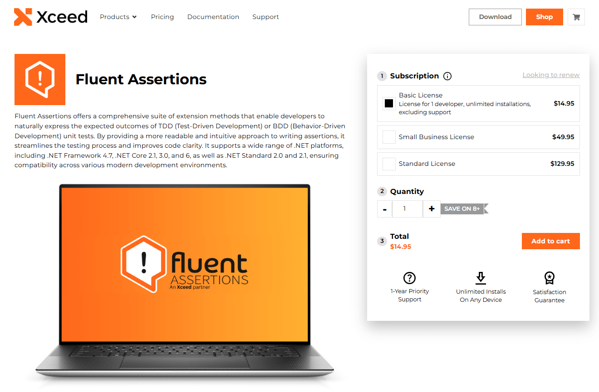

# Day 04 - AwesomeAssertions 基礎應用與實戰技巧

## 前言：現代測試 Assertions 的核心價值

在過去幾年的測試開發經驗中，我一直是 Fluent Assertions 的忠實使用者。它的流暢語法、豐富的 Assertions 方法，以及優秀的錯誤訊息，讓測試程式碼變得更加易讀和維護。

以前介紹 Fluent Assertions 的文章

- [編寫單元測試時的好用輔助套件 - Fluent Assertions](https://kevintsengtw.blogspot.com/2015/11/fluent-assertions.html)

企業裡寫測試的人變多之後，挑哪一套 Assertions Library 就成了要認真決定的事。AwesomeAssertions 完全免費、開源，用起來跟 Fluent Assertions 幾乎一樣。

今天會處理以下內容：

- AwesomeAssertions 的核心功能與特色
- 基本 Assertions 語法與各種資料類型應用
- 實戰應用技巧與最佳實務
- 專案實際應用的設計模式

---

## Fluent Assertions 商業授權變化分析

### 授權模式變化的背景

2025年，Fluent Assertions 宣布了授權模式的重大變化：

#### 新的授權政策

- **開源專案**：仍然免費
- **商業專案**：需要付費授權
- **企業使用**：需要購買企業授權



#### 對開發者的影響

**個人開發者與開源專案**：

- 繼續免費使用，無需擔心授權問題
- 開源專案維持原有的使用方式

**企業與商業專案**：

- 需要評估授權成本與專案預算
- 大型企業可能面臨可觀的授權費用
- 新專案需要在技術選型時考慮授權成本

**現有專案的困境**：

- 已大量使用 Fluent Assertions 的專案面臨選擇
- 繼續使用需支付授權費用
- 遷移到替代方案需要投入時間與人力

#### 企業決策考量

- **成本評估**：授權費用 vs 遷移成本
- **合規要求**：法務部門的授權合規性檢查
- **技術債務**：現有測試程式碼的遷移風險
- **團隊培訓**：新工具的學習曲線

相關連結：

- [Fluent Assertions 要付費了，該怎麼辦呢？｜mrkt 的程式學習筆記](https://www.dotblogs.com.tw/mrkt/2025/04/19/152408)

---

## AwesomeAssertions 完整介紹

### 什麼是 AwesomeAssertions？


AwesomeAssertions 是一個現代化的 .NET 測試 Assertions Library，設計目標是提供與 Fluent Assertions 相似的開發體驗，同時保持完全開源和免費。

**關於 AwesomeAssertions**：

AwesomeAssertions 是 FluentAssertions 的社群分支版本，使用 Apache 2.0 授權。本章節使用 **AwesomeAssertions 9.5.0** 版本，該版本的 API 與 FluentAssertions 高度相容。

#### 核心特色

- **完全免費**：Apache 2.0 授權，無商業使用限制
- **流暢語法**：支援方法鏈結的自然語言風格
- **豐富 Assertions**：涵蓋物件、集合、字串、數值等各種類型
- **優秀錯誤訊息**：提供詳細且易理解的失敗資訊
- **高效能**：最佳化的實作確保測試執行效率
- **擴充性**：支援自訂 Assertions 方法

### 安裝與基本設定

#### NuGet 套件安裝

```bash
# 使用 Package Manager Console
Install-Package AwesomeAssertions

# 使用 .NET CLI
dotnet add package AwesomeAssertions

# 使用 PackageReference (推薦)
<PackageReference Include="AwesomeAssertions" Version="9.5.0" PrivateAssets="all" />
```

#### 命名空間引用

```csharp
using AwesomeAssertions;
using Xunit;

namespace MyProject.Tests
{
    public class BasicAssertionTests
    {
        [Fact]
        public void FirstAwesomeAssertion_應該正常運作()
        {
            var result = "Hello World";
            
            // 使用 AwesomeAssertions 的流暢語法
            result.Should().NotBeNull()
                  .And.StartWith("Hello")
                  .And.EndWith("World")
                  .And.HaveLength(11);
        }
    }
}
```

---

## 基本 Assertions 語法與核心功能

### 物件 Assertions

#### 基本相等性與空值檢查

```csharp
public class ObjectAssertionTests
{
    [Fact]
    public void ObjectAssertion_基本檢查_應該正常運作()
    {
        var user = new User { Id = 1, Name = "John", Email = "john@example.com" };
        var nullUser = (User)null;
        
        // 基本物件 Assertions 
        user.Should().NotBeNull();
        user.Should().BeOfType<User>();
        user.Should().BeAssignableTo<IUser>();
        
        // 空值 Assertions 
        nullUser.Should().BeNull();
        
        // 相等性 Assertions 
        var anotherUser = new User { Id = 1, Name = "John", Email = "john@example.com", CreatedAt = user.CreatedAt }; // 複製建立時間，確保兩物件完全相等
        user.Should().BeEquivalentTo(anotherUser);
    }
    
    [Fact]
    public void ObjectAssertion_屬性檢查_應該正常運作()
    {
        var user = new User { Id = 1, Name = "John", Email = "john@example.com" };
        
        // 屬性值 Assertions 
        user.Id.Should().Be(1);
        user.Name.Should().NotBeNullOrEmpty()
                 .And.StartWith("J")
                 .And.HaveLength(4);
        user.Email.Should().Contain("@")
                  .And.EndWith(".com");
    }
}
```

### 字串 Assertions

#### 字串內容與格式驗證

```csharp
public class StringAssertionTests
{
    [Theory]
    [InlineData("Hello World", "Hello", "World")]
    [InlineData("Test@Example.com", "Test", ".com")]
    public void StringAssertion_內容檢查_應該正常運作(string input, string start, string end)
    {
        input.Should().NotBeNullOrEmpty()
             .And.StartWith(start)
             .And.EndWith(end);

        if (input.Contains('@'))
        {
            input.Should().Contain("@");
        }
    }
    
    [Fact]
    public void StringAssertion_模式匹配_應該正常運作()
    {
        var email = "user@example.com";
        var phoneNumber = "+1-555-123-4567";
        
        // 正規表達式 Assertions 
        email.Should().MatchRegex(@"^[^@]+@[^@]+\.[^@]+$");
        
        // 格式 Assertions 
        phoneNumber.Should().StartWith("+")
                           .And.Contain("-")
                           .And.HaveLength(15);
    }
    
    [Fact]
    public void StringAssertion_忽略大小寫_應該正常運作()
    {
        var text = "Hello World";
        
        // 忽略大小寫的比較
        text.Should().BeEquivalentTo("hello world");
        text.ToLower().Should().StartWith("hello", "因為我們要忽略大小寫");
    }
}
```

### 數值 Assertions

#### 數值範圍與精度驗證

```csharp
public class NumericAssertionTests
{
    [Theory]
    [InlineData(10, 5, 15)]
    [InlineData(0, -1, 1)]
    [InlineData(-5, -10, 0)]
    public void NumericAssertion_範圍檢查_應該正常運作(int value, int min, int max)
    {
        value.Should().BeGreaterThan(min)
             .And.BeLessThan(max)
             .And.BeInRange(min, max);
    }
    
    [Fact]
    public void NumericAssertion_浮點數處理_應該正常運作()
    {
        var pi = 3.14159;
        var approximatePi = 3.14;
        
        // 浮點數精度 Assertions 
        pi.Should().BeApproximately(3.14, 0.01);
        approximatePi.Should().BeApproximately(pi, 0.01);
        
        // 特殊值 Assertions 
        double.NaN.Should().BeNaN();
        double.PositiveInfinity.Should().Be(double.PositiveInfinity);
    }
    
    [Fact]
    public void NumericAssertion_計算結果_應該正常運作()
    {
        var calculator = new Calculator();
        
        // 計算結果 Assertions 
        calculator.Add(2, 3).Should().Be(5);
        calculator.Divide(10, 3).Should().BeApproximately(3.33, 0.01);
        calculator.Multiply(0, 100).Should().Be(0);
    }
}
```

### 集合 Assertions

#### 集合內容與結構驗證

```csharp
public class CollectionAssertionTests
{
    [Fact]
    public void CollectionAssertion_基本檢查_應該正常運作()
    {
        var numbers = new[] { 1, 2, 3, 4, 5 };
        var emptyList = new List<int>();
        
        // 基本集合 Assertions 
        numbers.Should().NotBeEmpty()
               .And.HaveCount(5)
               .And.Contain(3)
               .And.NotContain(10);
        
        emptyList.Should().BeEmpty()
                 .And.HaveCount(0);
    }
    
    [Fact]
    public void CollectionAssertion_順序與唯一性_應該正常運作()
    {
        var sortedNumbers = new[] { 1, 2, 3, 4, 5 };
        var unsortedNumbers = new[] { 3, 1, 4, 2, 5 };
        var duplicateNumbers = new[] { 1, 2, 2, 3, 3, 3 };
        
        // 順序 Assertions 
        sortedNumbers.Should().BeInAscendingOrder();
        unsortedNumbers.Should().NotBeInAscendingOrder();
        
        // 唯一性 Assertions 
        sortedNumbers.Should().OnlyHaveUniqueItems();
        duplicateNumbers.Should().Contain(x => duplicateNumbers.Count(y => y == x) > 1, "因為陣列包含重複項目");
    }
    
    [Fact]
    public void CollectionAssertion_複雜物件_應該正常運作()
    {
        var users = new[]
        {
            new User { Id = 1, Name = "Alice", Age = 25 },
            new User { Id = 2, Name = "Bob", Age = 30 },
            new User { Id = 3, Name = "Charlie", Age = 35 }
        };
        
        // 複雜物件集合 Assertions 
        users.Should().HaveCount(3)
             .And.Contain(u => u.Name == "Alice")
             .And.AllSatisfy(u => u.Age.Should().BeGreaterThan(20));
        
        // 投影 Assertions 
        users.Select(u => u.Name).Should().Contain("Bob")
             .And.NotContain("David");
        
        users.Where(u => u.Age > 30).Should().HaveCount(1);
    }
}
```

### 例外 Assertions

#### 基本例外處理與驗證

```csharp
public class ExceptionAssertionTests
{
    [Fact]
    public void Exception_基本檢查_應該正常運作()
    {
        var userService = new UserService();
        
        // 基本例外 Assertions 
        Action action = () => userService.GetUser(-1);
        
        action.Should().Throw<ArgumentException>()
              .WithMessage("使用者 ID 必須為正數*")
              .And.ParamName.Should().Be("id");
    }
    
    [Fact]
    public void Exception_不應拋出例外_應該正常運作()
    {
        var calculator = new Calculator();
        
        // 確保不拋出例外
        Action action = () => calculator.Add(1, 2);
        
        action.Should().NotThrow();
    }
    
    [Fact]
    public void Exception_特定例外類型_應該正常運作()
    {
        var service = new ValidationService();
        
        // 驗證特定例外類型
        Action action = () => service.ValidateEmail("");
        
        action.Should().Throw<ArgumentException>()
              .WithMessage("*email*");
    }
}
```

### 非同步 Assertions 基礎

#### Task 基本 Assertions

```csharp
public class AsyncAssertionTests
{
    [Fact]
    public async Task AsyncAssertion_任務完成_應該正常運作()
    {
        var userService = new UserService();
        
        // Task 完成狀態 Assertions 
        var task = userService.GetUserAsync(1);
        
        await task; // 等待完成
        
        task.IsCompletedSuccessfully.Should().BeTrue();
        task.Result.Should().NotBeNull();
        task.Result.Id.Should().Be(1);
    }
    
    [Fact]
    public async Task AsyncAssertion_例外處理_應該正常運作()
    {
        var apiService = new ApiService();
        
        // 非同步方法例外 Assertions 
        Func<Task> asyncAction = () => apiService.GetDataAsync("invalid-endpoint");
        
        await asyncAction.Should().ThrowAsync<HttpRequestException>()
                         .WithMessage("*404*");
    }
}
```

### 物件比對進階技巧

#### 深度物件比較基礎

```csharp
public class ObjectComparisonTests
{
    [Fact]
    public void ObjectComparison_深度比較_應該正常運作()
    {
        var expectedUser = new User
        {
            Id = 1,
            Name = "John Doe",
            Email = "john@example.com",
            Profile = new UserProfile
            {
                Age = 30,
                City = "New York"
            }
        };
        
        var actualUser = userService.GetUser(1);
        
        // 深度物件比較
        actualUser.Should().BeEquivalentTo(expectedUser);
    }
    
    [Fact]
    public void ObjectComparison_排除特定屬性_應該正常運作()
    {
        var user = userService.CreateUser("john@example.com", "John Doe");
        
        // 排除特定屬性
        user.Should().BeEquivalentTo(expectedUser, options =>
            options.Excluding(u => u.Id)          // 排除自動產生的 ID
                   .Excluding(u => u.CreatedAt)   // 排除時間戳記
        );
    }
}
```

#### 複雜物件深度比較

```csharp
public class ComplexObjectComparisonTests
{
    [Fact]
    public void ComplexObject_完整比較_應該正常運作()
    {
        var expectedOrder = new Order
        {
            Id = 1,
            CustomerName = "John Doe",
            OrderDate = new DateTime(2024, 1, 15),
            Items = new[]
            {
                new OrderItem { ProductId = 1, ProductName = "Laptop", Quantity = 1, Price = 999.99m },
                new OrderItem { ProductId = 2, ProductName = "Mouse", Quantity = 2, Price = 25.50m }
            },
            ShippingAddress = new Address
            {
                Street = "123 Main St",
                City = "Anytown",
                ZipCode = "12345"
            }
        };
        
        var actualOrder = orderService.GetOrder(1);
        
        // 完整深度物件比較
        actualOrder.Should().BeEquivalentTo(expectedOrder);
    }
    
    [Fact]
    public void ComplexObject_部分屬性比較_應該正常運作()
    {
        var user = userService.CreateUser("john@example.com", "John Doe");
        
        // 部分屬性比較
        user.Should().BeEquivalentTo(new 
        {
            Email = "john@example.com",
            Name = "John Doe",
            IsActive = true
        }, options => options.ExcludingMissingMembers());
    }
}
```

---

## 專案實戰應用技巧

### 測試設計最佳實務

#### 測試命名與組織

```csharp
public class UserServiceTests
{
    // 推薦：清楚的測試命名遵循 [方法]_[情境]_[預期結果] 模式
    [Fact]
    public void CreateUser_有效資料_應該回傳啟用使用者()
    {
        // Arrange
        var userData = new CreateUserRequest 
        { 
            Email = "test@example.com", 
            Name = "Test User" 
        };
        
        // Act
        var result = userService.CreateUser(userData);
        
        // Assert
        result.Should().NotBeNull()
              .And.BeOfType<User>();
        result.Email.Should().Be(userData.Email);
        result.IsActive.Should().BeTrue();
    }
    
    [Theory]
    [InlineData("", "Name cannot be empty")]
    [InlineData(null, "Name cannot be null")]
    [InlineData("A", "Name must be at least 2 characters")]
    public void CreateUser_無效名稱_應該拋出參數例外(string invalidName, string expectedError)
    {
        var userData = new CreateUserRequest { Email = "test@example.com", Name = invalidName };
        
        Action action = () => userService.CreateUser(userData);
        
        action.Should().Throw<ArgumentException>()
              .WithMessage(expectedError);
    }
}
```

#### Assertions 的可讀性最佳化

```csharp
public class ReadableAssertionTests
{
    [Fact]
    public void ProcessOrder_處理訂單_應該計算正確總額()
    {
        var order = orderService.ProcessOrder(sampleItems);
        
        // 推薦：鏈式 Assertions ，提高可讀性
        order.Should().NotBeNull("因為訂單處理不應該回傳 null")
             .And.BeOfType<Order>("因為結果應該是有效的 Order 物件");
        
        // 分組相關的 Assertions 
        order.Items.Should().HaveCount(3, "因為我們提供了 3 個項目")
             .And.AllSatisfy(item => 
             {
                 item.Price.Should().BeGreaterThan(0, "因為所有項目都必須有正數價格");
                 item.Quantity.Should().BeGreaterThan(0, "因為數量必須是正數");
             });
        
        // 明確的期望值 Assertions 
        order.TotalAmount.Should().Be(expectedTotal, 
            "因為總額應該是所有項目價格乘以數量的總和");
    }
}
```

### 常見 Assertions 模式

#### 領域特定的驗證模式

```csharp
public class DomainSpecificAssertionPatterns
{
    [Fact]
    public void ValidateUser_使用者驗證_應該符合業務規則()
    {
        var user = userService.CreateUser("john@example.com", "John Doe");
        
        // 業務規則驗證模式
        user.Should().NotBeNull();
        user.Email.Should().MatchRegex(@"^[^@]+@[^@]+\.[^@]+$", 
            "因為電子郵件應該符合有效格式");
        user.Name.Should().NotBeNullOrWhiteSpace()
                 .And.Match(name => name.Length >= 2 && name.Length <= 50,
                     "因為名稱長度應該在 2 到 50 個字元之間");
        user.CreatedAt.Should().BeCloseTo(DateTime.UtcNow, TimeSpan.FromMinutes(1),
            "因為使用者建立時間應該是最近的時間");
    }
    
    [Fact]
    public void ValidateApiResponse_API回應驗證_應該符合規格()
    {
        var response = apiClient.GetUserProfile(userId);
        
        // API 回應驗證模式
        response.Should().NotBeNull();
        response.StatusCode.Should().Be(HttpStatusCode.OK);
        response.Data.Should().NotBeNull()
                     .And.BeOfType<UserProfile>();
        
        // 回應時間驗證
        response.ResponseTime.Should().BeLessThan(TimeSpan.FromSeconds(2),
            "因為 API 回應時間應該在可接受範圍內");
    }
}
```

### 從傳統 Assert 升級

#### 語法對比與改善

```csharp
public class AssertionStyleComparison
{
    [Fact]
    public void TraditionalVsFluentAssertions_語法對比_展示流暢語法優勢()
    {
        var users = userService.GetActiveUsers();
        
        // 傳統 Assert 風格（不推薦）
        /*
        Assert.NotNull(users);
        Assert.True(users.Count > 0);
        Assert.True(users.All(u => u.IsActive));
        Assert.Contains(users, u => u.Email.Contains("@example.com"));
        */
        
        // AwesomeAssertions 流暢風格（推薦）
        users.Should().NotBeNull()
             .And.NotBeEmpty()
             .And.AllSatisfy(u => u.IsActive.Should().BeTrue())
             .And.Contain(u => u.Email.Contains("@example.com"));
        
        // 優勢：更清楚的錯誤訊息、更好的可讀性、支援方法鏈結
    }
    
    [Fact]
    public void ComplexObjectComparison_複雜物件比較_使用流暢語法()
    {
        var expectedUser = new User { Name = "John", Email = "john@example.com" };
        var actualUser = userService.GetUser(1);
        
        // 傳統風格需要多個 Assertions 
        /*
        Assert.Equal(expectedUser.Name, actualUser.Name);
        Assert.Equal(expectedUser.Email, actualUser.Email);
        Assert.Equal(expectedUser.IsActive, actualUser.IsActive);
        */
        
        // 流暢風格：一行搞定，錯誤訊息更詳細
        actualUser.Should().BeEquivalentTo(expectedUser, options =>
            options.Excluding(u => u.Id)
                   .Excluding(u => u.CreatedAt));
    }
}
```

---

## 今日重點回顧

### 總結

1. **Fluent Assertions 商業化影響分析**：
   - 理解授權變化對企業開發的實際影響
   - 掌握成本評估與風險分析方法
   - 建立技術選型的決策框架

2. **AwesomeAssertions 基礎功能掌握**：
   - 完整的安裝設定與專案整合
   - 各種資料類型的基本 Assertions 語法
   - 流暢語法的正確使用方式與優勢

3. **專案實戰應用技巧**：
   - 測試命名與組織的最佳實務
   - 領域特定驗證模式的建立
   - 從傳統 Assert 到流暢 Assertions 的升級策略

4. **測試程式碼品質提升**：
   - Assertions 可讀性的最佳化技巧
   - 錯誤訊息的改善方法
   - 測試程式碼的維護性提升
   - 從傳統 Assert 到流暢 Assertions 的轉換

### 實際應用建議

#### 立即可行動項目

- 評估專案的測試 Assertions Library 選擇需求
- 在新測試中採用 AwesomeAssertions
- 制定團隊測試 Assertions 撰寫標準
- 建立測試程式碼可讀性檢核清單

#### 下一步規劃

- 深入學習進階 Assertions 技巧
- 探索複雜物件比對方法
- 建立自訂 Assertions 擴充庫
- 掌握動態欄位排除技巧

---

## 明日預告

明天談 **AwesomeAssertions 進階技巧與複雜情境應用**：

- **複雜物件比對技巧**：Object Graph 比較與最佳化策略
- **自訂 Assertions 擴充**：建立領域特定的 Assertions 方法
- **動態欄位排除**：智慧處理時間戳記與自動產生欄位
- **效能最佳化 Assertions**：處理大量資料的 Assertions 策略

---

## 參考資源

### 工具與文件

- **AwesomeAssertions GitHub**：[https://github.com/AwesomeAssertions/AwesomeAssertions](https://github.com/AwesomeAssertions/AwesomeAssertions)
- **Fluent Assertions 官方文件**：[https://FluentAssertions.com/](https://FluentAssertions.com/)
- **xUnit.net 官方文件**：[https://xunit.net/](https://xunit.net/)

### 相關文章與經驗分享

- **Fluent Assertions 授權變化討論**：[GitHub Discussions](https://github.com/FluentAssertions/FluentAssertions/discussions)
- [Fluent Assertions 要付費了，該怎麼辦呢？｜mrkt 的程式學習筆記](https://www.dotblogs.com.tw/mrkt/2025/04/19/152408)

---

## 老派工程師的本日反思

今天說明了 AwesomeAssertions 的基礎應用，讓我想起了軟體開發中的一個課題：**工具選擇的平衡點**。

Fluent Assertions 的商業化並非壞事，開源專案需要資金維持發展。但對企業而言，這提醒我們要**有備案思維**。

AwesomeAssertions 作為 Fluent Assertions 的 fork 版本，提供了高度相容的語法體驗，同時保持完全免費開源。不過即使相容度很高，也不宜假設所有版本、擴充與邊界行為都完全一致；實際遷移時仍應以你採用的版本重新編譯並跑過測試來驗證。

**作為老派工程師，我學到的是：**

- 不要過度依賴單一工具或供應商
- 保持對開源替代方案的敏銳度
- 技術決策要考慮長期維護成本與授權風險
- 基礎的測試設計能力比工具本身更重要

用哪個工具其次，寫出來的測試看得懂、改得動、跑綠了你敢信，這才是重點。語法都一樣的前提下，選開源免費的那個。

明天進到複雜物件比對、自訂 Assertions 擴充，還有動態欄位的處理。

範例程式碼：

- <https://github.com/kevintsengtw/30days-in-testing-net10/tree/main/samples/day04>

---

**這是「重啟挑戰：老派軟體工程師的測試修練」的第四天。明天會介紹 Day 05：進階 Assertions 技巧與最佳實務。**
