# Day 06 - Code Coverage 程式碼涵蓋範圍實戰指南

<!-- toc -->

- [前言](#前言)
- [學習目標](#學習目標)
- [Code Coverage 基本概念](#code-coverage-基本概念)
- [Code Coverage 工具介紹](#code-coverage-工具介紹)
- [Fine Code Coverage 擴充套件](#fine-code-coverage-擴充套件)
- [涵蓋率報告判讀與改善](#涵蓋率報告判讀與改善)
- [VS Code 測試涵蓋率功能](#vs-code-測試涵蓋率功能)
- [程式碼複雜度評估](#程式碼複雜度評估)
- [CodeMaid Spade 視覺化分析](#codemaid-spade-視覺化分析)
- [實戰建議](#實戰建議)
- [總結](#總結)
- [老派工程師的心得感想](#老派工程師的心得感想)
- [明日預告](#明日預告)
- [參考資料](#參考資料)

<!-- /toc -->

## 前言

寫測試程式時，經常會遇到這樣的問題：「`我寫的測試夠嗎？`」、「`還有哪些程式碼沒有被測試到？`」

`Code Coverage（程式碼涵蓋範圍）` 是用來回答這些問題的指標。它會告訴你測試執行時，實際涵蓋了多少比例的程式碼。

但需要先說明一個重點：**Code Coverage 不是萬能的**。100% 的涵蓋率不代表沒有 Bug，也不表示測試品質良好。它只是一個輔助指標，幫助你找出可能遺漏的測試區域。

今天會介紹如何在不同開發環境中使用 Code Coverage 工具，包括 Visual Studio 和 VS Code 的相關工具設定，以及如何正確解讀涵蓋率報告。

本篇附有操作用的範例專案 `samples/day06`：內容沿用 Day 05 的 AwesomeAssertions 範例（現成的 29 個測試與多層業務邏輯，正好是觀察涵蓋率的好素材），並加入 MTP 的涵蓋率擴充套件。文中的工具操作都可以開啟這個專案跟著做。

## 學習目標

- 理解 Code Coverage 的實際用途和限制
- 使用 Visual Studio 內建涵蓋率與 MTP 原生涵蓋率擴充
- 認識 Fine Code Coverage 等工具生態
- 解讀涵蓋率報告並制定改善策略
- 學會在 VS Code 中使用測試涵蓋率功能
- 結合程式碼複雜度指標評估測試需求

---

## Code Coverage 基本概念

程式碼涵蓋範圍是一種測量指標，用來統計測試執行時實際執行了多少程式碼。

- 為有效防範 `Bug`，你的測試應該要使用或「涵蓋」大部分的程式碼。
- 若要判斷單元測試等自動測試實際涵蓋的專案程式碼比例，就需要程式碼涵蓋範圍工具——下面會逐一介紹。

### 常見誤解

**錯誤認知：**

- 涵蓋率 100% 就沒有 Bug
- 涵蓋率數字越高越好
- 可以用涵蓋率當作 KPI

**正確認知：**

- Code Coverage 只是提醒工具，告訴你哪些程式碼沒被測試
- 重點是測試的有效性，不是涵蓋率數字
- 幫助判斷是否需要補充測試案例
- **絕對不應該當作 KPI 使用**

> 當 Code Coverage 被當作 KPI 時，開發者會為了衝數字而寫沒有 Assert 的測試，完全失去了測試的意義。

### Code Coverage 的實際價值

1. **找出測試盲點**：快速識別沒有被測試的程式碼
2. **評估測試完整性**：檢查重要邏輯是否都有測試
3. **輔助重構決策**：找出需要優先處理的區域
4. **增加測試信心**：確認關鍵路徑都有被驗證

> 延伸閱讀：
>
> - [.NET 的單元測試最佳做法 > 程式碼涵蓋範圍和程式碼品質 | Microsoft Learn](https://learn.microsoft.com/zh-tw/dotnet/core/testing/unit-testing-best-practices#code-coverage-and-code-quality)

---

## Code Coverage 工具介紹

### Visual Studio 內建涵蓋率功能

Visual Studio 有內建的程式碼涵蓋範圍功能。自 **Visual Studio 2026** 起，內建涵蓋率首次開放給 Community 與 Professional 版本，等同過去只有 Enterprise 才有的功能；Visual Studio 2022 及更早版本，內建涵蓋率仍僅限 Enterprise。官方文件的說明：

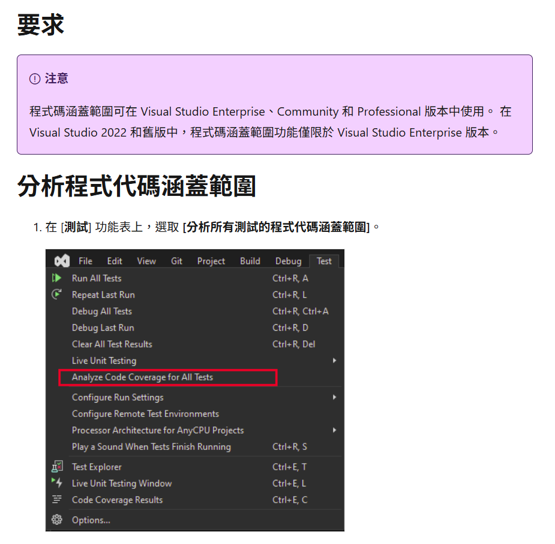

> 出處：[使用程式碼涵蓋範圍來判斷要測試多少程式碼 | Microsoft Learn](https://learn.microsoft.com/zh-tw/visualstudio/test/using-code-coverage-to-determine-how-much-code-is-being-tested)

接著實際操作。以 VS2026 開啟範例專案的 `Day06.CodeCoverage.sln`，內建涵蓋率有兩個入口：功能選單「`測試` → `分析所有測試的程式碼涵蓋範圍`」，或在 `測試總管` 中對選取的測試按右鍵執行「`分析程式碼涵蓋範圍`」。

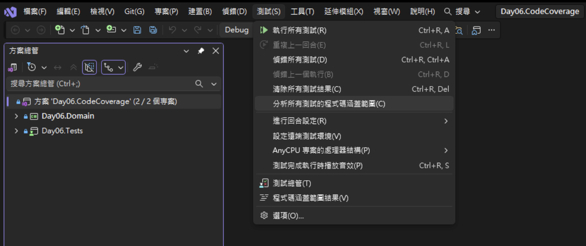

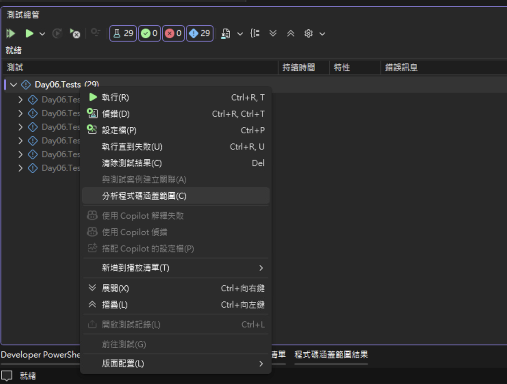

上兩圖為 Visual Studio 2026 **Community** 的操作畫面，分別是測試選單與測試總管右鍵的入口。

執行後會開啟「`程式碼涵蓋範圍結果`」視窗，以 %Lines 呈現各命名空間、類別的涵蓋率，範例專案整體約 93%：

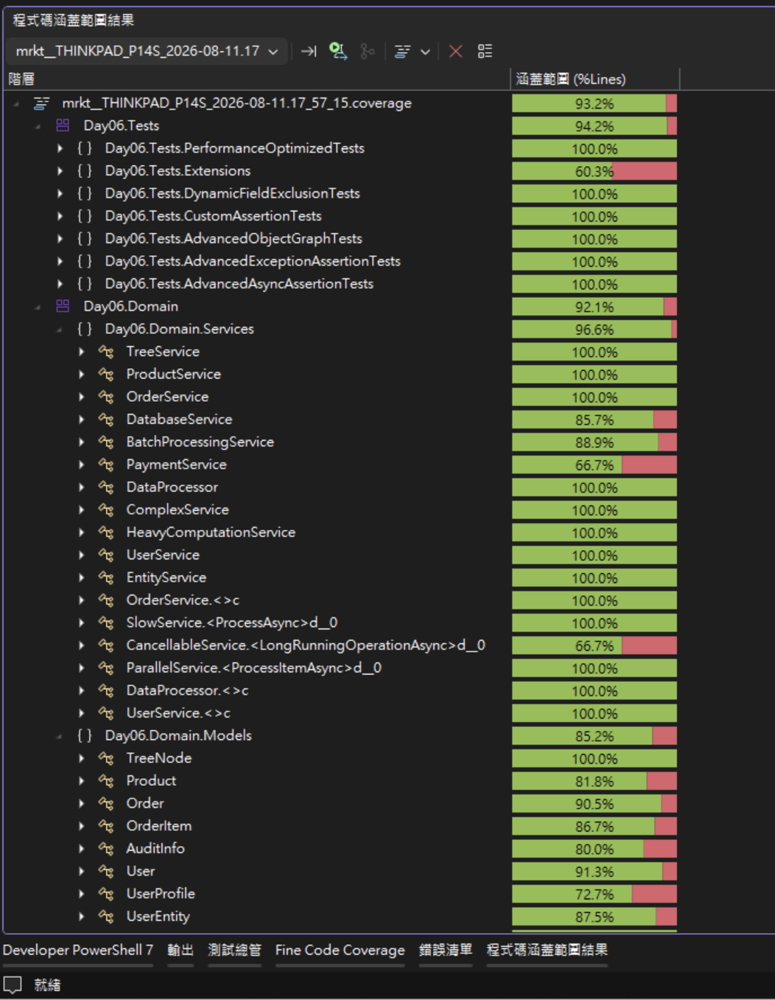

結果視窗的「`匯出結果`」可將原生二進位的 `.coverage` 轉存為可讀的 XML——預設是 Microsoft 自家的涵蓋率 XML 格式，匯出格式也可以選 **Cobertura**。兩種都能直接交給後面介紹的 ReportGenerator 產生完整 HTML 報告（純 GUI 操作也接得上這條流程），差別是自家 XML 格式只有行與區塊資料、沒有分支資料，產出的報告 Branch coverage 會是 N/A；想要完整的分支涵蓋資料，匯出時選 Cobertura。

匯出的 XML 除了交給 ReportGenerator，還有幾種用法：

- **腳本化處理**：XML 結構規則（`module` → `function` → `range`，都帶 `line_coverage` 屬性），可以寫腳本做涵蓋率門檻檢查，或列出 `covered="no"` 的行
- **團隊分享**：可讀的文字檔可以直接傳給同事或附在 PR 討論；對方若有同版本的原始碼，匯入後還能還原編輯器著色
- **合併多回合**：結果視窗的「`合併結果`」可把不同測試資料回合的結果合併成一份——例如兩次執行各涵蓋一半的分支，合併後就呈現完整涵蓋

> 匯出、匯入、傳送與合併（含合併的限制）的完整說明，見前面引用的官方文件「管理程式碼涵蓋範圍結果」與「合併不同執行次數的結果」兩節。

### dotnet-coverage 命令列工具

Visual Studio 內建涵蓋率的介紹到此告一段落。接著看第二種工具：獨立的命令列工具 `dotnet-coverage`，不開 IDE、或在 CI 環境收集涵蓋率時使用：

```bash
# 安裝工具
dotnet tool install -g dotnet-coverage

# 執行測試並產生報告
dotnet-coverage collect dotnet test
```

相關說明文件：

- [使用程式碼涵蓋範圍進行單元測試 | Microsoft Learn](https://learn.microsoft.com/zh-tw/dotnet/core/testing/unit-testing-code-coverage)
- [dotnet-coverage 程式碼涵蓋範圍公用程式 | Microsoft Learn](https://learn.microsoft.com/zh-tw/dotnet/core/additional-tools/dotnet-coverage)

限制：

- 要記一堆指令
- 流程比較麻煩
- 不夠直觀

### MTP 原生涵蓋率（官方）

xUnit v3 建構在 MTP 之上，`coverlet.collector`（VSTest 時代的收集器）已不適用。MTP 有微軟官方直接支援的涵蓋率擴充，於測試專案加入 `Microsoft.Testing.Extensions.CodeCoverage` 後，即可產出 cobertura 格式的涵蓋率資料，供後續的 ReportGenerator 使用：

```bash
# 加入涵蓋率擴充（範例專案 samples/day06 已加入；自己的專案以 CPM 管理版本時，此處僅示意套件名稱）
dotnet add package Microsoft.Testing.Extensions.CodeCoverage

# 執行測試並輸出 cobertura（.NET 10 原生 MTP 模式）
dotnet test --coverage --coverage-output-format cobertura --coverage-output coverage.cobertura.xml
```

> 實測版本矩陣（驗證日期 2026-08-11）：.NET SDK 10.0.302、xUnit v3 3.2.2、`Microsoft.Testing.Extensions.CodeCoverage` 18.9.0，於範例專案 `samples/day06` 實際執行測試並產出 cobertura 涵蓋率報告（輸出於 `TestResults/coverage.cobertura.xml`）。範例專案的 `Directory.Packages.props` 使用的就是 18.9.0，不需要刻意 pin 到更舊的版本。

看過三種工具後，要特別留意一件事：這裡產出的 `coverage.cobertura.xml`，與前面 Visual Studio「`匯出結果`」預設存出的自家 XML **同為 XML 檔，內容格式卻不同**。Cobertura 是開放格式，根節點為 `<coverage>`，以 package → class → line 組織並帶分支統計；自家格式根節點為 `<results>`，以 module → function → range 逐行記錄、沒有分支資料。ReportGenerator 兩種都讀得懂，但只支援 Cobertura 的工具（例如部分 CI 涵蓋率服務）吃不下自家格式——交檔案給其他系統前，先確認拿到的是哪一種。

跑完 `dotnet test --coverage` 只完成了資料收集，產出的 cobertura XML 還要轉成可讀的報告。後面的「產生完整的 HTML 涵蓋率報告（ReportGenerator）」小節會從執行測試開始，把整條流程走一遍。

---

## Fine Code Coverage 擴充套件

### 關於 Fine Code Coverage

`Fine Code Coverage（FCC）` 是免費、整合在 Visual Studio 裡的涵蓋率擴充套件，特色是自動反應測試總管（執行測試後即更新涵蓋率，不需明確 collect）、編輯器即時著色，且以 **Branch（分支）** 為統計單位（Visual Studio 內建以 Block 為單位）。FCC 也支援 MTP：在 MTP 專案下，若專案已安裝 Microsoft code coverage 擴充套件則會使用它，否則退回以 `dotnet-coverage` 收集。

VS2026 的擴充相容模型可直接載入 VS2022 版擴充，FCC 實測可在 VS2026 正常安裝；安裝方式為：延伸模組 → 管理延伸模組 → 搜尋 "Fine Code Coverage"。

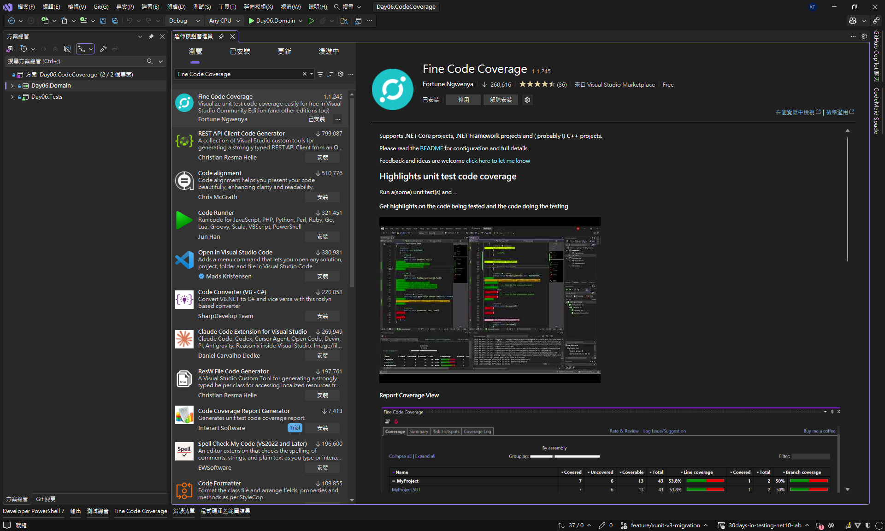

以 Day06 範例執行測試後，FCC 視窗自動更新逐類別的 Line／Branch 涵蓋率，編輯器行號旁同步著色：

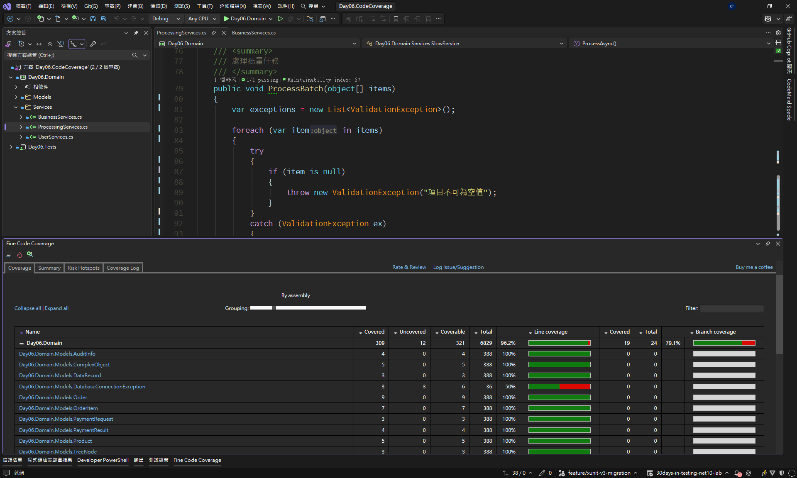

不過自 **Visual Studio 2026** 起，內建涵蓋率已下放至所有版本，加上 MTP 有官方原生的 CodeCoverage 擴充套件，完整報告又可交給 ReportGenerator，官方方案已相當完整。**因此本系列以官方方案為主軸**，FCC 在此僅作為工具生態的說明；若你偏好它的即時著色與分支統計，仍是一個可用的免費選項。

> 補充：FCC 作者本人也認為 Visual Studio 內建涵蓋率是後續的主要方向。

相關連結：

- [Fine Code Coverage - Visual Studio Marketplace](https://marketplace.visualstudio.com/items?itemName=FortuneNgwenya.FineCodeCoverage2022)
- [FortuneN/FineCodeCoverage - Github](https://github.com/FortuneN/FineCodeCoverage)

---

## 涵蓋率報告判讀與改善

不論使用哪一種工具取得涵蓋率，判讀與改善的方法都是共通的——工具只是取得資料的手段。

### 顏色標示判讀

涵蓋率會把程式碼分成三種狀態：

- **已涵蓋**：測試執行時有經過的程式碼
- **部分涵蓋**：一行含多個區塊（block），但只有部分被執行，常見於條件分支
- **未涵蓋**：測試完全沒有經過的程式碼

實際的編輯器配色依工具而異。以 Visual Studio 內建涵蓋率為例，在 `程式碼涵蓋範圍結果` 視窗點選「顯示程式碼涵蓋範圍著色」後，預設以**淺藍色**標示已涵蓋的程式碼，未涵蓋則以 `Coverage Not Touched Area` 的顏色標示；著色可套用在程式行或左緣圖示上，顏色可於 `工具 → 選項 → 環境 → 字型和色彩` 中的 Coverage 項目調整。

兩個要留意的行為：Visual Studio 內建涵蓋率以 **Block（區塊）** 為計數單位；而且修改程式碼或重跑測試後，舊的涵蓋率結果與著色**不會自動更新**，需重新執行分析。

### 改善策略

根據報告改善：

1. **優先處理未涵蓋區域**：完全沒被測試到的程式碼
2. **檢查部分涵蓋區域**：確認所有條件分支都有測試
3. **評估必要性**：簡單的 getter/setter 可能不需要測試

開發團隊通常以約 **80%** 為目標，但這並非絕對——某些情境（例如由樣板產生的程式碼）較低的涵蓋率也可以接受，一味追求 100% 未必劃算。

### 產生完整的 HTML 涵蓋率報告（ReportGenerator）

前述工具產出的 cobertura（例如官方 `Microsoft.Testing.Extensions.CodeCoverage` 擴充套件輸出的 `coverage.cobertura.xml`），可搭配 ReportGenerator 產生一份完整、可分享的 HTML 報告，內含 **Risk Hotspots（以 Cyclomatic Complexity、NPath Complexity、Crap Score 標示高風險方法）** 與分支涵蓋明細；若以 `-historydir` 累積多次執行結果，還能看到涵蓋率的歷史趨勢。

以範例專案 `samples/day06` 示範從執行測試到打開報告的完整流程。以下指令都在專案根目錄（`Day06.CodeCoverage.sln` 所在的目錄）執行：

1. 確認測試專案已加入涵蓋率擴充 `Microsoft.Testing.Extensions.CodeCoverage`（範例專案已加入；自己的專案還沒加的話，先執行）：

    ```bash
    dotnet add package Microsoft.Testing.Extensions.CodeCoverage
    ```

2. 執行測試並輸出 cobertura 格式的涵蓋率資料：

    ```bash
    dotnet test --coverage --coverage-output-format cobertura --coverage-output coverage.cobertura.xml
    ```

    執行完成後，涵蓋率資料會在專案根目錄的 `TestResults/coverage.cobertura.xml`。

3. 安裝 ReportGenerator 全域工具（只需要裝一次）：

    ```bash
    dotnet tool install -g dotnet-reportgenerator-globaltool
    ```

4. 由 cobertura XML 產生 HTML 報告，輸出到同一層的 `coveragereport/`：

    ```bash
    reportgenerator -reports:**/coverage.cobertura.xml -targetdir:coveragereport -reporttypes:Html
    ```

5. 開啟 `coveragereport/index.html` 檢視報告。

`-reports` 的來源不限 MTP 輸出的 cobertura：前面 Visual Studio「`匯出結果`」存出的 XML 檔也能直接當來源，例如 `reportgenerator -reports:code_coverage_report.xml ...`（自家 XML 格式一樣讀得懂，但如前所述沒有分支資料，報告的 Branch coverage 會是 N/A）。

在範例專案根目錄實際執行步驟 2 與步驟 4 的過程——終端機輸出、產出的 `coveragereport/` 目錄與報告預覽：

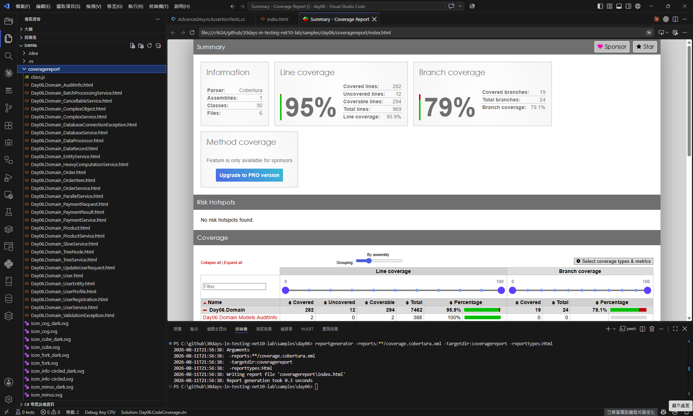

開啟 `coveragereport/index.html` 後的報告如下——Line coverage 95%、Branch coverage 79%，逐類別列出涵蓋明細（報告只統計受測程式碼 `Day06.Domain`，測試專案不計入，所以數字與前面 VS 結果視窗的整體 93% 不同）；Risk Hotspots 顯示「No risk hotspots found」，因為範例專案的方法複雜度最高只有 5，沒有超過門檻的高風險方法：

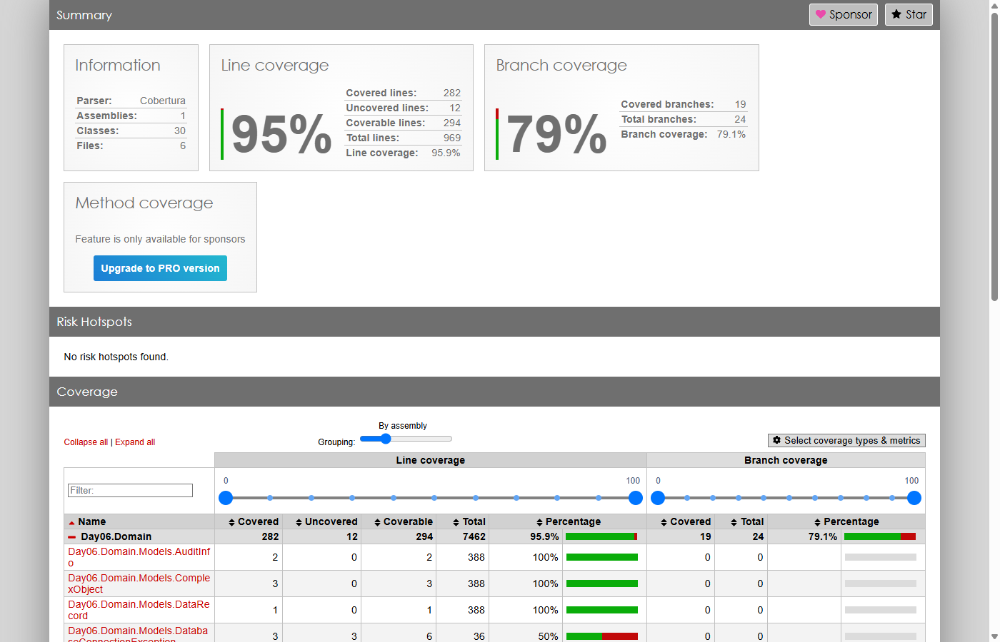

### Line Coverage 與 Branch Coverage 的差別

上面的報告同時出現了兩個數字：Line coverage 95%、Branch coverage 79%。這是判讀報告時常見的疑問——兩者意思不一樣：

- **Line coverage（行涵蓋率）**：有多少「行」程式碼在測試中被執行過。
- **Branch coverage（分支涵蓋率）**：每個條件判斷的分支（true／false 兩條路）有多少被走過。

行都跑過不代表分支都試過。看一個例子：

```csharp
public decimal CalculateTotal(decimal amount)
{
    var discount = amount > 1000 ? 0.1m : 0m;

    return amount * (1 - discount);
}
```

只寫一個 `amount = 2000` 的測試：每一行都被執行過，line coverage 100%；但 `amount <= 1000`、不打折的那條路從來沒走過，branch coverage 只有 50%。萬一不打折的路徑有 bug，這樣的測試完全抓不到。

這裡刻意用三元運算子。如果改寫成沒有 `else` 的 `if`，同一個測試量出來會不一樣——工具判定分支走沒走滿，看的是分支的目標位置有沒有被執行到，而 `if` 少了 `else` 的時候，「條件不成立」的目標剛好就是 `if` 區塊結束後的下一行；只要區塊跑過一次，兩個目標都算走到，branch 反而會顯示 100%。那種寫法只測 `amount = 2000` 得到的是 100%／100%，只測 `amount = 500` 才會看到 62.5%／50%（`Microsoft.Testing.Extensions.CodeCoverage` 與 coverlet 量到的數字一致）。

範例專案報告的 95% 與 79% 落差就是這個現象：行大多有跑到，但部分條件只測了其中一邊。判讀報告時，branch coverage 是比較嚴格的指標；前面 Visual Studio 著色裡的「部分涵蓋」，通常就是分支沒走滿的位置。

---

## VS Code 測試涵蓋率功能

如果你使用 VS Code，也可以直接分析測試涵蓋率。它的測試功能支援多種語言和框架，適合跨平台開發。

### VS Code 測試功能特色

- 支援多種語言：JavaScript、TypeScript、Python、Java、C# 等
- 豐富的擴充套件：支援 Jest、Mocha、Pytest、JUnit 等測試框架
- 整合式管理：Test Explorer 提供統一的測試管理介面
- 內建涵蓋率檢視：可以直接查看涵蓋率結果

### 開始使用

1. **安裝測試擴充套件**
   - 按 `Ctrl+Shift+X` 開啟擴充功能
   - 搜尋適合你專案的測試擴充套件 (dotnet C# 就安裝 `C# Dev Kit`)

2. **開啟測試總管**
   - 點選活動列的燒杯圖示
   - 或執行命令：`Testing: Focus on 測試總管 View`

3. **相關連結**
    - [Visual Studio Code > BUILD,DEBUG,TEST > Testing](https://code.visualstudio.com/docs/debugtest/testing)

### 測試涵蓋率功能

VS Code 提供幾種方式檢視涵蓋率：

#### 執行涵蓋率測試

有幾種執行方式：

- 在 `測試總管` 點選「`執行涵蓋範圍測試`」
- 在編輯器中對測試方法按滑鼠右鍵，選「`在涵蓋範圍涵蓋的數據指標上執行測試`」（`Ctrl+;` `Ctrl+Shift+C`；中文選單文字為 VS Code 語言套件的翻譯，功能就是「以涵蓋範圍執行游標處的測試」）
- 透過命令面板執行涵蓋率指令

    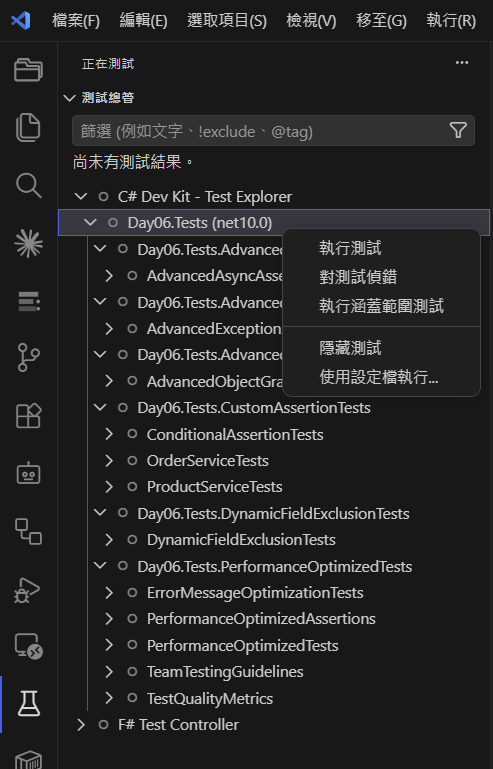

    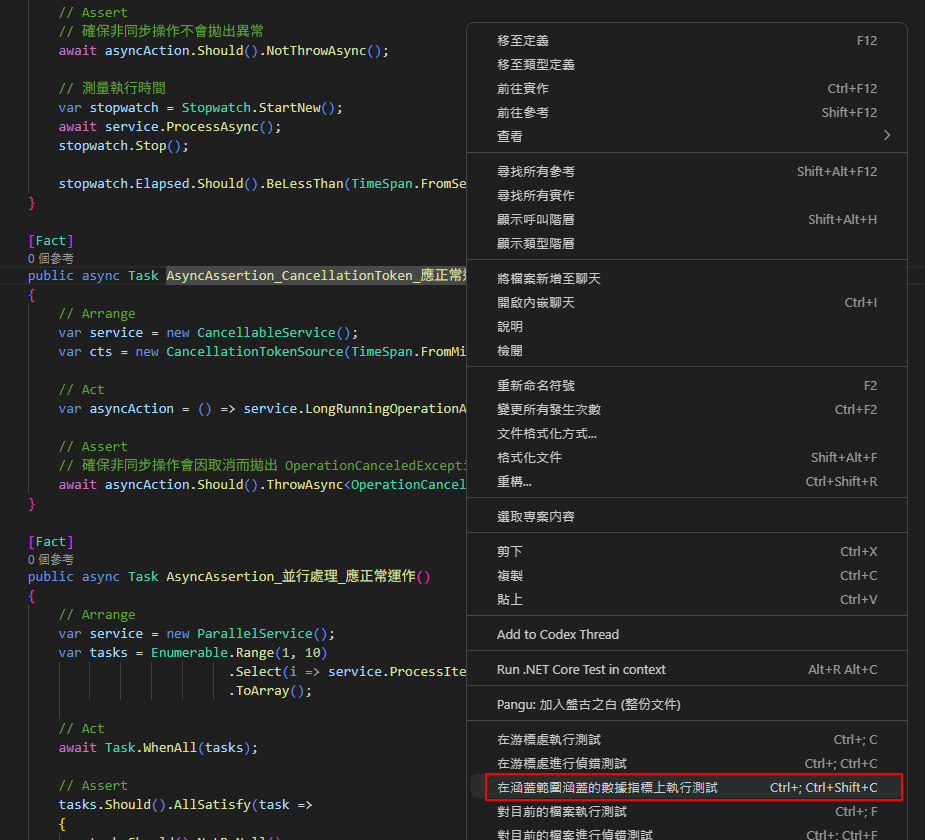

#### 測試涵蓋範圍

顯示樹狀結構的涵蓋率資訊：

- 各檔案的涵蓋率百分比
- 用顏色表示涵蓋率等級
- 滑鼠懸停可看詳細資料

    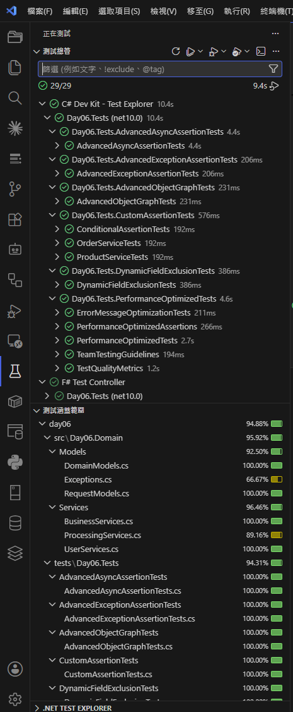

#### 編輯器內顯示

直接在程式碼中標示：

- 綠色：已涵蓋的程式碼
- 紅色：未涵蓋的程式碼
- 執行次數：顯示每行被執行的次數
- 切換顯示：`Test: Show Inline Coverage (測試: 切換內嵌涵蓋範圍)` (Ctrl+; Ctrl+Shift+I)

    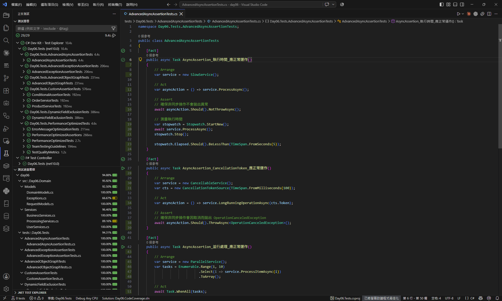

#### 檔案總管顯示

在檔案總管中直接顯示各檔案的涵蓋率百分比，方便快速識別需要加強測試的檔案。

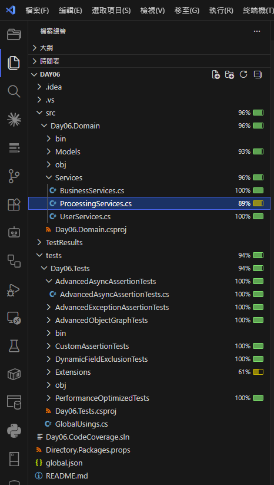

### VS Code 測試設定

可以調整的設定項目：

| 設定                               | 用途                     |
| ---------------------------------- | ------------------------ |
| `testing.countBadge`               | 活動列測試圖示的計數顯示 |
| `testing.gutterEnabled`            | 編輯器邊欄測試控制項     |
| `testing.defaultGutterClickAction` | 邊欄控制項預設動作       |
| `testing.coverageBarThresholds`    | 涵蓋率顏色閾值           |
| `testing.displayedCoveragePercent` | 涵蓋率百分比顯示類型     |
| `testing.showCoverageInExplorer`   | 檔案總管涵蓋率顯示       |

### VS Code vs Visual Studio

| 項目       | VS Code               | Visual Studio                   |
| ---------- | --------------------- | ------------------------------- |
| 平台支援   | Windows, macOS, Linux | 主要 Windows                    |
| 語言支援   | 多語言（透過擴充）    | 主要 .NET 語言                  |
| 測試框架   | 廣泛支援              | MSTest, xUnit, NUnit            |
| 涵蓋率工具 | 內建支援              | 內建支援（全版本）+ FCC／第三方 |
| 適用情境   | 跨平台、多語言        | .NET 專案                       |

---

## 程式碼複雜度評估

> 以下工具為 Visual Studio 的 Extensions (不是 VS Code 的 Extensions)

### CodeMaintainability 擴充套件

除了 Code Coverage，還可以用程式碼可維護性指標評估測試需求：

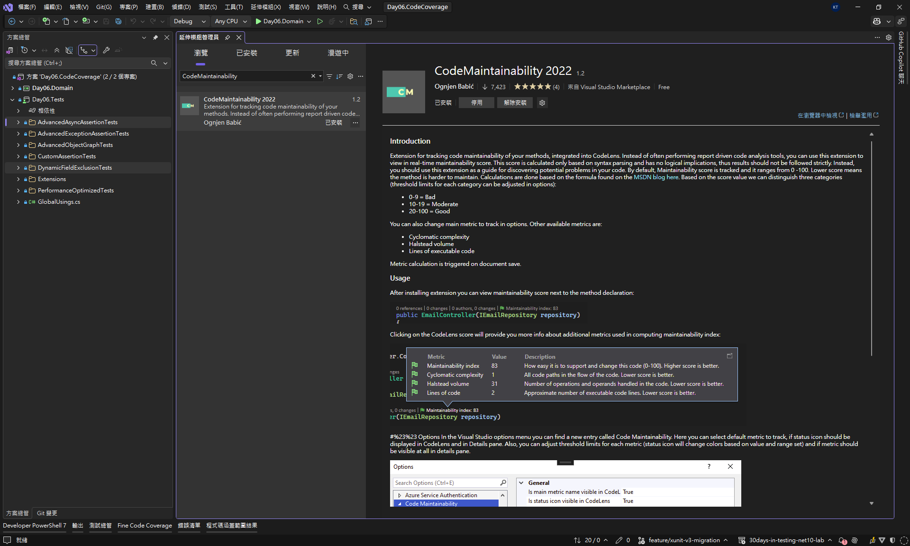

### 可維護性指標

CodeMaintainability 提供的指標：

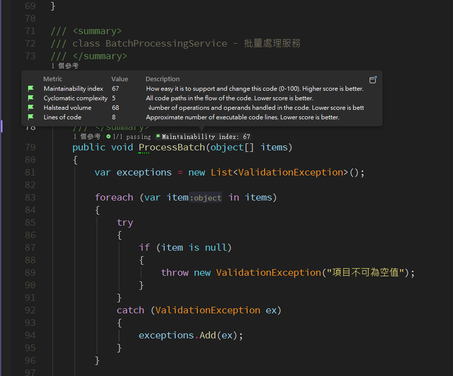

1. **Maintainability Index (0-100)**：可維護性指數
   - 0-9：差
   - 10-19：中等
   - 20-100：良好

2. **Cyclomatic Complexity**：循環複雜度
   - 程式的邏輯路徑數量
   - 數值越高，需要的測試案例越多

3. **Halstead Volume**：程式碼體積
   - 運算子與運算元的複雜度

4. **Lines of Code**：程式碼行數

### 循環複雜度（Cyclomatic Complexity）與測試案例的關係

循環複雜度除了衡量邏輯複雜度，也能協助判斷「至少」需要幾個單元測試案例。

**為什麼循環複雜度可以當作測試案例的下限？**

循環複雜度的數值代表程式中所有獨立邏輯路徑（independent paths）的數量。為了達到 `完整的邏輯涵蓋（branch coverage）`，理論上你需要撰寫至少等同於循環複雜度數值的測試案例，以涵蓋所有可能的邏輯分支。

### Max 方法範例

```csharp
public int Max(int[] array)
{
    if (array == null || array.Length == 0)
    {
        throw new ArgumentException("array must not be empty.");
    }

    int max = array[0];

    for (int i = 1; i < array.Length; i++)
    {
        if (array[i] > max)
        {
            max = array[i];
        }
    }

    return max;
}
```

在實務中，我們可以用一個簡化的方式來估算：

> 每個條件判斷（如 if、for、while、case、&&、||）都會增加 1

**Max 方法的循環複雜度分析：**

| 程式碼                                        | 複雜度 |
| --------------------------------------------- | ------ |
| `if (array == null` \|\| `array.Length == 0)` | +2     |
| `for (int i = 1; i < array.Length; i++)`      | +1     |
| `if (array[i] > max)`                         | +1     |
| 方法本身                                      | +1     |
| **總計**                                      | **5**  |

Max 這個方法的 `循環複雜度為 5`，代表它有 5 條獨立的邏輯路徑。這也表示：

- `至少需要 5 個單元測試案例` 才能涵蓋所有邏輯分支 (每個邏輯路徑都被執行過一次)。
- 如果想要達到 100% branch coverage，這個數字就是一個很好的起點。

**測試案例設計：**

以下是根據 Max(int[] array) 方法的循環複雜度為 5 所設計的 `5 個單元測試案例`，每個案例都對應一條獨立的邏輯路徑，確保涵蓋所有條件與分支：

| 測試案例                            | 測試內容     | 涵蓋路徑            |
| ----------------------------------- | ------------ | ------------------- |
| `Max_傳入null_應拋出例外`           | 傳入 null    | `array == null`     |
| `Max_傳入空陣列_應拋出例外`         | 傳入空陣列   | `array.Length == 0` |
| `Max_陣列只有單一元素_應回傳該元素` | 單一元素     | 不進入迴圈          |
| `Max_最大值在開頭_應回傳最大值`     | 最大值在開頭 | 迴圈不更新 max      |
| `Max_最大值在中間_應回傳最大值`     | 最大值在中間 | 迴圈更新 max        |

---

## CodeMaid Spade 視覺化分析

### CodeMaid 簡介

CodeMaid 是另一個實用的 Visual Studio 擴充套件：

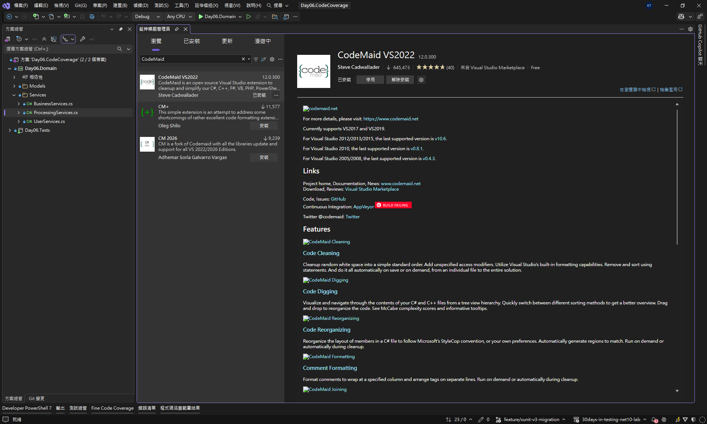

### Spade 功能

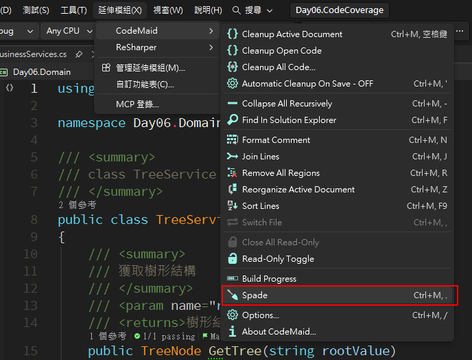

開啟 CodeMaid Spade 檢視程式碼結構：

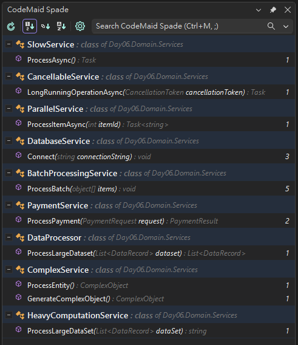

Spade 功能：

- 顯示類別成員的循環複雜度
- 幫助識別需要重構的程式碼

### 實際專案的複雜度警告

實際專案中可能出現高複雜度警告：

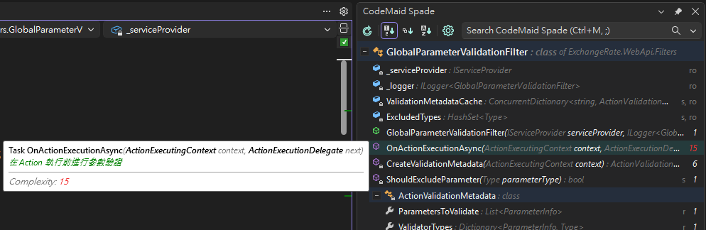

當看到紅色數字時：

- 該方法邏輯過於複雜
- 需要大量測試案例來涵蓋所有路徑
- 應該考慮重構

影響：

- 難以撰寫完整的單元測試
- 維護成本高
- 出錯風險增加

---

## 實戰建議

### 測試案例數量決策

1. **基於需求分析**：
   - 列出方法的使用案例
   - 識別邊界條件和例外情況
   - 考慮業務邏輯的各種情境

2. **參考複雜度指標**：
   - 循環複雜度提供測試案例下限
   - 高複雜度方法需要更多測試
   - 考慮重構降低複雜度

3. **平衡涵蓋率與品質**：
   - 不以 100% 涵蓋率為唯一目標
   - 專注於關鍵業務邏輯
   - 確保測試的實際價值

### 測試策略

1. 邊界測試：測試輸入值的上下限
2. 例外測試：驗證錯誤處理邏輯
3. 主流程測試：涵蓋正常的業務流程
4. 條件分支測試：確保所有分支都有測試

### 持續改善

1. 定期檢視報告：每次提交前檢查涵蓋率變化
2. 識別風險區域：檢查未涵蓋的關鍵程式碼
3. 漸進式改善：逐步提升重要模組的測試涵蓋率
4. 團隊協作：建立測試標準和流程

---

## 總結

今天的重點：

- Code Coverage 的正確認知：當作工具而非目標
- 官方方案為主軸：VS2026 內建涵蓋率（全版本開放）、MTP 原生 CodeCoverage 擴充搭配 ReportGenerator、VS Code 涵蓋率檢視
- 工具生態補充：Fine Code Coverage，以及評估複雜度的 CodeMaintainability 與 CodeMaid

---

## 老派工程師的心得感想

### 到底要寫多少測試案例才足夠？

單元測試案例的數量可以根據程式碼的複雜度和重要性來決定。可以使用以下方法來確定測試案例的數量：

- 邊界測試：測試輸入值的上下限，確保系統在極端情況下能正常執行。
- 驗證測試：確保輸入值符合預期格式和範圍。
- 條件判斷測試：測試不同條件下的分支路徑，確保每個分支都能正確執行。

### CodeMaid 對於寫單元測試的幫助？

看到這裡你可能會想：CodeMaid 是幫你整理程式碼的工具，跟寫單元測試好像沒什麼直接關係。

前面一直都有提到很多開發人員對於單元測試最在乎的一件事「`要寫多少的測試案例？`」

可以藉由 CodeMaid 所提供的一個小功能來得到一個粗略的數字，而這個數字不是一個相當準確的答案，但至少可以讓開發人員藉此來取得「`至少要寫多少個測試案例`」的參考依據。

### 個人建議

我的建議會是開發者依據需求 (SA 或 SD 規格)，去寫出功能的 `使用案例`，就是這個功能的 `使用說明書`，以使用這個方法的 User 角度去描述這個功能要怎麼使用，例如：

- 當輸入錯誤或沒有輸入資料的情境下，方法會有什麼錯誤訊息或回傳什麼樣的資料。
- 當輸入不符合規格的資料後，方法執行會回傳什麼樣的錯誤訊息。
- 當輸入符合規格的資料後，方法執行會回傳什麼樣的結果。
- 當輸入符合規格的資料後，遇到一些情境或狀態的判斷後，影響後續回傳結果。

而這些使用案例逐一列出來之後，我們就會知道程式會怎麼開發、要寫哪些的測試案例來驗證實作程式碼。而這些使用案例也就可以轉換作為測試案例。

### 實際開發的情況

實際的工作專案可能就無法依據 Code Maintainability 或 Code Metric 就可以判斷要寫多少測試案例，複雜度與可維護性的資料就只能當作參考。

專案開發時就會真的需要將使用案例逐一列出，接著依據需求規格與使用案例將程式實作出來，在實作的過程中就會知道有哪些情境會需要測試。

要寫多少個測試案例並沒有一個標準，甚至連達到 100% 程式碼涵蓋率的程式碼也並不表示就寫完了所有的測試案例。因為資料的多樣性與變化、需求規格的複雜等因素，對程式開發人員來說也只能盡量地讓已知的測試情境去寫出來。

`系統能夠正確地運作執行並不代表該系統的品質就是好的`，只是都沒有執行到會出錯的情境而已，一旦出現了當初設計、開發時沒有設想到的情境時，系統就會出現錯誤，而這就是系統的 BUG，然後為了要修復這個 BUG 而要去修改程式碼。

對一個沒有單元測試涵蓋的程式碼去做異動，就如同矇著眼睛走進一個到處埋著地雷的危險地帶。沒有單元測試的保護，異動程式碼任何一個地方都無法保證不會對既有功能有影響，甚至於影響到什麼地方也都充滿著未知。

所以

- 盡可能地為實作程式碼寫單元測試
- 盡可能地降低程式碼的循環複雜度

---

## 明日預告

前幾篇處理了測試基礎、xUnit、AwesomeAssertions 與 Code Coverage。接下來的問題是：單元測試該如何隔離外部相依性？

當程式碼需要存取資料庫、呼叫 API、讀取檔案或使用系統時間時，這些相依性會讓測試：

- 執行緩慢且結果不穩定
- 依賴特定環境才能執行
- 無法控制測試情境

明天會介紹 **「相依替代入門：使用 NSubstitute」**：

- **NSubstitute 實作技巧**：如何替代外部相依性
- **實際應用**：模擬資料庫存取、API 呼叫等常見情境
- **程式設計原則**：如何讓程式碼更容易測試
- **Test Double 基本概念**：Dummy、Stub、Fake、Spy、Mock 的差異

這是從基礎測試進階到實用單元測試的關鍵步驟。

---

## 參考資料

### 官方文件

- [.NET 的單元測試最佳做法 > 程式碼涵蓋範圍和程式碼品質](https://learn.microsoft.com/zh-tw/dotnet/core/testing/unit-testing-best-practices#code-coverage-and-code-quality)
- [使用程式碼涵蓋範圍進行單元測試 | Microsoft Learn](https://learn.microsoft.com/zh-tw/dotnet/core/testing/unit-testing-code-coverage)
- [dotnet-coverage 程式碼涵蓋範圍公用程式 | Microsoft Learn](https://learn.microsoft.com/zh-tw/dotnet/core/additional-tools/dotnet-coverage)

### 工具

- [Fine Code Coverage - Visual Studio Marketplace](https://marketplace.visualstudio.com/items?itemName=FortuneNgwenya.FineCodeCoverage2022)
- [Fine Code Coverage | Github](https://github.com/FortuneN/FineCodeCoverage)
- [CodeMaintainability 2022 - Visual Studio Marketplace](https://marketplace.visualstudio.com/items?itemName=ognjen-babic.CodeMaintainability2022)
- [CodeMaid VS2022 - Visual Studio Marketplace](https://marketplace.visualstudio.com/items?itemName=SteveCadwallader.CodeMaidVS2022)
- [GitHub - codecadwallader/codemaid](https://github.com/codecadwallader/codemaid)

### 相關連結

- [通過 Coverlet + ReportGenerator + Fine Code Coverage 產生測試涵蓋率報表 | 余小章 @ 大內殿堂 - 點部落](https://dotblogs.com.tw/yc421206/2021/04/19/via_coverlet_reportGenerator_fine_code_coverage_generate_test_code_coverage)

範例程式碼：

- <https://github.com/kevintsengtw/30days-in-testing-net10/tree/main/samples/day06>

---

**這是「重啟挑戰：老派軟體工程師的測試修練」的第六天。明天會介紹 Day 07：相依替代入門 - 使用 NSubstitute。**
