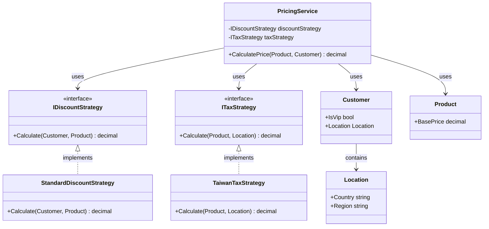
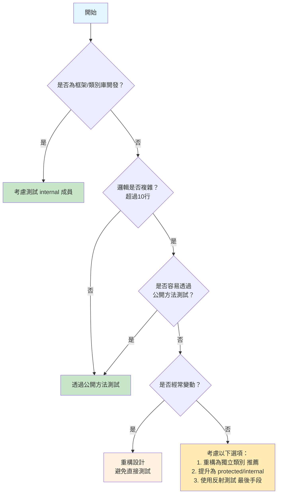

# Day 09 - 測試私有與內部成員 - Private 與 Internal 的測試策略

## 前言

測試程式碼時常會碰到一個問題：到底該不該測試 `私有（private）` 和 `內部（internal）` 成員？答案牽涉的不只測試工具，還包括類別的責任與設計邊界。

實際專案常有複雜的私有邏輯與元件內部的 internal 類別。今天要處理的問題是：怎麼測試這些成員，又不破壞封裝？

## 本日學習目標

- 建立正確的封裝測試思維，理解何時該測試、何時不該測試
- 掌握 Internal 成員的三種測試可見性技術與選用時機
- 學會使用反射技術測試私有方法，並評估其風險
- 理解替代設計模式如何改善可測試性
- 建立實務決策框架，避免測試成為技術債務

## 為什麼要討論私有與內部成員的測試？

程式碼不只有公開方法。複雜業務邏輯可能藏在私有方法裡，元件內部則靠 internal 成員協作。這些非公開程式碼也要維持品質，但直接測試會碰到封裝與維護成本的取捨。

### 封裝原則 vs 測試需求的平衡

#### 設計優先的測試思維

有這麼一個原則：**好的設計自然就有好的可測試性**。

如果你發現自己經常需要測試私有方法，大部分可能是設計出了問題。

```csharp
// 有問題的設計：複雜的私有邏輯
public class OrderProcessor
{
    public OrderResult ProcessOrder(Order order)
    {
        var validationResult = ValidateOrder(order);
        if (!validationResult.IsValid)
        {
            return OrderResult.Failed(validationResult.Errors);
        }

        var discountAmount = CalculateDiscount(order);
        var tax = CalculateTax(order, discountAmount);
        var total = CalculateTotal(order, discountAmount, tax);

        return OrderResult.Success(total);
    }

    // 複雜的私有方法，很想測試它
    private decimal CalculateDiscount(Order order)
    {
        // 20 行複雜的折扣計算邏輯
        // 各種會員等級、促銷活動、季節性折扣...
    }

    private decimal CalculateTax(Order order, decimal discountAmount)
    {
        // 15 行複雜的稅率計算
        // 根據地區、商品類型、企業使用者...
    }
}
```

### 更好的設計：責任分離

```csharp
// 改進的設計：將複雜邏輯提取為獨立的服務
public class OrderProcessor
{
    private readonly IDiscountCalculator _discountCalculator;
    private readonly ITaxCalculator _taxCalculator;
    private readonly IOrderValidator _orderValidator;

    public OrderProcessor(
        IDiscountCalculator discountCalculator,
        ITaxCalculator taxCalculator,
        IOrderValidator orderValidator)
    {
        _discountCalculator = discountCalculator;
        _taxCalculator = taxCalculator;
        _orderValidator = orderValidator;
    }

    public OrderResult ProcessOrder(Order order)
    {
        var validationResult = _orderValidator.Validate(order);
        if (!validationResult.IsValid)
        {
            return OrderResult.Failed(validationResult.Errors);
        }

        var discountAmount = _discountCalculator.Calculate(order);
        var tax = _taxCalculator.Calculate(order, discountAmount);
        var total = order.Amount - discountAmount + tax;

        return OrderResult.Success(total);
    }
}

// 現在每個計算器都可以獨立測試
public class DiscountCalculator : IDiscountCalculator
{
    public decimal Calculate(Order order)
    {
        // 複雜的折扣計算邏輯
        // 但現在是公開方法，容易測試
    }
}
```

這種設計的好處：

- 每個計算器都有清楚的職責
- 可以獨立測試每個元件
- 容易進行單元測試和整合測試
- 符合開放封閉原則

這種設計把測試焦點放在元件的公開行為，內部實作可以自由重構。

> 我們只會對類別裡的公開方法做測試，不需要刻意地去對私有方法做測試。
> 私有方法必定會有公開方法去使用，所以有對公開方法做了測試就會測試到私有方法。

## Internal 成員的測試策略

有時候我們需要測試 internal 成員，特別是在建立類別庫或框架時。.NET 提供了幾種讓測試專案能夠存取 internal 成員的方法。

### 實作範例專案

我們來建立一個實際的例子來展示不同的技術。首先安裝必要的套件：

```powershell
dotnet add package NSubstitute
dotnet add package AwesomeAssertions
```

**主要專案中的 Internal 類別：**

```csharp
// PriceCalculator.cs
namespace Day09.Core;

/// <summary>
/// class PriceCalculator - 價格計算器（僅供內部使用）
/// </summary>
internal class PriceCalculator
{
    /// <summary>
    /// 計算商品等級
    /// </summary>
    /// <param name="price">商品價格</param>
    /// <returns>商品等級</returns>
    internal string CalculatePriceLevel(decimal price)
    {
        return price switch
        {
            >= 10000 => "豪華級",
            >= 5000 => "高級",
            >= 1000 => "中級",
            > 0 => "經濟級",
            _ => "無效價格"
        };
    }

    /// <summary>
    /// 計算折扣後價格
    /// </summary>
    /// <param name="originalPrice">原價</param>
    /// <param name="discountRate">折扣率 (0-1之間)</param>
    /// <returns>折扣後價格</returns>
    internal decimal CalculateDiscountedPrice(decimal originalPrice, decimal discountRate)
    {
        if (discountRate is < 0 or > 1)
        {
            throw new ArgumentException("折扣率必須在0到1之間");
        }

        return originalPrice * (1 - discountRate);
    }
}
```

### 方法一：使用 InternalsVisibleTo 屬性

最直接的方法是在元件中加入 `InternalsVisibleTo` 屬性：

```csharp
// AssemblyInfo.cs 或任何類別檔案中
using System.Runtime.CompilerServices;

[assembly: InternalsVisibleTo("Day09.Tests")]
```

**測試程式碼：**

```csharp
// PriceCalculatorTests.cs
namespace Day09.Tests;

/// <summary>
/// PriceCalculator 測試類別（測試 Internal 成員）
/// </summary>
public class PriceCalculatorTests
{
    [Theory]
    [InlineData(15000, "豪華級")]
    [InlineData(8000, "高級")]
    [InlineData(3000, "中級")]
    [InlineData(500, "經濟級")]
    [InlineData(0, "無效價格")]
    public void CalculatePriceLevel_不同價格_應回傳正確等級(decimal price, string expected)
    {
        // Arrange
        var calculator = new PriceCalculator();

        // Act
        var actual = calculator.CalculatePriceLevel(price);

        // Assert
        actual.Should().Be(expected);
    }

    [Theory]
    [InlineData(1000, 0.1, 900)]
    [InlineData(2000, 0.2, 1600)]
    [InlineData(500, 0.05, 475)]
    public void CalculateDiscountedPrice_正常折扣_應計算正確價格(
        decimal originalPrice, decimal discountRate, decimal expected)
    {
        // Arrange
        var calculator = new PriceCalculator();

        // Act
        var actual = calculator.CalculateDiscountedPrice(originalPrice, discountRate);

        // Assert
        actual.Should().Be(expected);
    }

    [Theory]
    [InlineData(-0.1)]
    [InlineData(1.1)]
    public void CalculateDiscountedPrice_無效折扣率_應拋出例外(decimal invalidDiscountRate)
    {
        // Arrange
        var calculator = new PriceCalculator();

        // Act & Assert
        var action = () => calculator.CalculateDiscountedPrice(1000, invalidDiscountRate);
        action.Should().Throw<ArgumentException>()
              .WithMessage("折扣率必須在0到1之間");
    }
}
```

### 方法二：在 csproj 中設定

```xml
<!-- Day09.Core.csproj -->
<Project Sdk="Microsoft.NET.Sdk">

  <PropertyGroup>
    <TargetFramework>net10.0</TargetFramework>
    <ImplicitUsings>enable</ImplicitUsings>
    <Nullable>enable</Nullable>
  </PropertyGroup>

  <ItemGroup>
    <AssemblyAttribute Include="System.Runtime.CompilerServices.InternalsVisibleToAttribute">
      <_Parameter1>Day09.Tests</_Parameter1>
    </AssemblyAttribute>
  </ItemGroup>

</Project>
```

### 方法三：使用 Meziantou.MSBuild.InternalsVisibleTo

對於複雜的專案，推薦使用這個 NuGet 套件：

**相關連結：**

- [Declaring InternalsVisibleTo in the csproj - Meziantou's blog](https://www.meziantou.net/declaring-internalsvisibleto-in-the-csproj.htm)
- [GitHub - meziantou/Meziantou.MSBuild.InternalsVisibleTo](https://github.com/meziantou/Meziantou.MSBuild.InternalsVisibleTo)
- [NuGet Gallery | Meziantou.MSBuild.InternalsVisibleTo](https://www.nuget.org/packages/Meziantou.MSBuild.InternalsVisibleTo)

```xml
<!-- Day09.Core.csproj -->
<ItemGroup>
  <PackageReference Include="Meziantou.MSBuild.InternalsVisibleTo" Version="1.0.2">
    <PrivateAssets>all</PrivateAssets>
    <IncludeAssets>runtime; build; native; contentfiles; analyzers; buildtransitive</IncludeAssets>
  </PackageReference>
</ItemGroup>

<ItemGroup>
  <InternalsVisibleTo Include="$(AssemblyName).Tests" />
  <InternalsVisibleTo Include="$(AssemblyName).IntegrationTests" />
</ItemGroup>
```

### Internal 測試的風險評估

| 評估面向   | 風險程度 | 說明                             |
| :--------- | :------- | :------------------------------- |
| 封裝性破壞 | 中等     | 增加了測試對內部實作的相依       |
| 重構阻力   | 高       | 改變 internal 成員會影響測試     |
| 維護成本   | 中等     | 需要同步維護生產程式碼和測試程式碼   |
| 設計品質   | 低       | 如果過度使用，可能表示設計有問題 |

**何時適合測試 Internal 成員：**

- 框架或類別庫開發
- 複雜的內部演算法驗證
- 效能關鍵的內部元件
- 安全相關的內部邏輯

## 私有方法的測試技術

### 使用反射測試私有方法

雖然我們強調設計優先，但在實務中仍有需要測試私有方法的情況：

**需要測試私有方法的常見情境：**

1. **複雜演算法驗證**：私有方法包含重要的業務邏輯或數學運算，需要獨立驗證正確性
2. **效能關鍵路徑**：私有方法是系統的效能瓶頸，需要精確測試其行為
3. **安全相關邏輯**：涉及加密、驗證等安全機制的私有方法
4. **遺留系統重構**：既有系統的私有方法邏輯複雜，重構前需要先建立測試保護網
5. **特殊邊界條件**：某些邊界情況只能由私有方法觸發，難以從公開方法測試

以下是實作技術：

```csharp
// 包含私有方法的類別
using Day09.Core.Models;

namespace Day09.Core;

/// <summary>
/// class PaymentProcessor - 付款處理器
/// </summary>
public class PaymentProcessor
{
    /// <summary>
    /// 處理付款
    /// </summary>
    /// <param name="request">付款請求</param>
    /// <returns>付款結果</returns>
    public PaymentResult ProcessPayment(PaymentRequest request)
    {
        if (!ValidateRequest(request))
        {
            return PaymentResult.Failed("Invalid request");
        }

        var fee = CalculateFee(request.Amount, request.PaymentMethod);
        var total = request.Amount + fee;

        return PaymentResult.Success(total);
    }

    /// <summary>
    /// 驗證請求（私有方法，包含複雜邏輯）
    /// </summary>
    /// <param name="request">付款請求</param>
    /// <returns>是否有效</returns>
    private bool ValidateRequest(PaymentRequest request)
    {
        return request is { Amount: > 0 };
    }

    /// <summary>
    /// 計算手續費（私有方法，包含複雜邏輯）
    /// </summary>
    /// <param name="amount">金額</param>
    /// <param name="method">付款方式</param>
    /// <returns>手續費</returns>
    private decimal CalculateFee(decimal amount, PaymentMethod method)
    {
        return method switch
        {
            PaymentMethod.CreditCard => amount * 0.03m,
            PaymentMethod.DebitCard => amount * 0.01m,
            PaymentMethod.BankTransfer => Math.Max(amount * 0.005m, 10m),
            _ => 0m
        };
    }

    /// <summary>
    /// 檢查是否為工作日（靜態私有方法）
    /// </summary>
    /// <param name="date">日期</param>
    /// <returns>是否為工作日</returns>
    private static bool IsBusinessDay(DateTime date)
    {
        return date.DayOfWeek != DayOfWeek.Saturday &&
               date.DayOfWeek != DayOfWeek.Sunday;
    }
}
```

**測試私有執行個體方法：**

```csharp
[Theory]
[InlineData(1000, PaymentMethod.CreditCard, 30)]
[InlineData(1000, PaymentMethod.DebitCard, 10)]
[InlineData(1000, PaymentMethod.BankTransfer, 10)]
[InlineData(100, PaymentMethod.BankTransfer, 10)]  // 最低手續費
[InlineData(5000, PaymentMethod.BankTransfer, 25)] // 5000 * 0.005 = 25
public void CalculateFee_不同付款方式_應計算正確手續費(
    decimal amount, PaymentMethod method, decimal expected)
{
    // Arrange
    var processor = new PaymentProcessor();
    var type = typeof(PaymentProcessor);
    var methodInfo = type.GetMethod("CalculateFee", BindingFlags.NonPublic | BindingFlags.Instance);

    // Act
    var actual = (decimal)(methodInfo!.Invoke(processor, [amount, method]) ?? 0m);

    // Assert
    actual.Should().Be(expected);
}
```

**測試靜態私有方法：**

```csharp
[Theory]
[InlineData("2024-03-15", true)]  // 星期五
[InlineData("2024-03-16", false)] // 星期六
[InlineData("2024-03-17", false)] // 星期日
[InlineData("2024-03-18", true)]  // 星期一
public void IsBusinessDay_不同日期_應回傳正確結果(string dateString, bool expected)
{
    // Arrange
    var date = DateTime.Parse(dateString);
    var type = typeof(PaymentProcessor);
    var methodInfo = type.GetMethod("IsBusinessDay", BindingFlags.NonPublic | BindingFlags.Static);

    // Act
    var actual = (bool)(methodInfo!.Invoke(null, [date]) ?? false);

    // Assert
    actual.Should().Be(expected);
}
```

### 反射測試的輔助方法

為了簡化反射測試，可以建立輔助方法：

```csharp
// Helpers/ReflectionTestHelper.cs
using System;

namespace Day09.Tests.Helpers;

/// <summary>
/// 反射測試輔助類別
/// </summary>
public static class ReflectionTestHelper
{
    /// <summary>
    /// 呼叫私有執行個體方法
    /// </summary>
    /// <typeparam name="T">回傳型別</typeparam>
    /// <param name="instance">物件執行個體</param>
    /// <param name="methodName">方法名稱</param>
    /// <param name="parameters">參數</param>
    /// <returns>方法執行結果</returns>
    public static T InvokePrivateMethod<T>(object instance, string methodName, params object[] parameters)
    {
        var type = instance.GetType();
        var method = type.GetMethod(methodName, BindingFlags.NonPublic | BindingFlags.Instance);

        if (method is null)
        {
            throw new ArgumentException($"Method '{methodName}' not found in type '{type.Name}'");
        }

        var result = method.Invoke(instance, parameters);
        return result is null ? default! : (T)result;
    }

    /// <summary>
    /// 呼叫私有靜態方法
    /// </summary>
    /// <typeparam name="T">回傳型別</typeparam>
    /// <param name="type">型別</param>
    /// <param name="methodName">方法名稱</param>
    /// <param name="parameters">參數</param>
    /// <returns>方法執行結果</returns>
    public static T InvokePrivateStaticMethod<T>(Type type, string methodName, params object[] parameters)
    {
        var method = type.GetMethod(methodName, BindingFlags.NonPublic | BindingFlags.Static);

        if (method is null)
        {
            throw new ArgumentException($"Static method '{methodName}' not found in type '{type.Name}'");
        }

        var result = method.Invoke(null, parameters);
        return result is null ? default! : (T)result;
    }
}
```

**使用輔助方法簡化測試：**

```csharp
[Fact]
public void CalculateFee_使用輔助方法_應計算正確手續費()
{
    // Arrange
    var processor = new PaymentProcessor();
    var amount = 1000m;
    var method = PaymentMethod.CreditCard;

    // Act
    var actual = ReflectionTestHelper.InvokePrivateMethod<decimal>(
        processor, "CalculateFee", amount, method);

    // Assert
    actual.Should().Be(30m);
}

[Fact]
public void IsBusinessDay_使用輔助方法_應正確判斷工作日()
{
    // Arrange
    var date = new DateTime(2024, 3, 15); // 星期五

    // Act
    var actual = ReflectionTestHelper.InvokePrivateStaticMethod<bool>(
        typeof(PaymentProcessor), "IsBusinessDay", date);

    // Assert
    actual.Should().BeTrue();
}
```

### 私有方法測試的判斷標準

**何時考慮測試私有方法：**

1. **複雜度高**：超過 10 行的複雜邏輯
2. **演算法關鍵**：數學計算、加密、壓縮等演算法
3. **容易出錯**：曾經發生過 bug 的邏輯
4. **難以從公開方法測試**：特殊的邊界條件

**何時不要測試私有方法：**

1. **簡單的 getter/setter**
2. **純粹的委派呼叫**
3. **容易從公開方法測試的邏輯**
4. **經常變動的實作細節**

## 測試友善的設計模式

### 策略模式改善可測試性

當私有方法包含複雜邏輯時，考慮使用策略模式：

```csharp
// 原本的設計：難以測試的私有方法
public class PricingService
{
    public decimal CalculatePrice(Product product, Customer customer)
    {
        var basePrice = product.BasePrice;
        var discount = CalculateDiscount(customer, product); // 私有方法，邏輯複雜
        var tax = CalculateTax(product, customer.Location);  // 私有方法，邏輯複雜
        
        return basePrice - discount + tax;
    }

    private decimal CalculateDiscount(Customer customer, Product product)
    {
        // 30 行複雜的折扣計算邏輯
        // VIP 折扣、數量折扣、季節性折扣、促銷活動...
    }

    private decimal CalculateTax(Product product, Location location)
    {
        // 20 行複雜的稅收計算邏輯
        // 不同地區、商品類型、企業客戶...
    }
}
```

### 改進的設計：使用策略模式

```csharp
// 折扣計算策略介面
public interface IDiscountStrategy
{
    decimal Calculate(Customer customer, Product product);
}

// 稅收計算策略介面
public interface ITaxStrategy
{
    decimal Calculate(Product product, Location location);
}

// 折扣計算策略實作
public class StandardDiscountStrategy : IDiscountStrategy
{
    public decimal Calculate(Customer customer, Product product)
    {
        // 標準折扣邏輯 - 現在是公開方法，容易測試
        if (customer.IsVip)
        {
            return product.BasePrice * 0.1m;
        }
        
        return 0m;
    }
}

// 稅收計算策略實作
public class TaiwanTaxStrategy : ITaxStrategy
{
    public decimal Calculate(Product product, Location location)
    {
        // 台灣稅收計算邏輯 - 現在是公開方法，容易測試
        return product.BasePrice * 0.05m;
    }
}

// 改進後的定價服務
public class PricingService
{
    private readonly IDiscountStrategy _discountStrategy;
    private readonly ITaxStrategy _taxStrategy;

    public PricingService(IDiscountStrategy discountStrategy, ITaxStrategy taxStrategy)
    {
        this._discountStrategy = discountStrategy;
        this._taxStrategy = taxStrategy;
    }

    public decimal CalculatePrice(Product product, Customer customer)
    {
        var basePrice = product.BasePrice;
        var discount = this._discountStrategy.Calculate(customer, product);
        var tax = this._taxStrategy.Calculate(product, customer.Location);

        return basePrice - discount + tax;
    }
}
```

**測試策略實作：**

```csharp
using Day09.Core.StrategyPattern;

namespace Day09.Tests.StrategyPattern;

/// <summary>
/// StandardDiscountStrategy 測試類別
/// </summary>
public class StandardDiscountStrategyTests
{
    [Fact]
    public void Calculate_VIP客戶_應給予折扣()
    {
        // Arrange
        var strategy = new StandardDiscountStrategy();
        var customer = new Customer { IsVip = true };
        var product = new Product { BasePrice = 1000m };

        // Act
        var discount = strategy.Calculate(customer, product);

        // Assert
        discount.Should().Be(100m);
    }

    [Fact]
    public void Calculate_一般客戶_應無折扣()
    {
        // Arrange
        var strategy = new StandardDiscountStrategy();
        var customer = new Customer { IsVip = false };
        var product = new Product { BasePrice = 1000m };

        // Act
        var discount = strategy.Calculate(customer, product);

        // Assert
        discount.Should().Be(0m);
    }
}
```

**策略模式架構圖：**



### 部分模擬（Partial Mock）的使用

有時候我們只想模擬類別的部分行為：

```csharp
// 需要部分模擬的類別
using Day09.Core.Models;

namespace Day09.Core;

/// <summary>
/// class DataProcessor - 需要部分模擬的資料處理器
/// </summary>
public class DataProcessor
{
    /// <summary>
    /// 處理資料
    /// </summary>
    /// <param name="data">要處理的資料</param>
    /// <returns>處理結果</returns>
    public virtual ProcessResult ProcessData(string data)
    {
        var validationResult = ValidateData(data);
        if (!validationResult.IsValid)
        {
            return ProcessResult.Failed(validationResult.Errors);
        }

        var processedData = TransformData(data);
        var result = SaveData(processedData);

        return result;
    }

    /// <summary>
    /// 驗證資料
    /// </summary>
    /// <param name="data">要驗證的資料</param>
    /// <returns>驗證結果</returns>
    protected virtual ValidationResult ValidateData(string data)
    {
        // 複雜的驗證邏輯
        if (string.IsNullOrEmpty(data))
        {
            return new ValidationResult
            {
                IsValid = false,
                Errors = ["Data cannot be null or empty"]
            };
        }

        return new ValidationResult { IsValid = true };
    }

    /// <summary>
    /// 轉換資料
    /// </summary>
    /// <param name="data">要轉換的資料</param>
    /// <returns>轉換後的資料</returns>
    protected virtual string TransformData(string data)
    {
        // 複雜的轉換邏輯
        return data.ToUpper();
    }

    /// <summary>
    /// 儲存資料
    /// </summary>
    /// <param name="data">要儲存的資料</param>
    /// <returns>儲存結果</returns>
    protected virtual ProcessResult SaveData(string data)
    {
        // 實際的資料庫操作 - 在測試中需要模擬
        throw new NotImplementedException("Real database operation");
    }
}
```

**使用繼承進行部分模擬：**

```csharp
using Day09.Core.Models;

namespace Day09.Tests;

/// <summary>
/// DataProcessor 測試類別（部分模擬測試）
/// </summary>
public class DataProcessorTests
{
    [Fact]
    public void ProcessData_正常資料_應成功處理()
    {
        // Arrange
        var processor = new TestableDataProcessor();
        var validData = "test data";

        // Act
        var actual = processor.ProcessData(validData);

        // Assert
        actual.IsSuccess.Should().BeTrue();
        actual.Errors.Should().BeEmpty();
    }

    [Fact]
    public void ProcessData_空資料_應回傳失敗結果()
    {
        // Arrange
        var processor = new DataProcessor();
        var invalidData = "";

        // Act
        var actual = processor.ProcessData(invalidData);

        // Assert
        actual.IsSuccess.Should().BeFalse();
        actual.Errors.Should().NotBeEmpty();
    }
}

/// <summary>
/// 可測試的 DataProcessor，覆寫 SaveData 避免實際資料庫操作
/// </summary>
public class TestableDataProcessor : DataProcessor
{
    protected override ProcessResult SaveData(string data)
    {
        // 模擬成功的儲存操作
        return ProcessResult.Success();
    }
}
```

## 實務決策指南

### 決策樹：是否測試私有/Internal 成員



### 風險評估三層次分析法

決定是否測試私有或 internal 成員時，可以從三個層次判斷：

#### 第一層：設計品質評估

當你想要測試私有方法時，先問自己：「這是設計問題還是測試問題？」如果一個私有方法複雜到需要獨立測試，很可能它應該被抽取為獨立的類別或服務。好的物件導向設計告訴我們，每個類別應該有單一職責，複雜的私有方法往往表示這個類別承擔了太多責任。

考慮用重構技術如「提取類別」或「策略模式」來解決問題，而不是直接測試私有方法。這樣不只解決了測試問題，還改善了程式碼的可維護性和可讀性。

#### 第二層：維護成本評估

即使你決定測試私有成員，也要考慮長期的維護成本。測試私有實作細節會讓你的測試變得脆弱，每次重構都可能讓測試掛掉，即使業務邏輯沒有改變。

問問自己：「這個測試是否會成為重構的阻礙？」如果答案是肯定的，那麼可能需要重新考慮測試策略。測試應該是幫助我們更有信心地重構，而不是成為重構的障礙。

#### 第三層：價值產出評估

最後，評估測試帶來的實際價值。一個好的測試應該能夠：

- 抓到真實的業務邏輯錯誤
- 提供清楚的失敗訊息幫助除錯
- 在合理的維護成本下長期穩定執行

如果測試私有方法的成本高於收益，就改由公開方法或整合測試涵蓋相同邏輯。

### 避免測試技術債務

**好的測試實踐：**

```csharp
// 好：測試公開行為
[Fact]
public void ProcessOrder_正常訂單_應回傳成功結果()
{
    // 測試關注業務價值，不依賴實作細節
}

// 好：測試抽取的服務
[Fact]
public void DiscountCalculator_VIP客戶_應給予正確折扣()
{
    // 邏輯獨立，容易測試和維護
}
```

**需要避免的實踐：**

```csharp
// 避免：過度依賴實作細節
[Fact]
public void ProcessOrder_應按特定順序呼叫私有方法()
{
    // 這種測試很脆弱，重構時容易失敗
}

// 避免：測試簡單的私有方法
[Fact]
public void GetFormattedName_應組合姓和名()
{
    // 這種邏輯透過公開方法測試就足夠了
}
```

## 重點整理

1. **設計優先**：好的設計自然有好的可測試性，過度需要測試私有方法通常表示設計有問題

2. **Internal 成員測試**：
   - 使用 `InternalsVisibleTo` 適合簡單情況
   - 推薦使用 `Meziantou.MSBuild.InternalsVisibleTo` 處理複雜專案
   - 主要用於框架開發和複雜的內部演算法

3. **私有方法測試**：
   - 優先考慮重構為獨立類別
   - 反射測試是最後手段，有維護成本
   - 建立輔助方法簡化反射操作

4. **替代設計模式**：
   - 策略模式改善複雜邏輯的可測試性
   - 相依性注入讓原本的私有邏輯變成可替換的元件
   - 部分模擬適合需要混合真實和模擬行為的情況

5. **決策原則**：
   - 複雜度標準：超過 10 行且難以從公開方法測試
   - 維護性優於涵蓋率
   - 業務價值優於技術完美

## 明日預告

明天進到自動化的測試資料產生：

- **AutoFixture 基礎**：自動產生複雜的測試資料
- **匿名測試模式**：減少測試對特定資料的相依
- **物件建構策略**：處理複雜物件圖的自動建立
- **與 xUnit 整合**：簡化測試資料準備流程

## 本日小結

私有與內部成員該不該直接測試，沒有單一答案。以下整理本篇採用的判斷原則：

### 核心原則與策略

- **設計優先思維**：好的設計自然有好的可測試性，過度需要測試私有方法通常表示設計有問題
- **責任分離原則**：將複雜邏輯抽取為獨立服務，讓原本的私有邏輯變成可測試的公開行為
- **封裝與測試平衡**：在封裝原則和測試需求之間找到適當的平衡點

### Internal 成員測試技術

- **InternalsVisibleTo 三種方法**：從簡單的屬性宣告、csproj 的 AssemblyAttribute，到使用 Meziantou.MSBuild.InternalsVisibleTo 套件
- **元件邊界設計**：理解何時需要開放 internal 可見性給測試專案
- **風險評估**：評估測試可見性對封裝原則的影響

### 私有方法測試實作

- **反射技術應用**：掌握使用 Reflection 測試私有執行個體方法和靜態方法的技巧
- **輔助方法設計**：建立 ReflectionTestHelper 簡化反射操作的複雜性
- **複雜度標準評估**：建立決策標準，判斷何時值得測試私有方法

### 設計模式改善可測試性

- **策略模式應用**：將複雜的私有邏輯重構為可替換的策略元件
- **相依性注入設計**：用 DI 將原本難以測試的邏輯改成可測試的設計
- **部分模擬技術**：使用繼承覆寫特定方法進行部分行為模擬

### 實務決策框架

- **決策樹指導**：建立系統化的決策流程，判斷是否應該測試非公開成員
- **風險評估清單**：從設計品質、維護性、價值三個面向評估測試的必要性
- **技術債務預防**：避免讓測試成為阻礙重構的負擔

測試的目標是防止回歸並提供修改程式碼的信心，不是追求 100% 涵蓋率。應優先測試重要行為與風險高的路徑。

下一篇進到 AutoFixture，用自動產生測試資料把準備工作的篇幅壓下來。

範例程式碼：

- <https://github.com/kevintsengtw/30days-in-testing-net10/tree/main/samples/day09>

---

**這是「重啟挑戰：老派軟體工程師的測試修練」的第九天。明天會介紹 Day 10：AutoFixture 基礎 - 自動產生測試資料。**
