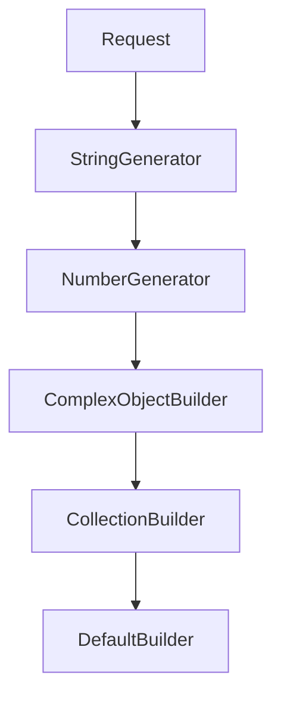

# Day 10 - AutoFixture 基礎：自動產生測試資料

<!-- toc -->

- [前言](#前言)
- [本日學習目標](#本日學習目標)
- [為什麼需要 AutoFixture？](#為什麼需要-autofixture)
- [AutoFixture 介紹與生態系統](#autofixture-介紹與生態系統)
- [AutoFixture 核心概念](#autofixture-核心概念)
- [基礎功能實戰](#基礎功能實戰)
- [xUnit 整合應用](#xunit-整合應用)
- [自動產生策略解析](#自動產生策略解析)
- [實務應用情境](#實務應用情境)
- [回顧 `Day 03：測試資料管理技術全方位`](#回顧-day-03測試資料管理技術全方位)
- [進階技巧預覽](#進階技巧預覽)
- [今日重點回顧](#今日重點回顧)
- [本日小結](#本日小結)
- [使用的套件版本](#使用的套件版本)

<!-- /toc -->

## 前言

前一天討論了私有與內部成員的測試策略，包括何時測試 internal 成員，以及如何用重構與設計模式改善可測試性。

測試寫多了會遇到一個實際問題：時間大量花在準備測試資料上。Day 03 的 Test Data Builder Pattern 確實解決了重複使用和可讀性，代價是每個 Builder 類別都得自己刻一堆樣板程式碼。

AutoFixture 處理的正是測試資料準備。它會自動產生複雜物件，讓測試把篇幅留給行為與斷言；概念上，可以把它看成 Test Data Builder Pattern 的自動化版本。

## 本日學習目標

- 理解 AutoFixture 的核心概念與自動產生策略
- 掌握基本型別和複雜物件的自動建構技術
- 學會與 xUnit 整合，建立高效的測試資料準備流程
- 理解匿名值產生原理，確保測試的穩定性和可預測性
- 建立實務應用情境的最佳實務

---

## 為什麼需要 AutoFixture？

### 傳統測試資料準備的痛點

在沒有 AutoFixture 之前，我們的測試通常是這樣的：

```csharp
[Fact]
public void CalculateOrderTotal_正常訂單_應計算正確總額()
{
    // Arrange - 大量的資料準備程式碼
    var customer = new Customer
    {
        Id = 1,
        Name = "張三",
        Email = "test@example.com",
        Address = new Address
        {
            Street = "台北市信義區",
            City = "台北市",
            PostalCode = "110",
            Country = "台灣"
        },
        Type = CustomerType.Premium,
        JoinDate = new DateTime(2020, 1, 1)
    };

    var product1 = new Product
    {
        Id = 101,
        Name = "筆記型電腦",
        Price = 30000m,
        Category = "電腦",
        InStock = true
    };

    var product2 = new Product
    {
        Id = 102,
        Name = "滑鼠",
        Price = 500m,
        Category = "週邊",
        InStock = true
    };

    var order = new Order
    {
        Id = 1001,
        Customer = customer,
        Items = new List<OrderItem>
        {
            new OrderItem { Product = product1, Quantity = 1, UnitPrice = 30000m },
            new OrderItem { Product = product2, Quantity = 2, UnitPrice = 500m }
        },
        OrderDate = new DateTime(2024, 3, 15),
        Status = OrderStatus.Pending
    };

    var calculator = new OrderCalculator();

    // Act
    var total = calculator.CalculateTotal(order);

    // Assert
    total.Should().Be(31000m);
}
```

### 問題分析

這種傳統做法有幾個明顯的問題：

1. **樣板程式碼過多**：90% 的程式碼都在準備資料，真正的測試邏輯被埋沒
2. **測試焦點模糊**：很難快速理解這個測試在驗證什麼
3. **維護困難**：當物件結構改變時，所有相關測試都需要修改
4. **資料相依性**：測試可能意外依賴於特定的資料值
5. **重複程式碼**：相同的資料準備邏輯在多個測試中重複出現

### AutoFixture 帶來的改變

使用 AutoFixture 後，同樣的測試可以簡化為：

```csharp
[Fact]
public void CalculateOrderTotal_正常訂單_應計算正確總額()
{
    // Arrange
    var fixture = new Fixture();
    var order = fixture.Create<Order>();
    
    // 只設定測試真正關心的資料
    order.Items = new List<OrderItem>
    {
        new OrderItem { UnitPrice = 30000m, Quantity = 1 },
        new OrderItem { UnitPrice = 500m, Quantity = 2 }
    };

    var calculator = new OrderCalculator();

    // Act
    var total = calculator.CalculateTotal(order);

    // Assert
    total.Should().Be(31000m);
}
```

這樣的改變帶來了顯著的好處：

- **程式碼大幅簡化**：資料準備從 40+ 行縮減到約 5～15 行（依情境而定）
- **焦點更明確**：清楚看出測試要驗證價格計算邏輯
- **維護性提升**：物件結構改變時，測試程式碼幾乎不需要修改
- **重複性降低**：不同測試可以共用相同的自動產生邏輯

## AutoFixture 介紹與生態系統

### 什麼是 AutoFixture？

AutoFixture 是一個為 .NET 平台設計的測試資料自動產生工具，它的核心理念是「匿名測試」(Anonymous Testing)。這個概念認為，大部分的測試都不應該依賴於特定的資料值，而應該專注於驗證程式邏輯的正確性。

#### 核心理念：匿名測試 (Anonymous Testing)

匿名測試資料的用途，是讓測試聚焦於行為。多數案例不在乎 Customer 叫 "John" 或 "Mary"；真正要驗證的是系統如何處理 Customer 物件。

### 官方資源

- **GitHub 專案**：<https://github.com/AutoFixture/AutoFixture>
- **官方網站**：<https://autofixture.github.io/>
- **快速入門指南**：<https://autofixture.github.io/docs/quick-start/>
- **NuGet 套件**：<https://www.nuget.org/packages/autofixture>

### AutoFixture 生態系統

AutoFixture 不只是單一工具，還有完整的套件家族：

```csharp
// 核心套件
Install-Package AutoFixture

// xUnit 整合
Install-Package AutoFixture.Xunit3

// NSubstitute 整合
Install-Package AutoFixture.AutoNSubstitute

// Moq 整合 (如果你還在使用 Moq)
Install-Package AutoFixture.AutoMoq
```

### 設計原理與架構

AutoFixture 採用了幾個重要的設計原理：

#### 1. 習慣取代設定 (Convention over Configuration)

AutoFixture 預設提供合理的慣例，大部分情況下不需要額外設定：

```csharp
var fixture = new Fixture();

// 這些都會自動產生合理的值
var name = fixture.Create<string>();        // 隨機字串
var age = fixture.Create<int>();           // 隨機整數
var email = fixture.Create<MailAddress>(); // 有效的電子郵件格式
var date = fixture.Create<DateTime>();     // 隨機日期
```

#### 2. 建造者模式 (Builder Pattern)

AutoFixture 內部使用建構器模式來組合不同的產生策略：

```csharp
// 可以透過客製化來改變預設行為
fixture.Customize<Customer>(c => c
    .With(x => x.Age, 25)             // 固定年齡為 25
    .Without(x => x.ContactInfo));    // 不設定聯絡資訊
```

#### 3. 責任鏈模式 (Chain of Responsibility)

AutoFixture 使用責任鏈來處理不同類型的物件建立：



## AutoFixture 核心概念

### 1. 自動產生策略

AutoFixture 根據型別資訊自動選擇合適的產生策略：

```csharp
var fixture = new Fixture();

// 基本型別
var id = fixture.Create<int>();           // 隨機正整數
var name = fixture.Create<string>();      // 類似 GUID 格式的字串
var price = fixture.Create<decimal>();    // 隨機十進位數
var isActive = fixture.Create<bool>();    // 隨機布林值

// 日期時間
var date = fixture.Create<DateTime>();    // 隨機日期時間
var timeSpan = fixture.Create<TimeSpan>();// 隨機時間長度

// 特殊型別
var guid = fixture.Create<Guid>();        // 新的 GUID
var uri = fixture.Create<Uri>();          // 有效的 URI
var email = fixture.Create<MailAddress>();// 有效的電子郵件
```

### 2. 複雜物件結構自動建構

AutoFixture 能夠自動建構複雜的物件結構，包括巢狀物件、集合屬性和相互關聯的物件關係：

```csharp
public class Product
{
    public int Id { get; set; }
    public string Name { get; set; }
    public decimal Price { get; set; }
    public Category Category { get; set; }  // 巢狀物件（示意版模型；範例專案的 Product.Category 是 string）
    public List<Review> Reviews { get; set; } // 集合屬性
}

public class Category
{
    public int Id { get; set; }
    public string Name { get; set; }
    public Category Parent { get; set; }    // 可能的循環參考
}

public class Review
{
    public int Id { get; set; }
    public string Content { get; set; }
    public int Rating { get; set; }
    public DateTime CreatedDate { get; set; }
}

// AutoFixture 會自動建構整個物件結構
var product = fixture.Create<Product>();

// 結果：
// - Product 的所有屬性都有值
// - Category 物件自動建立並填入資料
// - Reviews 集合包含隨機數量的 Review 物件
// - 循環參考被適當處理(避免無限遞迴)
// - 所有巢狀物件的屬性也都自動填入合理的值
```

### 循環參考處理機制

當遇到循環參考時（如 Customer ↔ Order 的相互關聯），AutoFixture 預設會拋出例外。我們需要設定適當的行為來處理這種情況：

```csharp
public class Customer
{
    public int Id { get; set; }
    public string Name { get; set; }
    public List<Order> Orders { get; set; } = new();
}

public class Order
{
    public int Id { get; set; }
    public Customer Customer { get; set; }
    public DateTime OrderDate { get; set; }
}

// 處理循環參考的基底類別
public abstract class AutoFixtureTestBase
{
    protected Fixture CreateFixture()
    {
        var fixture = new Fixture();

        // 移除預設的循環參考拋出行為
        fixture.Behaviors.OfType<ThrowingRecursionBehavior>().ToList()
               .ForEach(b => fixture.Behaviors.Remove(b));

        // 加入忽略循環參考的行為
        fixture.Behaviors.Add(new OmitOnRecursionBehavior());

        return fixture;
    }
}

// 在測試類別中繼承基底類別
public class CustomerServiceTests : AutoFixtureTestBase
{
    [Fact]
    public void ProcessOrder_正常訂單_應處理成功()
    {
        // Arrange
        var fixture = this.CreateFixture();
        var customer = fixture.Create<Customer>(); // 不會因循環參考而失敗
        
        // Act & Assert
        // 測試邏輯...
    }
}
```

### 3. 預設行為解析

AutoFixture 使用反射和慣例來決定如何建立物件：

```csharp
// 建構式選擇策略
public class Customer
{
    // AutoFixture 優先選擇參數最多的建構式
    public Customer(int id, string name, string email, DateTime joinDate)
    {
        Id = id;
        Name = name;
        Email = email;
        JoinDate = joinDate;
    }

    // 這個建構式參數較少，不會被選擇
    public Customer(int id, string name)
    {
        Id = id;
        Name = name;
    }
}

// 屬性設定策略
public class Order
{
    public int Id { get; set; }              // 可寫入：會被設定
    public string OrderNumber { get; }       // 唯讀：不會被設定
    public DateTime CreatedDate { get; private set; } // 私有 setter：不會被設定
    public List<OrderItem> Items { get; set; } = new(); // 有預設值：仍會被覆寫
}
```

## 基礎功能實戰

### 基本型別自動產生

以下建立一個測試專案，逐步看 AutoFixture 的功能：

```powershell
# 安裝必要的套件
dotnet add package AutoFixture
dotnet add package AutoFixture.Xunit3
dotnet add package xunit.v3.mtp-v2
dotnet add package AwesomeAssertions
```

`AutoFixture.Xunit3` 是 AutoFixture 與 xUnit v3 的整合套件，後面 `[Theory]` 搭配 AutoData 系列屬性都靠它。範例專案採中央套件版本管理（CPM），完整套件與版本見 `samples/day10/Directory.Packages.props`。

#### 字串產生

```csharp
[Fact]
public void AutoFixture_字串產生_應產生有效字串()
{
    // Arrange
    var fixture = this.CreateFixture();

    // Act
    var name = fixture.Create<string>();
    var description = fixture.Create<string>();
    var category = fixture.Create<string>();

    // Assert
    name.Should().NotBeNullOrEmpty();
    description.Should().NotBeNullOrEmpty();
    category.Should().NotBeNullOrEmpty();

    // 每次執行都會產生不同的值
    name.Should().NotBe(description);
    description.Should().NotBe(category);

    // 預設格式類似 GUID，但不應該依賴具體格式
    name.Should().NotContainAny(" ", "\t", "\n");
}
```

#### 數值產生

```csharp
[Fact]
public void AutoFixture_數值產生_應產生有效數值()
{
    // Arrange
    var fixture = this.CreateFixture();

    // Act
    // 整數類型
    var intValue = fixture.Create<int>();
    var longValue = fixture.Create<long>();
    var shortValue = fixture.Create<short>();
    var byteValue = fixture.Create<byte>();

    // 浮點數類型
    var doubleValue = fixture.Create<double>();
    var floatValue = fixture.Create<float>();
    var decimalValue = fixture.Create<decimal>();

    // Assert
    Assert.True(intValue > 0);
    Assert.True(longValue > 0);
    Assert.True(decimalValue > 0);

    // 注意：實際的遞增行為可能因為其他測試而變化，這裡只驗證基本行為
    var nextInt = fixture.Create<int>();
    Assert.True(nextInt > 0);
}
```

#### 日期與時間產生

```csharp
[Fact]
public void AutoFixture_日期時間產生_應產生有效日期()
{
    // Arrange
    var fixture = this.CreateFixture();

    // Act
    var dateTime = fixture.Create<DateTime>();
    // 跳過 DateOnly 因為在某些情況下可能產生無效日期
    var timeOnly = fixture.Create<TimeOnly>();
    var timeSpan = fixture.Create<TimeSpan>();

    // Assert
    // 驗證日期有效性
    Assert.True(dateTime > DateTime.MinValue);
    Assert.True(dateTime < DateTime.MaxValue);

    // 每次都不同
    var anotherDateTime = fixture.Create<DateTime>();
    // 注意：在極少情況下可能相同，所以這個測試可能需要調整
}
```

#### GUID 和特殊型別

```csharp
[Fact]
public void AutoFixture_特殊型別產生_應產生有效執行個體()
{
    // Arrange
    var fixture = this.CreateFixture();

    // Act
    var guid = fixture.Create<Guid>();
    var uri = fixture.Create<Uri>();
    var email = fixture.Create<MailAddress>();
    var version = fixture.Create<Version>();

    // Assert
    Assert.NotEqual(Guid.Empty, guid);
    Assert.NotNull(uri);
    Assert.True(uri.IsAbsoluteUri);
    Assert.Contains("@", email.Address);
    Assert.NotNull(version); // 調整驗證，因為版本號可能從 0 開始
}
```

### 複雜物件建構

#### 巢狀屬性處理

```csharp
public class Customer
{
    public int Id { get; set; }
    public string Name { get; set; }
    public string Email { get; set; }
    public Address Address { get; set; }
    public ContactInfo ContactInfo { get; set; }
    public DateTime JoinDate { get; set; }
    public CustomerType Type { get; set; }
}

public class Address
{
    public string Street { get; set; }
    public string City { get; set; }
    public string PostalCode { get; set; }
    public string Country { get; set; }
    public GeoLocation Location { get; set; }
}

public class GeoLocation
{
    public double Latitude { get; set; }
    public double Longitude { get; set; }
}

public class ContactInfo
{
    public string Phone { get; set; }
    public string MobilePhone { get; set; }
    public string Fax { get; set; }
}

public enum CustomerType
{
    Regular,
    Premium,
    VIP
}

[Fact]
public void AutoFixture_巢狀物件_應完整建構所有層級()
{
    // Arrange
    var fixture = this.CreateFixture();

    // Act
    var customer = fixture.Create<Customer>();

    // Assert
    customer.Should().NotBeNull();
    customer.Id.Should().BePositive();
    customer.Name.Should().NotBeNullOrEmpty();
    customer.Email.Should().NotBeNullOrEmpty();

    // 巢狀物件應該被建立
    customer.Address.Should().NotBeNull();
    customer.Address!.Street.Should().NotBeNullOrEmpty();
    customer.Address.Location.Should().NotBeNull();
    customer.Address.Location!.Latitude.Should().NotBe(0);

    customer.ContactInfo.Should().NotBeNull();
    customer.ContactInfo!.Phone.Should().NotBeNullOrEmpty();

    // 列舉應該有有效值
    customer.Type.Should().BeOneOf(CustomerType.Regular, CustomerType.Premium, CustomerType.VIP);
}
```

#### 集合與陣列處理

```csharp
public class Order
{
    public int Id { get; set; }
    public List<OrderItem> Items { get; set; }
    public string[] Tags { get; set; }
    public Dictionary<string, string> Metadata { get; set; }
    public HashSet<int> CategoryIds { get; set; }
}

public class OrderItem
{
    public int ProductId { get; set; }
    public string ProductName { get; set; }
    public int Quantity { get; set; }
    public decimal UnitPrice { get; set; }
}

[Fact]
public void AutoFixture_集合處理_應建立包含元素的集合()
{
    // Arrange
    var fixture = this.CreateFixture();

    // Act
    var order = fixture.Build<Order>()
                       .Without(x => x.Customer) // 避免循環參考
                       .Create();

    // Assert
    order.Items.Should().NotBeNull();
    order.Items.Should().NotBeEmpty();
    order.Items.Should().HaveCountGreaterThan(0);

    order.Tags.Should().NotBeNull();
    order.Tags.Should().NotBeEmpty();

    order.Metadata.Should().NotBeNull();
    order.Metadata.Should().NotBeEmpty();

    order.CategoryIds.Should().NotBeNull();
    order.CategoryIds.Should().NotBeEmpty();

    // 驗證集合元素的內容
    var firstItem = order.Items.First();
    firstItem.ProductId.Should().BePositive();
    firstItem.ProductName.Should().NotBeNullOrEmpty();
    firstItem.Quantity.Should().BePositive();
    firstItem.UnitPrice.Should().BePositive();
}
```

### 循環參考處理與深度控制

#### 循環參考問題

```csharp
public class Category
{
    public int Id { get; set; }
    public string Name { get; set; }
    public Category Parent { get; set; }        // 可能造成循環參考
    public List<Category> Children { get; set; } // 可能造成循環參考
}

[Fact]
public void AutoFixture_循環參考_應正常處理不會無限遞迴()
{
    // Arrange
    var fixture = this.CreateFixture(); // 使用已設定的 fixture

    // Act & Assert
    var category = fixture.Create<Category>();

    category.Should().NotBeNull();
    category.Id.Should().BePositive();
    category.Name.Should().NotBeNullOrEmpty();

    // 注意：因為使用 OmitOnRecursionBehavior，循環參考的屬性可能被設為 null
    // 所以這裡的驗證要相應調整
}
```

#### 深度控制設定

當物件包含循環參考 (如 Category 有 Parent 屬性) 時，AutoFixture 需要處理無限遞迴的問題。AutoFixture 提供了不同的遞迴處理策略：

- **ThrowingRecursionBehavior** (預設)：偵測到循環參考時拋出例外
- **OmitOnRecursionBehavior**：偵測到循環參考時將屬性設為 null

**實際測試範例**：

```csharp
// 測試預設行為：預期會拋出例外
[Fact]
public void AutoFixture_預設循環處理_應拋出例外()
{
    // Arrange
    var defaultFixture = this.CreateDefaultFixture();

    // Act & Assert
    // 使用 Should().Throw() 驗證預期的例外
    Action act = () => defaultFixture.Create<Category>();
    act.Should().Throw<ObjectCreationException>()
       .WithMessage("*recursion*"); // 驗證例外訊息包含遞迴相關內容
}

// 測試修改後的行為：使用 OmitOnRecursionBehavior
[Fact]
public void AutoFixture_OmitOnRecursion_應成功建立物件()
{
    // Arrange
    var fixture = new Fixture();

    // 移除預設的 ThrowingRecursionBehavior(會拋出例外)
    fixture.Behaviors.OfType<ThrowingRecursionBehavior>().ToList()
           .ForEach(b => fixture.Behaviors.Remove(b));

    // 加入 OmitOnRecursionBehavior(遇到循環參考時設為 null)
    fixture.Behaviors.Add(new OmitOnRecursionBehavior());

    // Act
    var category = fixture.Create<Category>();

    // Assert
    category.Should().NotBeNull();

    // 遞迴屬性在達到深度限制時會被設為 null
    // 這樣可以避免無限遞迴，同時保持物件的基本結構
}
```

#### 自訂循環處理策略

```csharp
[Fact]
public void AutoFixture_自訂循環處理_應使用指定策略()
{
    var fixture = new Fixture();
    
    // 移除預設的循環處理行為
    fixture.Behaviors.OfType<ThrowingRecursionBehavior>().ToList()
        .ForEach(b => fixture.Behaviors.Remove(b));
    
    // 加入自訂的循環處理行為
    fixture.Behaviors.Add(new OmitOnRecursionBehavior());
    
    // 或者設定最大遞迴深度
    fixture.RepeatCount = 3; // 集合預設包含 3 個元素
    
    var category = fixture.Create<Category>();
    
    category.Should().NotBeNull();
    category.Children.Should().HaveCount(3);
}
```

## xUnit 整合應用

### Fixture 物件的生命週期管理

在 xUnit 測試中，我們需要考慮 Fixture 物件的生命週期管理：

#### 每個測試獨立的 Fixture

```csharp
public class ProductServiceTests : AutoFixtureTestBase
{
    [Fact]
    public void CreateProduct_有效資料_應成功建立產品()
    {
        // Arrange
        var fixture = this.CreateFixture();
        var productData = fixture.Create<ProductCreateRequest>();
        var service = new ProductService();

        // Act
        var actual = service.CreateProduct(productData);

        // Assert
        actual.Should().NotBeNull();
        actual.Id.Should().BePositive();
    }

    [Fact]
    public void UpdateProduct_有效資料_應成功更新產品()
    {
        // Arrange
        var fixture = this.CreateFixture();
        var updateData = fixture.Create<ProductUpdateRequest>();
        var service = new ProductService();

        // Act
        var actual = service.UpdateProduct(1, updateData);

        // Assert
        actual.Should().BeTrue();
    }
}
```

#### 使用測試類別層級的 Fixture

```csharp
public class ProductServiceTestsWithSharedFixture
{
    private readonly Fixture _fixture;

    public ProductServiceTestsWithSharedFixture()
    {
        this._fixture = new Fixture();

        // 在建構式中進行共同的客製化設定
        this._fixture.Customize<ProductCreateRequest>(c => c.With(x => x.Price, () => (decimal)(Random.Shared.NextDouble() * 10000))   // 限制價格範圍
                                                            .With(x => x.Name, () => $"Product-{this._fixture.Create<string>()[..8]}") // 自訂名稱格式
        );
    }

    [Fact]
    public void CreateProduct_使用共享Fixture_應成功建立()
    {
        // Arrange
        var productData = this._fixture.Create<ProductCreateRequest>();
        var service = new ProductService();

        // Act
        var actual = service.CreateProduct(productData);

        // Assert
        Assert.NotNull(actual);
        Assert.True(productData.Price <= 10000);
        Assert.StartsWith("Product-", productData.Name);
    }

    [Fact]
    public void ValidateProduct_使用共享Fixture_應通過驗證()
    {
        // Arrange
        var productData = this._fixture.Create<ProductCreateRequest>();
        var validator = new ProductValidator();

        // Act
        var isValid = validator.Validate(productData);

        // Assert
        isValid.Should().BeTrue();
    }
}
```

#### 控制物件初始化：OmitAutoProperties 使用

在某些測試情境中，我們可能只想設定物件的特定屬性，而讓其他屬性保持預設值。這時候 `OmitAutoProperties()` 方法就非常有用：

```csharp
public class Customer
{
    public int Id { get; set; }
    public string Name { get; set; } = string.Empty;
    public string Email { get; set; } = string.Empty;
    public Address? Address { get; set; }
    public ContactInfo? ContactInfo { get; set; }
    public DateTime JoinDate { get; set; }
    public CustomerType Type { get; set; }
    public int Age { get; set; }
    public decimal TotalSpent { get; set; }
    public List<Order> Orders { get; set; } = new();
}

// 測試類別繼承循環參考處理基底類別
public class OmitAutoPropertiesTests : AutoFixtureTestBase
{
    [Fact]
    public void CreateCustomer_僅設定必要屬性_其他保持預設值()
    {
        // Arrange
        var fixture = this.CreateFixture();

        // 使用 OmitAutoProperties 控制屬性設定
        var customer = fixture.Build<Customer>()
                              .OmitAutoProperties() // 不自動設定任何屬性
                              .With(x => x.Id, 123) // 只設定我們關心的屬性
                              .With(x => x.Name, "測試客戶")
                              .Create();

        // Act & Assert
        customer.Id.Should().Be(123);
        customer.Name.Should().Be("測試客戶");

        // 其他屬性保持預設值
        customer.Email.Should().Be(string.Empty);
        customer.Age.Should().Be(0);
        customer.Type.Should().Be(CustomerType.Regular); // 列舉的預設值
    }

    [Fact]
    public void CreateCustomer_部分自動屬性_部分手動設定()
    {
        // Arrange
        var fixture = this.CreateFixture();

        // 結合 OmitAutoProperties 和選擇性屬性設定
        var customer = fixture.Build<Customer>()
                              .OmitAutoProperties()                   // 先停用所有自動屬性
                              .With(x => x.Id)                        // 啟用 Id 的自動產生
                              .With(x => x.Name)                      // 啟用 Name 的自動產生
                              .With(x => x.Email, "test@example.com") // 手動設定 Email
                              .Create();

        // Act & Assert
        customer.Id.Should().NotBe(0);                  // 自動產生的值
        customer.Name.Should().NotBeNullOrEmpty();      // 自動產生的值
        customer.Email.Should().Be("test@example.com"); // 手動設定的值

        // 未指定的屬性保持預設值
        customer.Age.Should().Be(0);
        customer.Type.Should().Be(CustomerType.Regular);
    }
}
```

#### 實務應用情境

`OmitAutoProperties()` 在以下情境特別有用：

1. **測試特定屬性**：當測試只需要驗證某些屬性時
2. **避免副作用**：某些屬性的設定可能觸發不必要的邏輯
3. **效能考量**：減少不必要的物件初始化開銷
4. **預設值驗證**：測試物件的預設狀態是否正確

### 測試方法中的快速資料準備

#### 基本使用模式

```csharp
public class OrderProcessingTests : AutoFixtureTestBase
{
    [Fact]
    public void ProcessOrder_正常流程_應成功處理()
    {
        // Arrange
        var fixture = this.CreateFixture();

        // 快速建立測試資料，避免循環參考
        var customer = fixture.Create<Customer>();
        var products = fixture.CreateMany<Product>(3).ToList();
        var order = fixture.Build<Order>()
                           .With(x => x.Customer, customer)
                           .Without(x => x.Customer) // 避免循環參考
                           .With(x => x.Status, OrderStatus.Completed)
                           .With(x => x.Items, products.Select(p => new OrderItem
                           {
                               Product = p,
                               Quantity = 2 // 使用固定數量，避免隨機性影響測試
                           }).ToList())
                           .Create();

        var processor = new OrderProcessor();

        // Act
        var actual = processor.Process(order);

        // Assert
        actual.Success.Should().BeTrue(); // 因為狀態設為 Completed
    }
}
```

#### 使用 CreateMany 建立集合

```csharp
[Fact]
public void BulkProcessOrders_多筆訂單_應全部處理成功()
{
    // Arrange
    var fixture = this.CreateFixture();
    var orders = fixture.Build<Order>()
                        .With(x => x.Status, OrderStatus.Completed)
                        .Without(x => x.Customer) // 避免循環參考
                        .CreateMany(5)
                        .ToList(); // 固定 5 筆，更可預測

    var processor = new BatchOrderProcessor();

    // Act
    var actual = processor.ProcessBatch(orders);

    // Assert
    actual.Should().NotBeNull();
    actual.SuccessCount.Should().Be(5);
    actual.FailureCount.Should().Be(0);
}
```

### 與 Fact/Theory 的協作模式

#### 在 Theory 測試中使用 AutoFixture

```csharp
public class DiscountCalculatorTests : AutoFixtureTestBase
{
    [Theory]
    [InlineData(CustomerType.Regular)]
    [InlineData(CustomerType.Premium)]
    [InlineData(CustomerType.VIP)]
    public void CalculateDiscount_不同客戶類型_應套用正確折扣(CustomerType customerType)
    {
        // Arrange
        var fixture = this.CreateFixture();

        // 建立客戶，但指定特定的客戶類型
        var customer = fixture.Build<Customer>()
                              .With(x => x.Type, customerType)
                              .Create();

        var order = fixture.Build<Order>()
                           .Without(x => x.Customer) // 避免循環參考
                           .Create();
        var calculator = new DiscountCalculator();

        // Act
        var discount = calculator.Calculate(customer, order);

        // Assert
        switch (customerType)
        {
            case CustomerType.Regular:
                discount.Should().Be(0);
                break;
            case CustomerType.Premium:
                discount.Should().Be(0.05m);
                break;
            case CustomerType.VIP:
                discount.Should().Be(0.15m);
                break;
        }
    }
}
```

#### 結合 MemberData 使用

```csharp
public class PricingTests
{
    public static IEnumerable<object[]> GetPricingTestData()
    {
        var fixture = new Fixture();
        
        // 使用固定的數量範圍，避免隨機性
        var quantities = new[] { 1, 3, 5, 10, 20 };
        
        foreach (var quantity in quantities)
        {
            var product = fixture.Create<Product>();
            var expectedTotal = product.Price * quantity;
            
            yield return new object[] { product, quantity, expectedTotal };
        }
    }

    [Theory]
    [MemberData(nameof(GetPricingTestData))]
    public void CalculateTotal_各種產品和數量_應計算正確總額(
        Product product, int quantity, decimal expectedTotal)
    {
        var calculator = new PriceCalculator();

        var total = calculator.Calculate(product, quantity);

        total.Should().Be(expectedTotal);
    }
}
```

## 自動產生策略解析

### 匿名值產生原理與可預測性

#### 匿名測試的核心概念

AutoFixture 的「匿名測試」理念是指測試不應該依賴於特定的資料值，而應該專注於驗證邏輯的正確性：

```csharp
[Fact]
public void AddCustomer_任何有效客戶_應成功新增()
{
    // Arrange
    var fixture = new Fixture();
    var customer = fixture.Create<Customer>();
    var repository = new CustomerRepository();

    // Act
    var actual = repository.Add(customer);

    // Assert
    actual.Should().BeTrue();
    // 測試關注的是「新增功能」而不是「特定資料」
}
```

#### 值產生的可預測性

雖然 AutoFixture 產生「隨機」值，但我們需要了解它的行為特性以確保測試的穩定性：

```csharp
[Fact]
public void AutoFixture_值產生_顯示基本特性()
{
    // Arrange
    var fixture = this.CreateFixture();

    // Act
    // 產生多個不同類型的值
    var int1 = fixture.Create<int>();
    var int2 = fixture.Create<int>();
    var int3 = fixture.Create<int>();

    // 字串應該非空且不重複
    var str1 = fixture.Create<string>();
    var str2 = fixture.Create<string>();

    // 布林值會產生有效的布林值
    var bool1 = fixture.Create<bool>();
    var bool2 = fixture.Create<bool>();
    var bool3 = fixture.Create<bool>();

    // Assert
    // 驗證整數都有值且不全相同（AutoFixture 會產生不同的值）
    Assert.True(int1 != int2 || int2 != int3); // 至少有一組不同

    Assert.NotEqual(str1, str2);

    // 布林值都是有效的布林值
    Assert.IsType<bool>(bool1);
    Assert.IsType<bool>(bool2);
    Assert.IsType<bool>(bool3);
}
```

### 重複執行的穩定性考量

#### 測試穩定性策略

為了確保測試的穩定性，需要注意以下原則：

```csharp
[Fact]
public void ProcessOrder_穩定性測試_應每次都產生相同結果()
{
    // Arrange
    var fixture = this.CreateFixture();
    fixture.RepeatCount = 3; // 固定集合大小

    var order = fixture.Build<Order>()
                       .With(x => x.Status, OrderStatus.Completed)
                       .Without(x => x.Customer) // 避免循環參考
                       .Create();

    var processor = new OrderProcessor();

    // Act - 無論執行多少次，相同輸入應該產生相同輸出
    var actual1 = processor.Process(order);
    var actual2 = processor.Process(order);

    // Assert
    actual1.TotalAmount.Should().Be(actual2.TotalAmount);
    actual1.Success.Should().Be(actual2.Success);
}

[Fact]
public void CalculateDiscount_邊界值測試_應處理所有情況()
{
    // Arrange
    var fixture = this.CreateFixture();

    // 策略：明確設定關鍵值，其他值保持隨機
    var customer = fixture.Build<Customer>()
                          .With(x => x.TotalSpent, 10000m) // 固定關鍵值
                          .Create();                       // 其他屬性保持隨機

    var calculator = new DiscountCalculator();

    // Act
    var discount = calculator.Calculate(customer);

    // Assert
    // 測試邏輯：消費滿 10000 應該有折扣
    Assert.True(discount >= 0.15m);
}
```

#### 避免不穩定的測試

```csharp
// X 不好的做法：依賴隨機值的具體內容
[Fact]
public void BadTest_依賴隨機值_可能導致測試不穩定()
{
    var fixture = new Fixture();
    var customer = fixture.Create<Customer>();

    // 錯誤：假設隨機產生的年齡會大於 18
    customer.Age.Should().BeGreaterThan(18); // 可能失敗
}

// O 好的做法：明確設定測試關心的值
[Fact]
public void GoodTest_明確設定關鍵值_確保測試穩定()
{
    // Arrange
    var fixture = this.CreateFixture();
    var customer = fixture.Build<Customer>()
                          .With(x => x.Age, 25) // 明確設定年齡
                          .Create();

    var validator = new CustomerValidator();

    // Act
    var isValid = validator.IsAdult(customer);

    // Assert
    isValid.Should().BeTrue(); // 穩定的結果
}
```

### 邊界值與特殊情況處理

#### 自動處理常見邊界情況

```csharp
[Fact]
public void AutoFixture_邊界值處理_應避免常見問題()
{
    // Arrange
    var fixture = this.CreateFixture();

    // Act
    // AutoFixture 預設避免常見問題值
    var strings = fixture.CreateMany<string>(10); // 減少數量以提高測試速度

    // 所有字串都不會是 null 或空字串
    strings.All(s => !string.IsNullOrEmpty(s)).Should().BeTrue();

    var numbers = fixture.CreateMany<int>(10); // 減少數量

    // 數字預設是正數
    numbers.All(n => n > 0).Should().BeTrue();
}
```

#### 自訂邊界值處理

```csharp
[Fact]
public void CustomBoundaryHandling_自訂範圍_應在指定範圍內()
{
    // Arrange
    var fixture = new Fixture();

    // 方法 1：使用 Random.Shared.Next() - 最簡潔
    fixture.Customize<User>(c => c.With(x => x.Age, () => Random.Shared.Next(18, 99))); // 18-98 歲

    // Act
    var people = fixture.CreateMany<User>(50);

    // Assert
    people.All(p => p.Age is >= 18 and <= 98).Should().BeTrue();
}

// 更專業的做法：建立自訂的 Customization
public class AgeCustomization : ICustomization
{
    private readonly int _minAge;
    private readonly int _maxAge;
    
    public AgeCustomization(int minAge = 18, int maxAge = 99)
    {
        _minAge = minAge;
        _maxAge = maxAge;
    }
    
    public void Customize(IFixture fixture)
    {
        fixture.Customize<User>(c => c
            .With(x => x.Age, () => Random.Shared.Next(_minAge, _maxAge)));
    }
}

// 使用自訂的 Customization
[Fact]
public void UsingCustomization_專業做法_更好維護()
{
    var fixture = new Fixture();
    fixture.Customize(new AgeCustomization(25, 65)); // 工作年齡範圍
    
    var user = fixture.Create<User>();
    
    user.Age.Should().BeInRange(25, 64);
}
```

#### 處理特殊情況

```csharp
public class EmailService
{
    public bool SendEmail(string email, string subject, string body)
    {
        if (string.IsNullOrEmpty(email) || !email.Contains("@"))
        {
            return false;
        }
            
        if (string.IsNullOrEmpty(subject))
        {
            return false;
        }
            
        // 模擬發送邏輯
        return true;
    }
}

[Fact]
public void SendEmail_正常情況_應成功發送()
{
    // Arrange
    var fixture = new Fixture();
    
    // 確保產生有效的電子郵件格式
    var email = fixture.Create<MailAddress>().Address;
    var subject = fixture.Create<string>();
    var body = fixture.Create<string>();
    
    var service = new EmailService();

    // Act
    var actual = service.SendEmail(email, subject, body);

    // Assert
    actual.Should().BeTrue();
}

[Theory]
[InlineData(null)]
[InlineData("")]
[InlineData("invalid-email")]
public void SendEmail_無效電子郵件_應回傳失敗(string? invalidEmail)
{
    // Arrange
    var fixture = new Fixture();
    var subject = fixture.Create<string>();
    var body = fixture.Create<string>();
    var service = new EmailService();

    // Act
    var actual = service.SendEmail(invalidEmail!, subject, body);

    // Assert
    actual.Should().BeFalse();
}
```

## 實務應用情境

### 從 Day 03 到 Day 10：測試資料準備的進化

以下用範例比較 Day 03 的 Test Data Builder Pattern 與 AutoFixture：

#### Day 03 的方式：手動 Test Data Builder

```csharp
// Day 3：需要手動建立 Builder 類別
public class OrderBuilder
{
    private int _id = 1;
    private Customer _customer = new Customer { Name = "Default Customer" };
    private List<OrderItem> _items = new();
    private DateTime _orderDate = DateTime.Now;
    private OrderStatus _status = OrderStatus.Pending;
    
    public OrderBuilder WithId(int id)
    {
        _id = id;
        return this;
    }
    
    public OrderBuilder WithCustomer(Customer customer)
    {
        _customer = customer;
        return this;
    }
    
    public OrderBuilder WithItems(params OrderItem[] items)
    {
        _items = items.ToList();
        return this;
    }
    
    public OrderBuilder AsCompleted()
    {
        _status = OrderStatus.Completed;
        return this;
    }
    
    public Order Build()
    {
        return new Order
        {
            Id = _id,
            Customer = _customer,
            Items = _items,
            OrderDate = _orderDate,
            Status = _status
        };
    }
    
    public static OrderBuilder AnOrder() => new();
}

// 使用方式
[Fact]
public void ProcessOrder_Day3方式_需要詳細的Builder準備()
{
    // Arrange - 需要大量的 Builder 設定
    var customer = new Customer { Name = "John", Email = "john@example.com" };
    var item1 = new OrderItem { ProductName = "產品A", UnitPrice = 100, Quantity = 2 };
    var item2 = new OrderItem { ProductName = "產品B", UnitPrice = 50, Quantity = 1 };
    
    var order = OrderBuilder
        .AnOrder()
        .WithCustomer(customer)
        .WithItems(item1, item2)
        .AsCompleted()
        .Build();
        
    var processor = new OrderProcessor();
    
    // Act
    var actual = processor.Process(order);
    
    // Assert
    actual.Success.Should().BeTrue();
}
```

#### Day 10 的方式：AutoFixture 自動化

```csharp
// Day 10：零設定成本，專注於測試邏輯
[Fact]
public void ProcessOrder_AutoFixture方式_專注於測試邏輯()
{
    // Arrange - 大幅簡化，只設定測試關心的部分
    var fixture = this.CreateFixture();
    var order = fixture.Build<Order>()
                       .With(x => x.Status, OrderStatus.Completed) // 只設定測試關心的狀態
                       .Create();                                  // 其他屬性自動產生合理值

    var processor = new OrderProcessor();

    // Act
    var actual = processor.Process(order);

    // Assert
    actual.Success.Should().BeTrue();
    actual.TotalAmount.Should().BePositive();
}

[Fact]
public void ProcessOrder_大量訂單測試_AutoFixture展現威力()
{
    // Arrange - 輕鬆建立 100 筆測試資料
    var fixture = this.CreateFixture();
    var orders = fixture.Build<Order>()
                        .With(x => x.Status, OrderStatus.Completed)
                        .CreateMany(100)
                        .ToList();

    var processor = new BatchOrderProcessor();

    // Act
    var actual = processor.ProcessBatch(orders);

    // Assert
    actual.SuccessCount.Should().Be(100);
    actual.FailureCount.Should().Be(0);
}
```

#### 比對分析

| 層面        | Day 3 方式               | Day 10 方式         | 改善程度    |
| --------- | ---------------------- | ----------------- | ------- |
| **程式碼行數** | 40+ 行 Builder + 15 行測試 | 5 行測試             | 90% 減少  |
| **維護成本**  | 物件改變需更新 Builder        | 自動適應變化            | 大幅降低    |
| **開發時間**  | 先寫 Builder 再寫測試        | 直接寫測試             | 50%+ 節省 |
| **測試焦點**  | 被資料準備分散                | 集中在業務邏輯           | 明顯提升    |
| **大量資料**  | 需要迴圈或複製貼上              | `CreateMany(100)` | 極大改善    |

### Entity 測試

在測試 Entity 類別時，AutoFixture 特別有用：

```csharp
public class Customer
{
    public int Id { get; set; }
    public string Name { get; set; }
    public string Email { get; set; }
    public DateTime JoinDate { get; set; }
    public decimal TotalSpent { get; set; }
    public List<Order> Orders { get; set; } = new();
    
    public CustomerLevel GetLevel()
    {
        return TotalSpent switch
        {
            >= 100000 => CustomerLevel.Diamond,
            >= 50000 => CustomerLevel.Gold,
            >= 10000 => CustomerLevel.Silver,
            _ => CustomerLevel.Bronze
        };
    }
    
    public bool CanGetDiscount()
    {
        return TotalSpent >= 1000 && Orders.Count >= 5;
    }
}

public enum CustomerLevel
{
    Bronze, Silver, Gold, Diamond
}

[Theory]
[InlineData(0, CustomerLevel.Bronze)]
[InlineData(5000, CustomerLevel.Bronze)]
[InlineData(15000, CustomerLevel.Silver)]
[InlineData(60000, CustomerLevel.Gold)]
[InlineData(120000, CustomerLevel.Diamond)]
public void GetLevel_不同消費金額_應回傳正確等級(decimal totalSpent, CustomerLevel expectedLevel)
{
    // Arrange
    var fixture = this.CreateFixture();
    var customer = fixture.Build<Customer>()
                          .With(x => x.TotalSpent, totalSpent)
                          .Create();

    // Act
    var level = customer.GetLevel();

    // Assert
    level.Should().Be(expectedLevel);
}

[Fact]
public void CanGetDiscount_符合條件_應可獲得折扣()
{
    // Arrange
    var fixture = this.CreateFixture();
    var customer = fixture.Build<Customer>()
                          .With(x => x.TotalSpent, 5000m)
                          .With(x => x.Orders, fixture.CreateMany<Order>(10).ToList())
                          .Create();

    // Act
    var canDiscount = customer.CanGetDiscount();

    // Assert
    canDiscount.Should().BeTrue();
}
```

### DTO 驗證

在 API 開發中，DTO 驗證是常見需求：

```csharp
public class CreateCustomerRequest
{
    [Required]
    [StringLength(100)]
    public string Name { get; set; }
    
    [Required]
    [EmailAddress]
    public string Email { get; set; }
    
    [Range(18, 120)]
    public int Age { get; set; }
    
    [Phone]
    public string Phone { get; set; }
}

[Fact]
public void ValidateCustomerRequest_有效資料_應通過驗證()
{
    // Arrange
    var fixture = this.CreateFixture();

    // 客製化以符合驗證規則
    var request = fixture.Build<CreateCustomerRequest>()
                         .With(x => x.Name, () =>
                         {
                             var name = fixture.Create<string>();
                             return name.Length > 50 ? name[..50] : name;
                         })
                         .With(x => x.Email, fixture.Create<MailAddress>().Address)
                         .With(x => x.Age, Random.Shared.Next(18, 78)) // 18-77 歲，符合 [Range(18, 120)] 驗證
                         .With(x => x.Phone, "0912-345-678")           // 提供有效的電話號碼格式
                         .Create();

    // Act
    var context = new ValidationContext(request);
    var results = new List<ValidationResult>();
    var isValid = Validator.TryValidateObject(request, context, results, true);

    // Assert
    isValid.Should().BeTrue();
    results.Should().BeEmpty();
}

[Fact]
public void ValidateCustomerRequest_姓名過長_應驗證失敗()
{
    // Arrange
    var fixture = new Fixture();
    var request = fixture.Build<CreateCustomerRequest>()
                         .With(x => x.Name, new string('A', 101)) // 超過 100 字元
                         .With(x => x.Email, fixture.Create<MailAddress>().Address)
                         .With(x => x.Age, 25)
                         .Create();

    // Act
    var context = new ValidationContext(request);
    var results = new List<ValidationResult>();
    var isValid = Validator.TryValidateObject(request, context, results, true);

    // Assert
    isValid.Should().BeFalse();
    results.Should().ContainSingle(r => r.MemberNames.Contains(nameof(request.Name)));
}
```

### 大量資料情境模擬

在效能測試或大量資料處理情境中：

```csharp
public class DataProcessor
{
    public ProcessingResult ProcessBatch(IEnumerable<DataRecord> records)
    {
        var processed = 0;
        var errors = new List<string>();
        
        foreach (var record in records)
        {
            try
            {
                // 處理邏輯...
                processed++;
            }
            catch (Exception ex)
            {
                errors.Add($"Record {record.Id}: {ex.Message}");
            }
        }
        
        return new ProcessingResult
        {
            ProcessedCount = processed,
            ErrorCount = errors.Count,
            Errors = errors
        };
    }
}

public class DataRecord
{
    public int Id { get; set; }
    public string Data { get; set; }
    public DateTime Timestamp { get; set; }
}

public class ProcessingResult
{
    public int ProcessedCount { get; set; }
    public int ErrorCount { get; set; }
    public List<string> Errors { get; set; }
}

[Fact]
public void ProcessBatch_大量資料_應正確處理()
{
    // Arrange
    var fixture = this.CreateFixture();
    var records = fixture.CreateMany<DataRecord>(100).ToList(); // 減少到 100 筆測試資料
    var processor = new DataProcessor();

    // Act
    var stopwatch = Stopwatch.StartNew();
    var actual = processor.ProcessBatch(records);
    stopwatch.Stop();

    // Assert
    actual.ProcessedCount.Should().Be(100);
    actual.ErrorCount.Should().Be(0);
    stopwatch.ElapsedMilliseconds.Should().BeLessThan(5000); // 效能要求
}

[Fact]
public void ProcessBatch_記憶體使用_應在合理範圍()
{
    // Arrange
    var fixture = this.CreateFixture();
    var processor = new DataProcessor();

    // 測試不同大小的資料集
    var sizes = new[] { 10, 50, 100 }; // 減少測試規模

    foreach (var size in sizes)
    {
        // Act
        var records = fixture.CreateMany<DataRecord>(size);

        var initialMemory = GC.GetTotalMemory(false);
        var actual = processor.ProcessBatch(records);
        var finalMemory = GC.GetTotalMemory(true);

        var memoryUsed = finalMemory - initialMemory;

        // Assert
        actual.ProcessedCount.Should().Be(size);

        // 記憶體使用應該在合理範圍內
        memoryUsed.Should().BeLessThan(size * 1024); // 每筆記錄不超過 1KB
    }
}
```

## 回顧 `Day 03：測試資料管理技術全方位`

### xUnit 傳統方法 vs AutoFixture 現代化方案

前面已介紹 AutoFixture 的功能與適用情境。現在回頭比對 Day 03 的 xUnit 測試資料管理方式：

#### Day 03 的測試資料管理技術回顧

##### 1. 參數化測試資料提供方式

```csharp
// Day 03：MemberData 方式
public static IEnumerable<object[]> GetUserTestData()
{
    yield return ["John", "john@example.com", 25, true];
    yield return ["", "john@example.com", 25, false];     // 名稱為空
    yield return ["John", "invalid-email", 25, false];    // 無效 Email
    yield return ["John", "john@example.com", 10, false]; // 年齡過小
}

[Theory]
[MemberData(nameof(GetUserTestData))]
public void ValidateUser_Day3方式_使用預定義資料(
    string name, string email, int age, bool expected)
{
    // Arrange
    var user = new User { Name = name, Email = email, Age = age };
    var validator = new UserValidator();

    // Act
    var actual = validator.IsValid(user);

    // Assert
    actual.Should().Be(expected);
}
```

```csharp
// Day 10：AutoFixture 方式
[Theory]
[InlineData(true)]  // 期望驗證通過
[InlineData(false)] // 期望驗證失敗
public void ValidateUser_AutoFixture方式_動態產生資料(bool shouldBeValid)
{
    // Arrange
    var fixture = new Fixture();
    var user = fixture.Build<User>()
                      .With(x => x.Name, shouldBeValid ? fixture.Create<string>() : "")
                      .With(x => x.Email, shouldBeValid ? fixture.Create<MailAddress>().Address : "invalid-email")
                      .With(x => x.Age, shouldBeValid ? 25 : 10)
                      .Create();
    var validator = new UserValidator();

    // Act
    var actual = validator.IsValid(user);

    // Assert
    actual.Should().Be(shouldBeValid);
}
```

##### 2. ClassData 專用資料類別

```csharp
// Day 03：ClassData 方式
public class UserValidationTestData : IEnumerable<object[]>
{
    public IEnumerator<object[]> GetEnumerator()
    {
        // 需要手動定義每一筆測試資料
        yield return new object[] { CreateValidUser(), true };
        yield return new object[] { CreateUserWithEmptyName(), false };
        yield return new object[] { CreateUserWithInvalidEmail(), false };
        // ... 需要為每種情境手動建立
    }
    
    private User CreateValidUser() => new() 
    { 
        Name = "John Doe", 
        Email = "john@example.com", 
        Age = 30 
    };
    
    private User CreateUserWithEmptyName() => new() 
    { 
        Name = "", 
        Email = "john@example.com", 
        Age = 30 
    };
    // ... 更多手動建立的方法
}

[Theory]
[ClassData(typeof(UserValidationTestData))]
public void ValidateUser_ClassData方式_預定義物件(User user, bool expected)
{
    // Arrange
    var validator = new UserValidator();
    
    // Act
    var actual = validator.IsValid(user);
    
    // Assert
    Assert.Equal(expected, actual);
}
```

```csharp
// Day 10：AutoFixture 等價實作
[Fact]
public void ValidateUser_AutoFixture大量情境_自動涵蓋各種案例()
{
    var fixture = new Fixture();

    // 測試 100 個有效使用者(隨機產生但符合規則)
    for (var i = 0; i < 100; i++)
    {
        // Arrange
        var validUser = fixture.Build<User>()
                               .With(x => x.Email, fixture.Create<MailAddress>().Address)
                               .With(x => x.Age, Random.Shared.Next(18, 99)) // 18-98 歲
                               .Create();

        var validator = new UserValidator();

        // Act
        var actual = validator.IsValid(validUser);

        // Assert
        actual.Should().BeTrue($"Generated user should be valid: {validUser.Name}");
    }
}
```

##### 3. Test Data Builder Pattern

```csharp
// Day 03：手動 Test Data Builder
public class UserBuilder
{
    private string _name = "Default User";
    private string _email = "default@example.com";
    private int _age = 25;
    
    public UserBuilder WithName(string name) { _name = name; return this; }
    public UserBuilder WithEmail(string email) { _email = email; return this; }
    public UserBuilder WithAge(int age) { _age = age; return this; }
    
    public User Build() => new() { Name = _name, Email = _email, Age = _age };
    
    public static UserBuilder AUser() => new();
    public static UserBuilder AnAdultUser() => new UserBuilder().WithAge(25);
}

[Fact]
public void CreateUser_Builder方式_語意清晰()
{
    // Arrange
    var user = UserBuilder
        .AnAdultUser()
        .WithName("John")
        .WithEmail("john@example.com")
        .Build();
        
    var service = new UserService();
    
    // Act
    var actual = service.CreateUser(user);
    
    // Assert
    Assert.NotNull(actual);
}
```

AutoFixture 的 `Build` 方法可以看作是 Test Data Builder Pattern 的自動化進化版：

```csharp
// AutoFixture 的 Build 方法
var fixture = new Fixture();

var user = fixture.Build<User>()
    .With(x => x.Name, "John")
    .With(x => x.Email, "john@example.com")
    .Without(x => x.InternalId)  // 排除某些屬性
    .Create();
```

##### 4. 資料提供者模式

```csharp
// Day 03：專用資料提供者
public interface ITestDataProvider<T>
{
    IEnumerable<T> GetValidData();
    IEnumerable<T> GetInvalidData();
    IEnumerable<T> GetBoundaryData();
}

public class UserTestDataProvider : ITestDataProvider<User>
{
    public IEnumerable<User> GetValidData()
    {
        yield return new User { Name = "John", Email = "john@example.com", Age = 30 };
        yield return new User { Name = "Jane", Email = "jane@example.com", Age = 25 };
        // 需要手動定義每個案例
    }
    
    public IEnumerable<User> GetInvalidData()
    {
        yield return new User { Name = "", Email = "john@example.com", Age = 30 };
        yield return new User { Name = "John", Email = "invalid", Age = 30 };
        // 需要手動定義每個案例
    }
    
    public IEnumerable<User> GetBoundaryData()
    {
        yield return new User { Name = "John", Email = "john@example.com", Age = 18 };
        yield return new User { Name = "John", Email = "john@example.com", Age = 120 };
        // 需要手動定義邊界案例
    }
}
```

##### 5. Fixture 資源管理

```csharp
// Day 03：IClassFixture 資源共享
public class DatabaseFixture : IDisposable
{
    public string ConnectionString { get; }
    
    public DatabaseFixture()
    {
        // 需要手動管理資源建立
        ConnectionString = CreateTestDatabase();
        SeedTestData();
    }
    
    private void SeedTestData()
    {
        // 需要手動準備測試資料
        using var connection = new SqlConnection(ConnectionString);
        connection.Open();
        
        var users = new[]
        {
            ("John Doe", "john@example.com"),
            ("Jane Smith", "jane@example.com")
        };
        
        foreach (var (name, email) in users)
        {
            // 手動插入每筆資料
            var sql = "INSERT INTO Users (Name, Email) VALUES (@Name, @Email)";
            using var cmd = new SqlCommand(sql, connection);
            cmd.Parameters.AddWithValue("@Name", name);
            cmd.Parameters.AddWithValue("@Email", email);
            cmd.ExecuteNonQuery();
        }
    }
    
    public void Dispose() => CleanupTestDatabase();
}
```

#### 比對分析

| 層面               | Day 03 方法                | Day 10 AutoFixture         | 評估           |
| ------------------ | -------------------------- | -------------------------- | -------------- |
| **資料準備工作量** | 每個測試案例都需手動定義   | 自動產生，只需指定關鍵屬性 | AutoFixture 勝 |
| **測試涵蓋範圍**   | 只測試預定義的案例         | 可輕鬆測試大量隨機組合     | AutoFixture 勝 |
| **可讀性**         | 明確的測試意圖和資料內容   | 需要理解自動產生邏輯       | Day 03 勝      |
| **維護成本**       | 物件結構改變需更新所有資料 | 自動適應物件結構變化       | AutoFixture 勝 |
| **學習成本**       | 標準 xUnit 功能，容易上手  | 需要學習 AutoFixture API   | Day 03 勝      |
| **測試穩定性**     | 固定資料，結果可預測       | 隨機資料，需要謹慎設計     | Day 03 勝      |
| **邊界值測試**     | 需要手動定義所有邊界情況   | 可配合自動產生大量邊界值   | AutoFixture 勝 |
| **複雜物件處理**   | 需要手動建構巢狀物件       | 自動處理複雜物件圖         | AutoFixture 勝 |
| **團隊協作**       | 容易理解和修改             | 需要團隊共識和規範         | Day 03 勝      |
| **偵錯便利性**     | 固定資料便於偵錯           | 隨機資料增加偵錯困難       | Day 03 勝      |

#### 具體應用情境建議

##### 選擇 Day 03 方法的時機

###### 關鍵業務邏輯測試

```csharp
// 明確的業務規則驗證，需要固定資料
[Theory]
[InlineData(1000, MemberLevel.Bronze)]
[InlineData(5000, MemberLevel.Silver)]
[InlineData(15000, MemberLevel.Gold)]
public void CalculateMemberLevel_消費金額_應回傳正確等級(decimal amount, MemberLevel expected)
{
    // 這種測試需要精確的資料對應關係
}
```

###### 邊界值和特殊情況

```csharp
public static IEnumerable<object[]> GetBoundaryTestData()
{
    yield return new object[] { int.MaxValue, "最大值測試" };
    yield return new object[] { int.MinValue, "最小值測試" };
    yield return new object[] { 0, "零值測試" };
    yield return new object[] { -1, "負值測試" };
}
```

###### 複雜的測試情境

```csharp
public static UserBuilder AVIPCustomer() => new UserBuilder()
    .WithMemberLevel(MemberLevel.VIP)
    .WithTotalSpent(100000m)
    .WithMembershipYears(5);
```

##### 選擇 AutoFixture 的時機

###### 大量資料的效能測試

```csharp
[Fact]
public void ProcessOrders_大量訂單_應在合理時間內完成()
{
    var fixture = new Fixture();
    var orders = fixture.CreateMany<Order>(10000).ToList();
    
    var processor = new BatchOrderProcessor();
    var stopwatch = Stopwatch.StartNew();
    
    processor.ProcessBatch(orders);
    
    stopwatch.ElapsedMilliseconds.Should().BeLessThan(10000);
}
```

###### 物件結構驗證

```csharp
[Fact]
public void SerializeUser_任意使用者_應成功序列化和反序列化()
{
    // Arrange
    var fixture = this.CreateFixture();
    var original = fixture.Create<User>();

    // Act
    var json = JsonSerializer.Serialize(original);
    var deserialized = JsonSerializer.Deserialize<User>(json);

    // Assert
    deserialized.Should().BeEquivalentTo(original);
}
```

###### API 整合測試

```csharp
[Fact]
public async Task CreateUser_任何有效使用者_應回傳201()
{
    var fixture = new Fixture();
    var user = fixture.Build<CreateUserRequest>()
        .With(x => x.Email, fixture.Create<MailAddress>().Address)
        .Create();
        
    var response = await _client.PostAsJsonAsync("/api/users", user);
    
    response.StatusCode.Should().Be(HttpStatusCode.Created);
}
```

#### 混合策略：發揮兩者優勢

實務上最佳的做法是結合兩種方式：

```csharp
public static class TestDataFactory
{
    private static readonly Fixture _fixture = new();
    
    // 結合 AutoFixture 和 Builder Pattern
    public static UserBuilder ARandomUser()
    {
        var baseUser = _fixture.Create<User>();
        return new UserBuilder(baseUser);
    }
    
    // 針對特定情境使用固定資料
    public static UserBuilder AVIPCustomer()
    {
        return ARandomUser()
            .WithMemberLevel(MemberLevel.VIP)
            .WithTotalSpent(100000m);
    }
    
    // 大量隨機資料產生
    public static IEnumerable<User> CreateRandomUsers(int count)
    {
        return _fixture.CreateMany<User>(count);
    }
}

// 使用混合策略的測試
[Fact]
public void ProcessVIPOrder_VIP客戶_應享有特殊優惠()
{
    // Arrange
    // 使用 Builder 確保 VIP 身份
    var vipCustomer = TestDataFactory.AVIPCustomer().Build();
    
    // 使用 AutoFixture 快速產生訂單
    var fixture = new Fixture();
    var order = fixture.Build<Order>()
        .With(x => x.Customer, vipCustomer)
        .Create();
        
    var processor = new OrderProcessor();
    
    // Act
    var actual = processor.Process(order);
    
    // Assert
    actual.Success.Should().BeTrue();
}
```

#### 兩種建造者模式的比較

| 特點         | 傳統 Test Data Builder         | AutoFixture Build         |
| ------------ | ------------------------------ | ------------------------- |
| **實作成本** | 需要手動建立 Builder 類別      | 零實作成本，開箱即用      |
| **維護性**   | 物件結構改變時需要更新 Builder | 自動適應物件結構變化      |
| **語法**     | 自訂方法名稱，如 `WithName()`  | 統一的 `With()` 語法      |
| **預設值**   | 需要手動設定預設值             | 自動產生合理的預設值      |
| **複雜物件** | 需要為巢狀物件建立對應 Builder | 自動處理巢狀物件結構      |
| **學習曲線** | 需要理解建造者模式             | 學會 AutoFixture API 即可 |

#### 實務建議

在實際專案中，我們可以結合兩種方式的優點：

```csharp
public static class TestDataFactory
{
    private static readonly Fixture _fixture = new();
    
    // 使用 AutoFixture 建立基礎資料，再用 Builder 模式加工
    public static OrderBuilder AnOrder()
    {
        var baseOrder = _fixture.Create<Order>();
        return new OrderBuilder(baseOrder);
    }
    
    public static CustomerBuilder ACustomer()
    {
        var baseCustomer = _fixture.Create<Customer>();
        return new CustomerBuilder(baseCustomer);
    }
}

// 使用方式：結合兩者優點
var order = TestDataFactory
    .AnOrder()
    .ForVIPCustomer()  // 業務語意
    .WithFreeShipping() // 業務語意  
    .Build();
```

這種做法保留 AutoFixture 自動產生資料的便利，也維持測試的可讀性與業務語意。

Day 03 的方法重視可控性與可讀性，AutoFixture 則偏向降低資料準備成本。實際專案不必二選一，依測試目的搭配即可。

## 進階技巧預覽

### 客製化預覽

雖然今天主要介紹基礎功能，但 AutoFixture 還有更多進階的客製化功能：

```csharp
// 明日預告：AutoFixture 進階客製化
var fixture = new Fixture();

// 自訂特定屬性
fixture.Customize<Customer>(c => c
    .With(x => x.Email, "test@example.com")
    .Without(x => x.ContactInfo));

// 自訂型別轉換
fixture.Customize<Product>(c => c
    .FromFactory<string>(name => new Product { Name = name }));

// 條件式客製化
fixture.Customize<Order>(c => c
    .With(x => x.Status, OrderStatus.Pending)
    .Do(x => x.CalculateTotal()));
```

## 今日重點回顧

### 建議做法

1. **使用匿名測試概念**
   - 專注於測試邏輯而非具體資料
   - 只在必要時固定特定值

2. **適當的 Fixture 生命週期管理**
   - 測試間獨立性需求高時使用局部 Fixture
   - 共同客製化需求時使用類別層級 Fixture

3. **合理的集合大小**
   - 使用 CreateMany 時考慮效能影響
   - 根據測試目的調整集合大小

### 避免做法

1. **過度依賴隨機值**
   - 不要假設隨機值的具體內容
   - 避免基於隨機值撰寫脆弱的斷言

2. **忽略邊界值**
   - 不要只測試 AutoFixture 產生的「正常」值
   - 仍需要明確測試邊界情況

3. **濫用自動產生**
   - 不是所有測試都適合 AutoFixture
   - 簡單的測試可能用固定值更清楚

### 從 Day 03 到 Day 10 的進化歷程

- **Day 03 的 Test Data Builder**：手動建立 Builder 類別，提供良好的可讀性和語意化
- **Day 10 的 AutoFixture**：自動化的 Builder Pattern 進化版，零設定成本且自動適應變化
- **最佳實務**：在需要業務語意時使用傳統 Builder，在需要大量資料時使用 AutoFixture
- **混合策略**：結合兩者優點，用 AutoFixture 產生基礎資料，再用 Builder 加工業務語意

### 核心概念與價值

- **匿名測試理念**：測試應著重行為而非具體資料，減少對特定資料值的相依
- **自動產生策略**：基於型別資訊和慣例自動選擇合適的值產生方式
- **物件圖建構**：能夠處理複雜的巢狀物件、集合和循環參考結構
- **樣板程式碼減少**：將測試的資料準備從 40+ 行縮減到約 5～15 行，提升可讀性和維護性

### 基礎功能掌握

- **基本型別產生**：字串、數值、日期、GUID 等型別的智慧產生策略
- **複雜物件處理**：巢狀屬性、集合陣列、字典等複雜結構的自動建構
- **循環參考控制**：內建的遞迴偵測和深度控制機制
- **特殊型別支援**：電子郵件、URI、版本號等特殊格式的有效產生

### xUnit 整合實踐

- **Fixture 生命週期**：掌握測試方法層級和類別層級的 Fixture 使用時機
- **快速資料準備**：使用 CreateMany、Build 等方法高效準備測試資料
- **Theory 測試協作**：結合 InlineData 和 MemberData 實現參數化測試

### 穩定性與可預測性

- **值產生規律**：理解 AutoFixture 的隨機產生機制，不應假設特定的遞增或交替規律
- **測試穩定性策略**：透過固定關鍵值和合理邊界設定確保測試穩定，避免依賴隨機值的特定模式
- **邊界值處理**：自動避免 null 值、負數等常見問題，同時支援自訂範圍

### 實際應用情境

- **Entity 測試**：快速產生複雜實體物件進行業務邏輯驗證
- **DTO 驗證**：結合驗證屬性測試 API 請求物件的正確性
- **大量資料模擬**：效能測試和批次處理情境的資料準備

## 本日小結

AutoFixture 以「匿名測試」降低資料準備的篇幅，測試因而能把焦點放在行為。它和 Day 03 的 Test Data Builder Pattern 並不衝突：前者省事，後者把業務意圖寫得更明白。

明天談 AutoFixture 的進階功能：客製化機制、業務規則整合，以及進階的產生策略。

## 使用的套件版本

本章範例使用以下套件版本：

- **AutoFixture**: 4.18.1
- **AutoFixture.Xunit3**: 4.19.0
- **AwesomeAssertions**: 9.5.0
- **xunit.v3.mtp-v2**: 3.2.2
- **.NET**: 10.0

範例程式碼：

- <https://github.com/kevintsengtw/30days-in-testing-net10/tree/main/samples/day10>

---

**這是「重啟挑戰：老派軟體工程師的測試修練」的第十天。明天會介紹 Day 11 - AutoFixture 進階：自訂化測試資料產生策略。**
