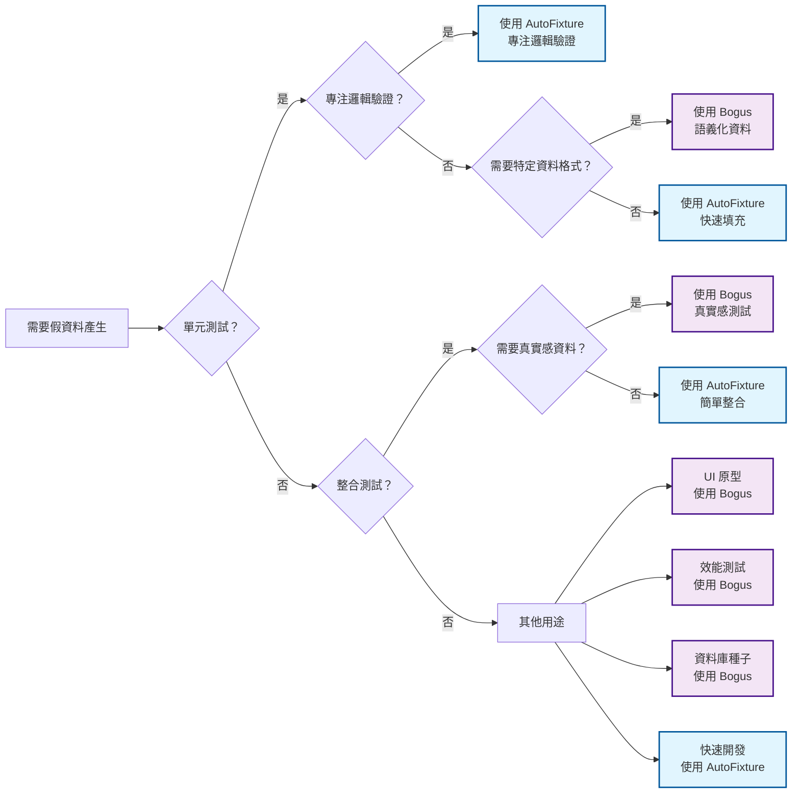

# Day 14 - Bogus 入門：與 AutoFixture 的差異比較

## 前言

前面幾天從 AutoFixture 的匿名測試一路做到 NSubstitute 整合。這套方法適合產生「不重要但必須存在」的資料；若測試需要像姓名、地址、電話這類有語意的內容，Bogus 會更合適。

本篇介紹 Bogus 的擬真資料產生方式，並與 AutoFixture 比較，釐清兩者適合的測試情境。

## Bogus 簡介

### 什麼是 Bogus？

Bogus 是一個 .NET 平台的假資料產生函式庫，移植自著名的 JavaScript 函式庫 faker.js。它專門用於產生真實感強烈的假資料，如姓名、地址、電話號碼、電子郵件等，特別適合需要模擬真實世界資料的測試情境。

> **NuGet Package**: Bogus  
> **套件連結**：[https://www.nuget.org/packages/Bogus/](https://www.nuget.org/packages/Bogus/)  
> **GitHub**: [https://github.com/bchavez/Bogus](https://github.com/bchavez/Bogus)

### 核心特色

1. **真實感資料產生**：提供有意義的假資料，如真實的姓名、地址、公司名稱
2. **多語言支援**：支援超過 40 種語言和地區格式
3. **可重現性**：透過 seed 控制，確保測試資料的一致性
4. **豐富的資料類型**：內建多種 DataSet，涵蓋各種真實世界的資料類型
5. **簡潔的 Fluent API**：直觀易用的設定語法

## 安裝與基本使用

### 安裝 Bogus

```bash
dotnet add package Bogus
```

### 基本語法結構

Bogus 的核心是 `Faker<T>` 類別，使用 `RuleFor` 方法定義屬性的產生規則：

```csharp
using Bogus;

public class Product
{
    public int Id { get; set; }
    public string Name { get; set; } = "";
    public string Description { get; set; } = "";
    public decimal Price { get; set; }
    public string Category { get; set; } = "";
    public DateTime CreatedDate { get; set; }
}

// 建立產品資料的 Faker
var productFaker = new Faker<Product>()
    .RuleFor(p => p.Id, f => f.IndexFaker)
    .RuleFor(p => p.Name, f => f.Commerce.ProductName())
    .RuleFor(p => p.Description, f => f.Commerce.ProductDescription())
    .RuleFor(p => p.Price, f => f.Random.Decimal(10, 1000))
    .RuleFor(p => p.Category, f => f.Commerce.Categories(1).First())
    .RuleFor(p => p.CreatedDate, f => f.Date.Past());

// 產生單筆資料
var product = productFaker.Generate();

// 產生多筆資料
var products = productFaker.Generate(10);
```

### 內建 DataSet 概覽

Bogus 提供豐富的內建 DataSet，每個都專注於特定領域的資料產生：

```csharp
var faker = new Faker();

// 個人資訊 (Person DataSet)
var fullName = faker.Person.FullName;
var firstName = faker.Person.FirstName;
var lastName = faker.Person.LastName;
var email = faker.Person.Email;
var gender = faker.Person.Gender;
var dateOfBirth = faker.Person.DateOfBirth;

// 地址資訊 (Address DataSet)
var fullAddress = faker.Address.FullAddress();
var streetAddress = faker.Address.StreetAddress();
var city = faker.Address.City();
var state = faker.Address.State();
var zipCode = faker.Address.ZipCode();
var country = faker.Address.Country();
var countryCode = faker.Address.CountryCode();
var latitude = faker.Address.Latitude();
var longitude = faker.Address.Longitude();

// 商業資訊 (Company & Commerce DataSet)
var companyName = faker.Company.CompanyName();
var companySuffix = faker.Company.CompanySuffix();
var catchPhrase = faker.Company.CatchPhrase();
var department = faker.Commerce.Department();
var productName = faker.Commerce.ProductName();
var productAdjective = faker.Commerce.ProductAdjective();
var productMaterial = faker.Commerce.ProductMaterial();
var price = faker.Commerce.Price(1, 1000, 2); // 回傳 string 格式價格，如 "123.45"
var ean13 = faker.Commerce.Ean13();
var ean8 = faker.Commerce.Ean8();

// 網路資訊 (Internet DataSet)
var url = faker.Internet.Url();
var domainName = faker.Internet.DomainName();
var ipAddress = faker.Internet.Ip();
var ipv6 = faker.Internet.Ipv6();
var userAgent = faker.Internet.UserAgent();
var userName = faker.Internet.UserName();
var password = faker.Internet.Password();
var mac = faker.Internet.Mac();
var protocol = faker.Internet.Protocol();

// 金融資訊 (Finance DataSet)
var creditCardNumber = faker.Finance.CreditCardNumber();
var creditCardCvv = faker.Finance.CreditCardCvv();
var account = faker.Finance.Account();
var accountName = faker.Finance.AccountName();
var amount = faker.Finance.Amount(100, 10000, 2);
var currency = faker.Finance.Currency();
var bitcoinAddress = faker.Finance.BitcoinAddress();
var ethereumAddress = faker.Finance.EthereumAddress();
var iban = faker.Finance.Iban();
var bic = faker.Finance.Bic();

// 時間資訊 (Date DataSet)
var pastDate = faker.Date.Past();
var futureDate = faker.Date.Future();
var recentDate = faker.Date.Recent();
var soonDate = faker.Date.Soon();
var between = faker.Date.Between(DateTime.Now.AddDays(-30), DateTime.Now);
var timeSpan = faker.Date.Timespan();
var weekday = faker.Date.Weekday();
var month = faker.Date.Month();

// 車輛資訊 (Vehicle DataSet)
var manufacturer = faker.Vehicle.Manufacturer();
var model = faker.Vehicle.Model();
var fuel = faker.Vehicle.Fuel();
var vin = faker.Vehicle.Vin();
var vehicleType = faker.Vehicle.Type();

// 圖片資訊 (Image DataSet)
// 註：舊版的分類圖片方法（Cats、Food、Sports 等）已隨 LoremPixel 服務停止而自 Bogus 移除
var picsumUrl = faker.Image.PicsumUrl();                   // https://picsum.photos 圖片網址
var placeholderUrl = faker.Image.PlaceholderUrl(200, 100); // 佔位圖網址
var loremFlickrUrl = faker.Image.LoremFlickrUrl();         // LoremFlickr 圖片網址
var dataUri = faker.Image.DataUri(64, 64);                 // data: URI 內嵌圖（SVG）

// 文字內容 (Lorem DataSet)
var word = faker.Lorem.Word();
var words = faker.Lorem.Words(5);
var sentence = faker.Lorem.Sentence();
var sentences = faker.Lorem.Sentences(3);
var paragraph = faker.Lorem.Paragraph();
var paragraphs = faker.Lorem.Paragraphs(2);
var text = faker.Lorem.Text();
var slug = faker.Lorem.Slug();

// 電話號碼 (Phone DataSet)
var phoneNumber = faker.Phone.PhoneNumber();
var phoneNumberFormat = faker.Phone.PhoneNumberFormat();

// 系統資訊 (System DataSet)
var fileName = faker.System.FileName();
var commonFileName = faker.System.CommonFileName();
var mimeType = faker.System.MimeType();
var commonFileType = faker.System.CommonFileType();
var commonFileExt = faker.System.CommonFileExt();
var filePath = faker.System.FilePath();
var directoryPath = faker.System.DirectoryPath();

// 隨機資料 (Random DataSet)
var randomInt = faker.Random.Int(1, 100);
var randomDecimal = faker.Random.Decimal(0, 1000);
var randomBool = faker.Random.Bool();
var randomDouble = faker.Random.Double(0, 100);
var randomFloat = faker.Random.Float(0, 10);
var randomByte = faker.Random.Byte();
var randomChar = faker.Random.Char('a', 'z');
var randomString = faker.Random.String(10);
var randomHash = faker.Random.Hash();
var randomGuid = faker.Random.Guid();
var randomEnum = faker.Random.Enum<DayOfWeek>();
var randomArrayElement = faker.Random.ArrayElement(new[] { "A", "B", "C" });
var randomListItem = faker.Random.ListItem(new List<string> { "X", "Y", "Z" });
var shuffled = faker.Random.Shuffle(new[] { 1, 2, 3, 4, 5 });
```

## 多語言支援

Bogus 的一大特色是支援多種語言和文化，讓產生的資料更符合當地習慣：

```csharp
// 繁體中文
var chineseFaker = new Faker<Person>("zh_TW")
    .RuleFor(p => p.Name, f => f.Person.FullName)
    .RuleFor(p => p.Address, f => f.Address.FullAddress());

// 日文
var japaneseFaker = new Faker<Person>("ja")
    .RuleFor(p => p.Name, f => f.Person.FullName)
    .RuleFor(p => p.Phone, f => f.Phone.PhoneNumber());

// 法文
var frenchFaker = new Faker<Person>("fr")
    .RuleFor(p => p.Name, f => f.Person.FullName)
    .RuleFor(p => p.Company, f => f.Company.CompanyName());
```

支援的語言包括：英文、中文（簡體/繁體）、日文、韓文、法文、德文、西班牙文、俄文等超過 40 種語言。

## 進階功能

### 可重現性控制

透過設定 seed，確保每次產生相同的資料序列：

```csharp
// 設定全域 seed
Randomizer.Seed = new Random(12345);

var productFaker = new Faker<Product>()
    .RuleFor(p => p.Name, f => f.Commerce.ProductName());

// 每次執行都會產生相同的產品名稱序列
var products1 = productFaker.Generate(5);
var products2 = productFaker.Generate(5); // 相同的資料

// 重置 seed
Randomizer.Seed = new Random();
```

### 條件式產生與機率控制

```csharp
var userFaker = new Faker<User>()
    .RuleFor(u => u.Name, f => f.Person.FullName)
    .RuleFor(u => u.Email, f => f.Internet.Email())
    // 80% 機率為 Premium 使用者
    .RuleFor(u => u.IsPremium, f => f.Random.Bool(0.8f))
    // 根據 Premium 狀態決定積分
    .RuleFor(u => u.Points, (f, u) => u.IsPremium ? f.Random.Int(1000, 5000) : f.Random.Int(0, 500))
    // 20% 機率電話為 null
    .RuleFor(u => u.Phone, f => f.Phone.PhoneNumber().OrNull(f, 0.2f))
    // 30% 機率為空字串
    .RuleFor(u => u.Nickname, f => f.Person.FirstName.OrDefault(f, 0.3f, ""))
    // 隨機選擇陣列元素
    .RuleFor(u => u.Department, f => f.PickRandom("IT", "HR", "Finance", "Marketing"))
    // 權重式隨機選擇
    .RuleFor(u => u.Role, f => f.PickRandomWeighted(
        new[] { "User", "Admin", "SuperAdmin" },
        new[] { 0.7f, 0.25f, 0.05f }));
```

### 集合與關聯資料

```csharp
// 產生具有關聯性的訂單資料
var orderFaker = new Faker<Order>()
    .RuleFor(o => o.Id, f => f.IndexFaker)
    .RuleFor(o => o.CustomerName, f => f.Person.FullName)
    .RuleFor(o => o.OrderDate, f => f.Date.Past())
    // 產生 1-5 個訂單明細
    .RuleFor(o => o.Items, f => 
    {
        var itemFaker = new Faker<OrderItem>()
            .RuleFor(i => i.ProductName, f => f.Commerce.ProductName())
            .RuleFor(i => i.Quantity, f => f.Random.Int(1, 10))
            .RuleFor(i => i.UnitPrice, f => f.Commerce.Price(10, 100));
        
        return itemFaker.Generate(f.Random.Int(1, 5));
    })
    // 計算總金額
    .RuleFor(o => o.TotalAmount, (f, o) => o.Items.Sum(item => item.Quantity * item.UnitPrice));
```

### 自訂 DataSet 與擴充功能

```csharp
// 建立自訂的台灣資料產生器
public static class TaiwanDataSet
{
    private static readonly string[] TaiwanCities = 
    {
        "台北市", "新北市", "桃園市", "台中市", "台南市", "高雄市",
        "基隆市", "新竹市", "嘉義市", "宜蘭縣", "新竹縣", "苗栗縣"
    };
    
    private static readonly string[] TaiwanUniversities = 
    {
        "台灣大學", "清華大學", "交通大學", "成功大學", "中山大學",
        "政治大學", "中央大學", "中正大學", "中興大學", "師範大學"
    };
    
    private static readonly string[] TaiwanCompanies = 
    {
        "台積電", "鴻海", "聯發科", "中華電信", "台塑", "統一",
        "富邦", "中信", "國泰", "遠傳", "華碩", "宏碁"
    };
    
    public static string TaiwanCity(this Faker faker)
        => faker.PickRandom(TaiwanCities);
    
    public static string TaiwanUniversity(this Faker faker)
        => faker.PickRandom(TaiwanUniversities);
    
    public static string TaiwanCompany(this Faker faker)
        => faker.PickRandom(TaiwanCompanies);
    
    public static string TaiwanIdCard(this Faker faker)
    {
        var firstChar = faker.PickRandom("ABCDEFGHJKLMNPQRSTUVXYWZIO");
        var genderDigit = faker.Random.Int(1, 2);
        var digits = faker.Random.String2(8, "0123456789");
        return $"{firstChar}{genderDigit}{digits}";
    }
    
    public static string TaiwanMobilePhone(this Faker faker)
    {
        var prefix = faker.PickRandom("09");
        var middle = faker.Random.Int(0, 9);
        var suffix = faker.Random.String2(7, "0123456789");
        return $"{prefix}{middle}{suffix}";
    }
}

// 使用自訂 DataSet
var taiwanPersonFaker = new Faker<TaiwanPerson>()
    .RuleFor(p => p.Name, f => f.Person.FullName)
    .RuleFor(p => p.City, f => f.TaiwanCity())
    .RuleFor(p => p.University, f => f.TaiwanUniversity())
    .RuleFor(p => p.Company, f => f.TaiwanCompany())
    .RuleFor(p => p.IdCard, f => f.TaiwanIdCard())
    .RuleFor(p => p.Mobile, f => f.TaiwanMobilePhone());
```

### 複雜物件關係與約束

```csharp
// 具有複雜業務邏輯的員工資料產生
var employeeFaker = new Faker<Employee>()
    .RuleFor(e => e.Id, f => f.Random.Guid())
    .RuleFor(e => e.FirstName, f => f.Person.FirstName)
    .RuleFor(e => e.LastName, f => f.Person.LastName)
    // 根據姓名產生 Email
    .RuleFor(e => e.Email, (f, e) => f.Internet.Email(e.FirstName, e.LastName, "company.com"))
    // 年齡範圍限制
    .RuleFor(e => e.Age, f => f.Random.Int(22, 65))
    // 根據年齡決定職級
    .RuleFor(e => e.Level, (f, e) =>
    {
        return e.Age switch
        {
            < 25 => "Junior",
            < 35 => "Senior",
            < 45 => "Lead",
            _ => "Principal"
        };
    })
    // 根據職級決定薪資範圍
    .RuleFor(e => e.Salary, (f, e) =>
    {
        return e.Level switch
        {
            "Junior" => f.Random.Decimal(35000, 50000),
            "Senior" => f.Random.Decimal(50000, 80000),
            "Lead" => f.Random.Decimal(80000, 120000),
            "Principal" => f.Random.Decimal(120000, 200000),
            _ => f.Random.Decimal(35000, 50000)
        };
    })
    // 入職日期約束
    .RuleFor(e => e.HireDate, (f, e) =>
    {
        var maxYearsAgo = e.Age - 22; // 假設 22 歲畢業
        return f.Date.Past(maxYearsAgo);
    })
    // 產生技能清單
    .RuleFor(e => e.Skills, f =>
    {
        var allSkills = new[] { "C#", ".NET", "JavaScript", "React", "Angular", "Vue", 
                               "SQL Server", "MongoDB", "Azure", "AWS", "Docker", "Kubernetes" };
        return f.PickRandom(allSkills, f.Random.Int(2, 6)).ToList();
    })
    // 產生專案經驗
    .RuleFor(e => e.Projects, (f, e) =>
    {
        var projectFaker = new Faker<Project>()
            .RuleFor(p => p.Name, f => f.Company.CatchPhrase())
            .RuleFor(p => p.Description, f => f.Lorem.Sentence())
            .RuleFor(p => p.StartDate, f => f.Date.Between(e.HireDate, DateTime.Now.AddMonths(-1)))
            .RuleFor(p => p.EndDate, (f, p) => f.Date.Between(p.StartDate, DateTime.Now))
            .RuleFor(p => p.Technologies, f => f.PickRandom(e.Skills, f.Random.Int(1, 3)).ToList());
        
        var yearsOfExperience = (DateTime.Now - e.HireDate).Days / 365;
        var projectCount = Math.Max(1, yearsOfExperience / 2);
        return projectFaker.Generate(f.Random.Int(1, projectCount));
    });
```

### 資料格式化與多語言進階應用

```csharp
// 多語言環境的使用者資料
var multiLanguageUserFaker = new Faker<GlobalUser>()
    .RuleFor(u => u.Id, f => f.Random.Guid())
    // 隨機選擇地區
    .RuleFor(u => u.Locale, f => f.PickRandom("en_US", "zh_TW", "ja_JP", "ko_KR", "fr_FR", "de_DE"))
    // 根據地區產生姓名
    .RuleFor(u => u.Name, (f, u) =>
    {
        var localFaker = new Faker(u.Locale);
        return localFaker.Person.FullName;
    })
    // 根據地區產生地址
    .RuleFor(u => u.Address, (f, u) =>
    {
        var localFaker = new Faker(u.Locale);
        return localFaker.Address.FullAddress();
    })
    // 根據地區產生電話
    .RuleFor(u => u.Phone, (f, u) =>
    {
        var localFaker = new Faker(u.Locale);
        return localFaker.Phone.PhoneNumber();
    });

// 測試資料的邊界值產生
var boundaryTestFaker = new Faker<TestData>()
    // 字串長度邊界
    .RuleFor(t => t.ShortString, f => f.Random.String2(1, 10))
    .RuleFor(t => t.LongString, f => f.Random.String2(255, 1000))
    .RuleFor(t => t.EmptyOrNull, f => f.PickRandom<string?>(null, "", " "))
    // 數值邊界
    .RuleFor(t => t.MinValue, f => int.MinValue)
    .RuleFor(t => t.MaxValue, f => int.MaxValue)
    .RuleFor(t => t.ZeroValue, f => 0)
    .RuleFor(t => t.NegativeValue, f => f.Random.Int(int.MinValue, -1))
    .RuleFor(t => t.PositiveValue, f => f.Random.Int(1, int.MaxValue))
    // 特殊字元處理
    .RuleFor(t => t.SpecialChars, f => f.PickRandom(
        "!@#$%^&*()", "中文字符", "éñüñol", "日本語", "한국어"))
    // 日期邊界
    .RuleFor(t => t.MinDate, f => DateTime.MinValue)
    .RuleFor(t => t.MaxDate, f => DateTime.MaxValue)
    .RuleFor(t => t.FutureDate, f => f.Date.Future(10))
    .RuleFor(t => t.PastDate, f => f.Date.Past(10));
```

### 效能最佳化技巧

```csharp
// 大量資料產生的效能最佳化
public class OptimizedDataGenerator
{
    private static readonly Faker _faker = new();
    private static readonly Faker<User> _userFaker = CreateUserFaker();
    
    // 預編譯 Faker 以提升效能
    private static Faker<User> CreateUserFaker()
    {
        return new Faker<User>()
            .RuleFor(u => u.Id, f => f.Random.Guid())
            .RuleFor(u => u.Name, f => f.Person.FullName)
            .RuleFor(u => u.Email, f => f.Internet.Email())
            .RuleFor(u => u.Age, f => f.Random.Int(18, 80));
    }
    
    // 批次產生以減少記憶體分配
    public static IEnumerable<User> GenerateUsersBatch(int totalCount, int batchSize = 1000)
    {
        var generated = 0;
        while (generated < totalCount)
        {
            var currentBatchSize = Math.Min(batchSize, totalCount - generated);
            var batch = _userFaker.Generate(currentBatchSize);
            
            foreach (var user in batch)
            {
                yield return user;
            }
            
            generated += currentBatchSize;
        }
    }
    
    // 重複使用 Faker 執行個體
    public static List<Product> GenerateProducts(int count)
    {
        // 避免重複建立 Faker 執行個體
        return _productFaker.Generate(count);
    }
    
    private static readonly Faker<Product> _productFaker = new Faker<Product>()
        .RuleFor(p => p.Id, f => f.Random.Guid())
        .RuleFor(p => p.Name, f => f.Commerce.ProductName())
        .RuleFor(p => p.Price, f => f.Commerce.Price(1, 1000));
}

// 使用 Lazy 初始化複雜的 Faker
public class LazyFakerExample
{
    private static readonly Lazy<Faker<ComplexEntity>> _complexFaker = 
        new(() => CreateComplexFaker());
    
    private static Faker<ComplexEntity> CreateComplexFaker()
    {
        // 複雜的初始化邏輯
        return new Faker<ComplexEntity>()
            .RuleFor(e => e.Id, f => f.Random.Guid())
            .RuleFor(e => e.Data, f => GenerateComplexData(f));
    }
    
    public static ComplexEntity Generate() => _complexFaker.Value.Generate();
    
    private static ComplexData GenerateComplexData(Faker faker)
    {
        // 複雜的資料產生邏輯
        return new ComplexData();
    }
}
```

## Bogus vs AutoFixture：深度比較

### 設計理念差異

| 項目         | AutoFixture               | Bogus                           |
| ------------ | ------------------------- | ------------------------------- |
| **核心理念** | 匿名測試 (Anonymous Test) | 真實模擬 (Realistic Simulation) |
| **資料品質** | 隨機填充，專注測試邏輯    | 有意義資料，模擬真實情境        |
| **學習成本** | 自動推斷，零設定          | 明確定義，需要學習 DataSet      |
| **可讀性**   | 抽象化，減少資料噪音      | 具體化，資料有意義              |

### 適用情境分析

#### AutoFixture 適合的情境

**優勢**：

- **單元測試**：專注於邏輯驗證，不關心資料內容
- **快速開發**：零設定，自動推斷物件結構
- **複雜相依性**：自動處理循環參考和巢狀物件
- **測試穩定性**：資料變化不影響測試邏輯

**應用範例**：

```csharp
[Theory]
[AutoData]
public void Calculator_Add_ShouldReturnSum(Calculator calculator, int a, int b)
{
    // 不關心 a, b 的具體值，只測試加法邏輯
    var result = calculator.Add(a, b);
    result.Should().Be(a + b);
}
```

#### Bogus 適合的情境

**優勢**：

- **整合測試**：需要真實感的資料進行端到端測試
- **UI 原型**：展示用的擬真資料
- **效能測試**：大量真實格式的資料
- **資料庫種子**：初始化開發/測試環境

**應用範例**：

```csharp
[Fact]
public void EmailService_SendWelcomeEmail_ShouldFormatCorrectly()
{
    // 需要真實的使用者資料來測試郵件格式
    var userFaker = new Faker<User>()
        .RuleFor(u => u.FirstName, f => f.Person.FirstName)
        .RuleFor(u => u.Email, f => f.Internet.Email());
    
    var user = userFaker.Generate();
    var emailContent = emailService.GenerateWelcomeEmail(user);
    
    emailContent.Should().Contain($"Dear {user.FirstName}");
    emailContent.Should().Contain(user.Email);
}
```

### 效能比較

| 項目           | AutoFixture          | Bogus                  |
| -------------- | -------------------- | ---------------------- |
| **產生速度**   | 較快（簡單填充）     | 較慢（複雜規則計算）   |
| **記憶體使用** | 較低                 | 較高（資料集載入）     |
| **啟動成本**   | 低                   | 中等（初始化 DataSet） |
| **擴充性**     | 優秀（Builder 模式） | 良好（自訂 DataSet）   |

### 學習曲線

```csharp
// AutoFixture：簡單直接，但深度使用需要理解內部機制
var fixture = new Fixture();
var user = fixture.Create<User>(); // 一行搞定

// Bogus：需要學習 DataSet，但語法直觀
var userFaker = new Faker<User>()
    .RuleFor(u => u.Name, f => f.Person.FullName)    // 需要知道 Person.FullName
    .RuleFor(u => u.Email, f => f.Internet.Email()); // 需要知道 Internet.Email

var user = userFaker.Generate();
```

## 混合使用策略

在實際專案中，AutoFixture 和 Bogus 並非互斥的選擇，可以根據不同需求靈活搭配：

### 分層測試策略

```csharp
// 定義 API 請求模型
public class CreateOrderRequest
{
    public string CustomerName { get; set; } = "";
    public string CustomerEmail { get; set; } = "";
    public string ShippingAddress { get; set; } = "";
    public List<CreateOrderItemRequest> Items { get; set; } = new();
}

public class CreateOrderItemRequest
{
    public int ProductId { get; set; }
    public int Quantity { get; set; }
}

// 單元測試：使用 AutoFixture
[Theory]
[AutoData]
public void OrderService_CalculateTotal_ShouldSumItemPrices(
    OrderService service, 
    Order order)
{
    // 只關心計算邏輯，不關心資料內容
    var total = service.CalculateTotal(order);
    var expected = order.Items.Sum(i => i.Price * i.Quantity);
    total.Should().Be(expected);
}

// 整合測試：使用 Bogus
[Fact]
public async Task OrderAPI_CreateOrder_ShouldReturnOrderWithFormattedData()
{
    // 需要真實資料測試 API 回應格式
    var orderFaker = new Faker<CreateOrderRequest>()
        .RuleFor(o => o.CustomerName, f => f.Person.FullName)
        .RuleFor(o => o.CustomerEmail, f => f.Internet.Email())
        .RuleFor(o => o.ShippingAddress, f => f.Address.FullAddress());
    
    var request = orderFaker.Generate();
    var response = await client.PostAsJsonAsync("/orders", request);
    
    response.StatusCode.Should().Be(HttpStatusCode.Created);
}
```

### AutoBogus：兩者結合（已停維）

> **重要提醒**：AutoBogus 套件已停止維護，不再更新。在 .NET 10 專案中建議直接使用 Bogus 的 `Faker<T>` 搭配 `RuleFor` 來達到相同效果。以下內容保留作為歷史參考，範例專案已改寫為純 Bogus 實作。

AutoBogus 套件原本提供了 AutoFixture 的便利性和 Bogus 的真實感：

```bash
# 已停維，不建議在新專案中使用
dotnet add package AutoBogus
dotnet add package AutoBogus.Conventions
```

#### 基本 AutoBogus 使用

```csharp
using AutoBogus;

// 最簡單的用法：零設定自動產生
var user = AutoFaker.Generate<User>();
var users = AutoFaker.Generate<User>(10);

// AutoBogus 會自動識別屬性名稱並套用適當的 Bogus 規則
public class User
{
    public Guid Id { get; set; }            // 自動產生 Guid
    public string FirstName { get; set; }   // 自動使用 f.Person.FirstName
    public string LastName { get; set; }    // 自動使用 f.Person.LastName
    public string Email { get; set; }       // 自動使用 f.Internet.Email
    public DateTime BirthDate { get; set; } // 自動使用 f.Person.DateOfBirth
    public string Phone { get; set; }       // 自動使用 f.Phone.PhoneNumber
    public string Address { get; set; }     // 自動使用 f.Address.FullAddress
}
```

#### AutoBogus 慣例設定

```csharp
using AutoBogus;
using AutoBogus.Conventions;

// 全域慣例設定
AutoFaker.Configure(builder =>
{
    builder
        // 啟用內建慣例
        .WithConventions(config =>
        {
            // 人員相關慣例
            config.Person.Enabled = true;
            
            // 網路相關慣例
            config.Internet.Enabled = true;
            
            // 地址相關慣例
            config.Address.Enabled = true;
            
            // 自訂慣例
            config.Register<CustomEmailConvention>();
        })
        // 設定文化地區
        .WithLocale("zh_TW")
        // 設定重現性
        .WithSeed(12345)
        // 設定遞迴深度
        .WithRecursiveDepth(3)
        // 跳過特定屬性
        .WithSkip<User>(u => u.InternalId)
        // 自訂規則涵蓋
        .WithOverride<User>(faker => faker
            .RuleFor(u => u.Email, f => f.Internet.Email())
            .RuleFor(u => u.Salary, f => f.Random.Decimal(30000, 150000)));
});

// 自訂慣例範例
public class CustomEmailConvention : IAutoFakerConvention
{
    public bool CanGenerate(AutoFakerContext context)
    {
        return context.GenerateType == typeof(string) && 
               context.GenerateName.ToLower().Contains("email");
    }

    public void Generate(AutoFakerContext context)
    {
        var email = context.Faker.Internet.Email();
        context.Instance = email;
    }
}
```

#### AutoBogus 進階設定

```csharp
// 建立自訂的 AutoFaker
var customFaker = AutoFaker.Create(builder =>
{
    builder
        .WithLocale("en_US")
        .WithBinder<CustomBinder>()
        .WithGenerator<CustomGenerator>()
        .WithConventions(config =>
        {
            // 只啟用特定慣例
            config.Person.Enabled = true;
            config.Internet.Enabled = false;
        });
});

var employee = customFaker.Generate<Employee>();

// 自訂 Binder
public class CustomBinder : IAutoBinder
{
    public AutoGeneratorOverride GetOverride<T>(AutoGenerateContext context)
    {
        if (typeof(T) == typeof(Employee))
        {
            return new AutoGeneratorOverride
            {
                Faker = new Faker<Employee>()
                    .RuleFor(e => e.EmployeeId, f => $"EMP-{f.Random.Number(1000, 9999)}")
                    .RuleFor(e => e.Department, f => f.PickRandom("IT", "HR", "Finance", "Marketing"))
            };
        }
        
        return null;
    }
}

// 自訂 Generator
public class CustomGenerator : IAutoGenerator
{
    public bool CanGenerate(Type type)
    {
        return type == typeof(CustomObject);
    }

    public object Generate(AutoGenerateContext context)
    {
        return new CustomObject
        {
            Id = context.Faker.Random.Guid(),
            Value = context.Faker.Random.String(10)
        };
    }
}
```

#### AutoBogus 與 Collections

```csharp
// 自動產生集合
var users = AutoFaker.Generate<User>(50);
var usersList = AutoFaker.Generate<List<User>>();
var usersArray = AutoFaker.Generate<User[]>();

// 自動處理巢狀物件
public class Company
{
    public Guid Id { get; set; }
    public string Name { get; set; }
    public string Address { get; set; }
    public List<Employee> Employees { get; set; } // 自動產生員工清單
    public List<Department> Departments { get; set; } // 自動產生部門清單
}

public class Employee
{
    public Guid Id { get; set; }
    public string FirstName { get; set; }
    public string LastName { get; set; }
    public string Email { get; set; }
    public Guid CompanyId { get; set; }
    public Guid DepartmentId { get; set; }
    public List<Skill> Skills { get; set; } // 自動產生技能清單
}

// 一行程式碼產生完整的公司結構
var company = AutoFaker.Generate<Company>();
```

#### AutoBogus 測試整合

```csharp
// 與 xUnit 整合
public class AutoBogusTests
{
    private readonly ITestOutputHelper _output;
    
    public AutoBogusTests(ITestOutputHelper output)
    {
        _output = output;
        
        // 測試專用設定
        AutoFaker.Configure(builder =>
        {
            builder
                .WithSeed(42) // 固定 seed 確保測試穩定
                .WithLocale("zh_TW")
                .WithOverride<TestUser>(faker => faker
                    .RuleFor(u => u.Email, f => f.Internet.Email("testuser", "test.com")));
        });
    }
    
    [Fact]
    public void UserService_CreateUser_ShouldReturnCreatedUser()
    {
        // Arrange
        var newUser = AutoFaker.Generate<CreateUserRequest>();
        var userService = new UserService();
        
        // Act
        var result = userService.CreateUser(newUser);
        
        // Assert
        result.Should().NotBeNull();
        result.Email.Should().Be(newUser.Email);
        
        _output.WriteLine($"Generated user: {result.Email}");
    }
    
    [Theory]
    [MemberData(nameof(GetUserTestData))]
    public void UserService_ValidateUser_ShouldHandleVariousInputs(User user)
    {
        // Arrange
        var validator = new UserValidator();
        
        // Act
        var result = validator.Validate(user);
        
        // Assert
        result.Should().NotBeNull();
    }
    
    public static IEnumerable<object[]> GetUserTestData()
    {
        // 使用 AutoBogus 產生測試資料
        var users = AutoFaker.Generate<User>(5);
        return users.Select(u => new object[] { u });
    }
}

// 與 AutoFixture 比較的測試範例
public class DataGenerationComparisonTests
{
    [Fact]
    public void AutoFixture_vs_AutoBogus_DataQuality()
    {
        // AutoFixture: 隨機資料
        var fixture = new Fixture();
        var autoFixtureUser = fixture.Create<User>();
        
        // AutoBogus: 語義化資料
        var autoBogusUser = AutoFaker.Generate<User>();
        
        // 比較資料品質
        _output.WriteLine("AutoFixture User:");
        _output.WriteLine($"  Name: {autoFixtureUser.FirstName} {autoFixtureUser.LastName}");
        _output.WriteLine($"  Email: {autoFixtureUser.Email}");
        
        _output.WriteLine("AutoBogus User:");
        _output.WriteLine($"  Name: {autoBogusUser.FirstName} {autoBogusUser.LastName}");
        _output.WriteLine($"  Email: {autoBogusUser.Email}");
        
        // AutoBogus 的資料看起來更真實
        autoBogusUser.Email.Should().Contain("@");
        autoBogusUser.FirstName.Should().NotBeEmpty();
    }
}
```

#### AutoBogus 效能考量

```csharp
// 效能最佳化的 AutoBogus 使用
public class OptimizedAutoBogus
{
    private static readonly IAutoFaker _optimizedFaker;
    
    static OptimizedAutoBogus()
    {
        // 預先設定並快取 Faker
        _optimizedFaker = AutoFaker.Create(builder =>
        {
            builder
                .WithLocale("zh_TW")
                .WithRecursiveDepth(2) // 限制遞迴深度
                .WithConventions(config =>
                {
                    // 只啟用需要的慣例
                    config.Person.Enabled = true;
                    config.Internet.Enabled = true;
                    config.Address.Enabled = false; // 停用不需要的慣例
                });
        });
    }
    
    // 批次產生以提升效能
    public static List<T> GenerateBatch<T>(int count) where T : class
    {
        return _optimizedFaker.Generate<T>(count);
    }
    
    // 重複使用相同設定
    public static T Generate<T>() where T : class
    {
        return _optimizedFaker.Generate<T>();
    }
}

// 記憶體使用最佳化
public class MemoryEfficientGeneration
{
    public static IEnumerable<User> GenerateUsersLazy(int count)
    {
        for (int i = 0; i < count; i++)
        {
            yield return AutoFaker.Generate<User>();
        }
    }
    
    // 適合大量資料產生的情境
    public static void ProcessLargeDataset()
    {
        var userCount = 100000;
        
        foreach (var user in GenerateUsersLazy(userCount))
        {
            // 處理單一使用者，不會一次載入全部到記憶體
            ProcessUser(user);
        }
    }
    
    private static void ProcessUser(User user)
    {
        // 處理邏輯
    }
}
```

## 實務應用範例

### 電商系統測試資料產生

以下用電商系統示範 Bogus 如何產生較複雜的測試資料：

```csharp
// 電商系統的領域模型
public class Customer
{
    public Guid Id { get; set; }
    public string FirstName { get; set; } = "";
    public string LastName { get; set; } = "";
    public string Email { get; set; } = "";
    public string Phone { get; set; } = "";
    public DateTime BirthDate { get; set; }
    public CustomerLevel Level { get; set; }
    public List<Address> Addresses { get; set; } = new();
    public List<Order> Orders { get; set; } = new();
    public DateTime CreatedAt { get; set; }
    public DateTime? LastLoginAt { get; set; }
}

public class Address
{
    public Guid Id { get; set; }
    public string Label { get; set; } = ""; // "Home", "Work", "Other"
    public string Street { get; set; } = "";
    public string City { get; set; } = "";
    public string PostalCode { get; set; } = "";
    public string Country { get; set; } = "";
    public bool IsDefault { get; set; }
}

public class Order
{
    public Guid Id { get; set; }
    public string OrderNumber { get; set; } = "";
    public Guid CustomerId { get; set; }
    public DateTime OrderDate { get; set; }
    public OrderStatus Status { get; set; }
    public List<OrderItem> Items { get; set; } = new();
    public decimal SubTotal { get; set; }
    public decimal TaxAmount { get; set; }
    public decimal ShippingFee { get; set; }
    public decimal TotalAmount { get; set; }
    public Address ShippingAddress { get; set; } = new();
    public PaymentInfo Payment { get; set; } = new();
}

public class OrderItem
{
    public Guid Id { get; set; }
    public Guid ProductId { get; set; }
    public string ProductName { get; set; } = "";
    public string ProductSku { get; set; } = "";
    public int Quantity { get; set; }
    public decimal UnitPrice { get; set; }
    public decimal Discount { get; set; }
    public decimal TotalPrice { get; set; }
}

public class Product
{
    public Guid Id { get; set; }
    public string Name { get; set; } = "";
    public string Sku { get; set; } = "";
    public string Description { get; set; } = "";
    public string Category { get; set; } = "";
    public string Brand { get; set; } = "";
    public decimal Price { get; set; }
    public decimal Cost { get; set; }
    public int StockQuantity { get; set; }
    public bool IsActive { get; set; }
    public DateTime CreatedAt { get; set; }
    public List<string> Tags { get; set; } = new();
    public ProductDimensions Dimensions { get; set; } = new();
}

public class PaymentInfo
{
    public Guid Id { get; set; }
    public PaymentMethod Method { get; set; }
    public string TransactionId { get; set; } = "";
    public decimal Amount { get; set; }
    public DateTime ProcessedAt { get; set; }
    public PaymentStatus Status { get; set; }
}

public enum CustomerLevel { Bronze, Silver, Gold, Platinum }
public enum OrderStatus { Pending, Processing, Shipped, Delivered, Cancelled }
public enum PaymentMethod { CreditCard, DebitCard, PayPal, BankTransfer, Cash }
public enum PaymentStatus { Pending, Completed, Failed, Refunded }

public class ProductDimensions
{
    public decimal Length { get; set; }
    public decimal Width { get; set; }
    public decimal Height { get; set; }
    public decimal Weight { get; set; }
}

// 電商系統資料產生器
public class ECommerceDataGenerator
{
    private static readonly Faker<Product> ProductFaker = new Faker<Product>()
        .RuleFor(p => p.Id, f => f.Random.Guid())
        .RuleFor(p => p.Name, f => f.Commerce.ProductName())
        .RuleFor(p => p.Sku, f => f.Commerce.Ean13())
        .RuleFor(p => p.Description, f => f.Commerce.ProductDescription())
        .RuleFor(p => p.Category, f => f.Commerce.Categories(1).First())
        .RuleFor(p => p.Brand, f => f.Company.CompanyName())
        .RuleFor(p => p.Price, f => f.Random.Decimal(10, 1000))
        .RuleFor(p => p.Cost, (f, p) => p.Price * f.Random.Decimal(0.3m, 0.7m))
        .RuleFor(p => p.StockQuantity, f => f.Random.Int(0, 500))
        .RuleFor(p => p.IsActive, f => f.Random.Bool(0.9f))
        .RuleFor(p => p.CreatedAt, f => f.Date.Past(2))
        .RuleFor(p => p.Tags, f => f.PickRandom(
            new[] { "New", "Sale", "Featured", "Limited", "Premium", "Eco-Friendly" }, 
            f.Random.Int(0, 3)).ToList())
        .RuleFor(p => p.Dimensions, f => new ProductDimensions
        {
            Length = f.Random.Decimal(1, 100),
            Width = f.Random.Decimal(1, 100), 
            Height = f.Random.Decimal(1, 50),
            Weight = f.Random.Decimal(0.1m, 20)
        });

    private static readonly Faker<Address> AddressFaker = new Faker<Address>()
        .RuleFor(a => a.Id, f => f.Random.Guid())
        .RuleFor(a => a.Label, f => f.PickRandom("Home", "Work", "Other"))
        .RuleFor(a => a.Street, f => f.Address.StreetAddress())
        .RuleFor(a => a.City, f => f.Address.City())
        .RuleFor(a => a.PostalCode, f => f.Address.ZipCode())
        .RuleFor(a => a.Country, f => f.Address.Country())
        .RuleFor(a => a.IsDefault, f => f.Random.Bool(0.3f));

    public static Faker<Customer> CreateCustomerFaker(List<Product> availableProducts = null)
    {
        return new Faker<Customer>()
            .RuleFor(c => c.Id, f => f.Random.Guid())
            .RuleFor(c => c.FirstName, f => f.Person.FirstName)
            .RuleFor(c => c.LastName, f => f.Person.LastName)
            .RuleFor(c => c.Email, (f, c) => f.Internet.Email(c.FirstName, c.LastName))
            .RuleFor(c => c.Phone, f => f.Phone.PhoneNumber())
            .RuleFor(c => c.BirthDate, f => f.Person.DateOfBirth)
            .RuleFor(c => c.Level, f => f.PickRandom<CustomerLevel>())
            .RuleFor(c => c.CreatedAt, f => f.Date.Past(3))
            .RuleFor(c => c.LastLoginAt, (f, c) => f.Date.Between(c.CreatedAt, DateTime.Now).OrNull(f, 0.2f))
            .RuleFor(c => c.Addresses, f => AddressFaker.Generate(f.Random.Int(1, 3)))
            .RuleFor(c => c.Orders, (f, c) => 
            {
                if (availableProducts?.Count > 0)
                {
                    return GenerateOrdersForCustomer(f, c, availableProducts);
                }
                return new List<Order>();
            })
            .FinishWith((f, c) =>
            {
                // 確保至少有一個預設地址
                if (c.Addresses.Any() && !c.Addresses.Any(a => a.IsDefault))
                {
                    c.Addresses.First().IsDefault = true;
                }
            });
    }

    private static List<Order> GenerateOrdersForCustomer(Faker faker, Customer customer, List<Product> products)
    {
        var orderCount = customer.Level switch
        {
            CustomerLevel.Bronze => faker.Random.Int(0, 2),
            CustomerLevel.Silver => faker.Random.Int(1, 5),
            CustomerLevel.Gold => faker.Random.Int(3, 10),
            CustomerLevel.Platinum => faker.Random.Int(5, 15),
            _ => faker.Random.Int(0, 3)
        };

        var orders = new List<Order>();
        var orderDate = customer.CreatedAt;

        for (int i = 0; i < orderCount; i++)
        {
            orderDate = faker.Date.Between(orderDate, DateTime.Now);
            var order = GenerateOrder(faker, customer, products, orderDate);
            orders.Add(order);
        }

        return orders;
    }

    private static Order GenerateOrder(Faker faker, Customer customer, List<Product> products, DateTime orderDate)
    {
        var itemCount = faker.Random.Int(1, 5);
        var selectedProducts = faker.PickRandom(products, itemCount);
        
        var orderItems = selectedProducts.Select(product => new OrderItem
        {
            Id = faker.Random.Guid(),
            ProductId = product.Id,
            ProductName = product.Name,
            ProductSku = product.Sku,
            Quantity = faker.Random.Int(1, 3),
            UnitPrice = product.Price,
            Discount = faker.Random.Decimal(0, product.Price * 0.2m),
        }).ToList();

        // 計算每個項目的總價
        foreach (var item in orderItems)
        {
            item.TotalPrice = (item.UnitPrice - item.Discount) * item.Quantity;
        }

        var subtotal = orderItems.Sum(i => i.TotalPrice);
        var taxRate = 0.1m; // 10% 稅率
        var taxAmount = subtotal * taxRate;
        var shippingFee = subtotal > 500 ? 0 : faker.Random.Decimal(50, 150);
        var totalAmount = subtotal + taxAmount + shippingFee;

        return new Order
        {
            Id = faker.Random.Guid(),
            OrderNumber = $"ORD-{orderDate:yyyyMMdd}-{faker.Random.Number(1000, 9999)}",
            CustomerId = customer.Id,
            OrderDate = orderDate,
            Status = faker.PickRandom<OrderStatus>(),
            Items = orderItems,
            SubTotal = subtotal,
            TaxAmount = taxAmount,
            ShippingFee = shippingFee,
            TotalAmount = totalAmount,
            ShippingAddress = faker.PickRandom(customer.Addresses),
            Payment = new PaymentInfo
            {
                Id = faker.Random.Guid(),
                Method = faker.PickRandom<PaymentMethod>(),
                TransactionId = faker.Random.AlphaNumeric(12).ToUpper(),
                Amount = totalAmount,
                ProcessedAt = orderDate.AddMinutes(faker.Random.Int(1, 30)),
                Status = faker.PickRandom<PaymentStatus>()
            }
        };
    }

    // 產生完整的電商測試資料
    public static (List<Product> Products, List<Customer> Customers) GenerateECommerceData(
        int productCount = 100, 
        int customerCount = 50)
    {
        // 先產生產品
        var products = ProductFaker.Generate(productCount);
        
        // 再產生客戶（包含訂單）
        var customerFaker = CreateCustomerFaker(products);
        var customers = customerFaker.Generate(customerCount);

        return (products, customers);
    }
}
```

### 測試情境應用

```csharp
public class ECommerceServiceTests
{
    private readonly List<Product> _testProducts;
    private readonly List<Customer> _testCustomers;
    
    public ECommerceServiceTests()
    {
        // 產生測試資料
        (_testProducts, _testCustomers) = ECommerceDataGenerator.GenerateECommerceData(50, 20);
    }
    
    [Fact]
    public void OrderService_CalculateTotal_ShouldCalculateCorrectly()
    {
        // Arrange
        var customer = _testCustomers.First(c => c.Orders.Any());
        var order = customer.Orders.First();
        var orderService = new OrderService();
        
        // Act
        var calculatedTotal = orderService.CalculateTotal(order.Items);
        
        // Assert
        calculatedTotal.Should().Be(order.SubTotal);
    }
    
    [Theory]
    [MemberData(nameof(GetCustomerLevels))]
    public void CustomerService_GetDiscount_ShouldReturnCorrectDiscount(CustomerLevel level, decimal expectedDiscount)
    {
        // Arrange
        var customer = _testCustomers.First(c => c.Level == level);
        var customerService = new CustomerService();
        
        // Act
        var discount = customerService.GetDiscount(customer);
        
        // Assert
        discount.Should().Be(expectedDiscount);
    }
    
    public static IEnumerable<object[]> GetCustomerLevels()
    {
        yield return new object[] { CustomerLevel.Bronze, 0.00m };
        yield return new object[] { CustomerLevel.Silver, 0.05m };
        yield return new object[] { CustomerLevel.Gold, 0.10m };
        yield return new object[] { CustomerLevel.Platinum, 0.15m };
    }
    
    [Fact]
    public void InventoryService_CheckStock_ShouldHandleOutOfStock()
    {
        // Arrange
        var outOfStockProduct = _testProducts.First(p => p.StockQuantity == 0);
        var inventoryService = new InventoryService();
        
        // Act
        var result = inventoryService.CheckStock(outOfStockProduct.Id, 1);
        
        // Assert
        result.Should().BeFalse();
    }
    
    [Fact]
    public void PaymentService_ProcessPayment_ShouldHandleFailedPayments()
    {
        // Arrange
        var customer = _testCustomers.First();
        var failedOrder = customer.Orders.FirstOrDefault(o => o.Payment.Status == PaymentStatus.Failed);
        
        if (failedOrder != null)
        {
            var paymentService = new PaymentService();
            
            // Act
            var result = paymentService.RetryPayment(failedOrder.Payment);
            
            // Assert
            result.Should().NotBeNull();
        }
    }
}
```

### 資料庫種子資料產生

```csharp
public class DatabaseSeeder
{
    private readonly ApplicationDbContext _context;
    
    public DatabaseSeeder(ApplicationDbContext context)
    {
        _context = context;
    }
    
    public async Task SeedAsync()
    {
        // 清除現有資料
        _context.Orders.RemoveRange(_context.Orders);
        _context.Customers.RemoveRange(_context.Customers);
        _context.Products.RemoveRange(_context.Products);
        await _context.SaveChangesAsync();
        
        // 產生測試資料
        var (products, customers) = ECommerceDataGenerator.GenerateECommerceData(200, 100);
        
        // 分批插入以避免記憶體問題
        await SeedProductsAsync(products);
        await SeedCustomersAsync(customers);
        
        Console.WriteLine($"Seeded {products.Count} products and {customers.Count} customers");
    }
    
    private async Task SeedProductsAsync(List<Product> products)
    {
        const int batchSize = 50;
        for (int i = 0; i < products.Count; i += batchSize)
        {
            var batch = products.Skip(i).Take(batchSize);
            _context.Products.AddRange(batch);
            await _context.SaveChangesAsync();
        }
    }
    
    private async Task SeedCustomersAsync(List<Customer> customers)
    {
        const int batchSize = 25;
        for (int i = 0; i < customers.Count; i += batchSize)
        {
            var batch = customers.Skip(i).Take(batchSize);
            _context.Customers.AddRange(batch);
            await _context.SaveChangesAsync();
        }
    }
}

// 在 Program.cs 或 Startup.cs 中使用
public class Program
{
    public static async Task Main(string[] args)
    {
        var builder = WebApplication.CreateBuilder(args);
        
        // 設定服務...
        builder.Services.AddDbContext<ApplicationDbContext>(options =>
            options.UseSqlServer(builder.Configuration.GetConnectionString("DefaultConnection")));
        
        var app = builder.Build();
        
        // 在開發環境中種子資料
        if (app.Environment.IsDevelopment())
        {
            using var scope = app.Services.CreateScope();
            var context = scope.ServiceProvider.GetRequiredService<ApplicationDbContext>();
            var seeder = new DatabaseSeeder(context);
            await seeder.SeedAsync();
        }
        
        app.Run();
    }
}
```

這個完整的範例展示了如何使用 Bogus 建立複雜的測試資料，包含業務邏輯約束、關聯性資料和實際的測試應用情境。



### 具體選擇建議

**建議使用 AutoFixture 的情境**：

- 撰寫單元測試，專注於邏輯驗證
- 需要處理複雜的物件圖和循環參考
- 團隊偏好最小設定的開發方式
- 與 xUnit 的 AutoData 整合需求

**建議使用 Bogus 的情境**：

- 需要真實感強烈的測試資料
- 進行整合測試或端到端測試
- 建立 UI 原型或展示資料
- 進行效能測試需要大量資料
- 資料庫種子化需求

**關於 AutoBogus**：

> AutoBogus 套件已停止維護，建議直接使用 Bogus 的 `Faker<T>` 搭配 `RuleFor` 來取代。純 Bogus 的寫法雖然需要多幾行程式碼，但更穩定且持續有社群維護。

## 實務注意事項

### Bogus 的限制

1. **效能開銷**：產生複雜語義化資料比隨機填充慢
2. **記憶體使用**：載入多語言 DataSet 會增加記憶體使用
3. **學習成本**：需要熟悉各種 DataSet 的 API
4. **過度工程**：簡單測試可能不需要如此真實的資料

### AutoFixture 的限制

1. **可讀性**：產生的隨機資料可能難以理解和除錯
2. **特定需求**：無法滿足需要特定格式的測試情境
3. **設定複雜性**：深度自訂需要理解內部機制
4. **隱含相依**：自動推斷可能產生意外的物件結構

### 最佳實務建議

1. **明確測試目標**：根據測試目的選擇合適工具
2. **團隊共識**：建立工具選擇的團隊標準
3. **效能監控**：注意大量資料產生對測試執行時間的影響
4. **文件化設定**：複雜的 Faker 設定要有適當的註解說明

### 範例專案的套件版本

本篇範例專案使用 Bogus 35.6.5，並為了與 AutoFixture 比較而同時引用 AutoFixture 4.18.1 與 AutoFixture.AutoNSubstitute 4.18.1。要留意的是：本系列的 NSubstitute 已統一升到 6.2.0，而 AutoFixture.AutoNSubstitute 4.18.1 宣告的相依上限是 NSubstitute < 6.0.0，所以 restore 時會出現 NU1608 警告——這是預期行為，測試全數通過，詳細的原因與取捨見 Day 13 的「關於 NU1608 警告」一節。

## 今日小結

本篇用姓名、地址、訂單等資料比較 Bogus 與 AutoFixture。Bogus 負責資料的語意與真實感，AutoFixture 則適合快速補齊物件結構；兩者可以依測試目的分工，不必只選一套。

### 關鍵學習重點

1. **Bogus 核心價值**：提供有意義、真實感強的假資料產生
2. **豐富的 DataSet**：涵蓋從基本的個人資訊到複雜的商業資料
3. **多語言支援**：支援多語言，讓測試資料更貼近實際使用情境
4. **進階功能掌握**：
   - 條件式產生與機率控制
   - 複雜物件關係建立
   - 自訂 DataSet 擴充
   - 效能最佳化技巧
5. **AutoBogus 整合**：結合 AutoFixture 便利性與 Bogus 真實感（注意：AutoBogus 已停維，建議改用純 Bogus `Faker<T>`）
6. **實務應用**：完整的電商系統範例展示真實世界的使用情境

### 技術深度提升

**基礎功能掌握**：

- 內建 DataSet 的全面應用
- 多語言設定
- 資料重現性控制

**進階技術運用**：

- 複雜業務邏輯的資料約束
- 關聯性資料的一致性維護
- 大量資料產生的效能最佳化
- 自訂擴充與客製化需求

**整合應用能力**：

- 與測試框架的深度整合
- 資料庫種子資料的自動化
- CI/CD 流程中的測試資料管理

### 實務應用價值

**工具選擇策略**：

- **AutoFixture**：單元測試、邏輯驗證、快速開發
- **Bogus**：整合測試、真實資料需求、UI 原型、效能測試
- **混合策略**：使用 Bogus `Faker<T>` 搭配 AutoFixture，取代已停維的 AutoBogus

**最佳實務原則**：

- 根據測試目標選擇合適工具
- 建立團隊統一的資料產生標準
- 注意效能和記憶體使用最佳化
- 適當時機混合使用不同工具

**品質保證提升**：

- 更真實的測試資料提升測試涵蓋率
- 多語言測試確保國際化品質
- 邊界值測試增強系統穩定性

### 學習行程回顧

Day 10 到 Day 13 依序處理 AutoFixture 基礎、自訂、xUnit 與 NSubstitute 整合；本篇再補上 Bogus。選擇工具時，先判斷測試需要的是快速補齊物件，還是具有業務語意的擬真資料。

**技術堆疊完整性**：

- **匿名測試資料**：AutoFixture 快速產生
- **語義化資料**：Bogus 真實模擬
- **混合策略**：Bogus `Faker<T>` 搭配 AutoFixture 靈活應用
- **效能考量**：批次產生、記憶體最佳化
- **實務整合**：測試框架、資料庫、CI/CD

### 實務經驗總結

工具要對準問題。AutoFixture 適合快速補齊物件，Bogus 適合產生有語意的假資料，兩者可以搭配使用。已停維的 AutoBogus 則改由 Bogus 的 `Faker<T>` 與 `RuleFor` 取代。

選擇資料產生工具時，先問測試是否在意資料內容。答案會決定該用匿名物件、語意化假資料，還是兩者混用。

## 相關參考資料

- [Bogus GitHub Repository](https://github.com/bchavez/Bogus)
- [Bogus NuGet Package](https://www.nuget.org/packages/Bogus/)
- [AutoBogus GitHub Repository](https://github.com/nickdodd79/AutoBogus)（已停維）
- [Generating Sample Data with Bogus - Shawn Wildermuth](https://blog.wildermuth.com/2023/01/29/generating-sample-data-with-bogus/)
- [Data Generation with Bogus in .NET - Code Maze](https://code-maze.com/data-generation-bogus-dotnet/)
- [Creating Domain-Driven Test Data with Bogus - NimblePros](https://blog.nimblepros.com/blogs/creating-domain-driven-test-data-with-bogus/)

明天談 AutoFixture 與 Bogus 的整合，在同一個專案裡怎麼分工。

範例程式碼：

- <https://github.com/kevintsengtw/30days-in-testing-net10/tree/main/samples/day14>

---

**這是「重啟挑戰：老派軟體工程師的測試修練」的第十四天。明天會介紹 Day 15 - AutoFixture 與 Bogus 的整合應用。**
