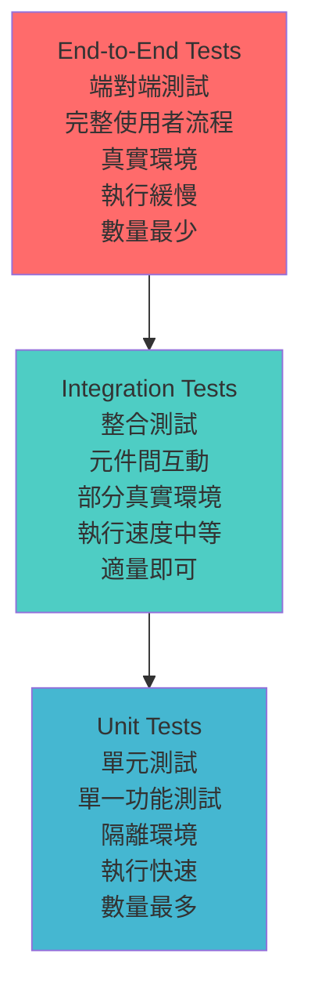

# Day 19 - 整合測試入門：基礎架構與應用情境

<!-- toc -->

- [前言](#前言)
- [整合測試基礎理論](#整合測試基礎理論)
- [ASP.NET Core 測試架構](#aspnet-core-測試架構)
- [基本整合測試實作](#基本整合測試實作)
- [測試環境設定](#測試環境設定)
- [實作重點](#實作重點)
- [測試情境](#測試情境)
- [重點整理](#重點整理)
- [實務範例專案說明](#實務範例專案說明)
- [整合測試的學習層級](#整合測試的學習層級)
- [在本機執行測試（MTP）](#在本機執行測試mtp)
- [參考資源](#參考資源)

<!-- /toc -->

## 前言

前面的單元測試已涵蓋 xUnit、測試替身、時間與檔案系統相依性。這一篇把範圍擴大到**整合測試**，讓 HTTP 管線與資料存取層一起執行。

微服務架構和 Web API 開發特別吃整合測試。單元測試很好，但有些問題只有在多個元件一起運作時才會浮現：

- 驗證不同元件間的互動是否正確
- 測試完整的 HTTP 請求/回應流程
- 確保資料庫操作與業務邏輯的整合
- 驗證設定檔和環境變數的載入
- 測試中介軟體 (Middleware) 的運作
- 驗證相依性注入容器的設定

以下使用 ASP.NET Core 的 `WebApplicationFactory` 建立第一組 Web API 整合測試。

## 整合測試基礎理論

### 整合測試的定義與價值

根據測試理論，整合測試有兩個重要定義：

**定義一：多物件協作測試**

> 將兩個以上的類別做整合，並且測試它們之間的運作是不是正確的，測試案例一定是跨類別物件的，通常是會用到多個物件來做

**定義二：外部資源整合測試**

> 會使用到外部資源，例如資料庫、外部服務、檔案、需要對測試環境進行特別處理等等

整合測試是測試多個元件組合在一起時是否能正常運作的測試方式。與單元測試不同，整合測試會實際啟動應用程式的某些部分，讓各個元件真實地互動。

**為什麼需要整合測試？**

雖然每個單元模組都通過各自的單元測試，但是組合後的各個模組未必能順利執行（單元測試無法做到這一點）。整合測試的目的是：

- **確保多個模組在整合運作後，能夠正確工作**
- **確認是否完善例外處理，減少更多問題的發生**
- **驗證 Web Application 的完整設定與整合**

用一個 Web API 的例子來說明三種測試的差異：

```csharp
[ApiController]
[Route("api/[controller]")]
public class ShippersController : ControllerBase
{
    private readonly IShipperService _shipperService;
    private readonly ILogger<ShippersController> _logger;

    public ShippersController(IShipperService shipperService, ILogger<ShippersController> logger)
    {
        _shipperService = shipperService;
        _logger = logger;
    }

    [HttpGet("{id}")]
    public async Task<ActionResult<SuccessResultOutputModel<ShipperOutputModel>>> GetShipper(int id)
    {
        _logger.LogInformation("取得貨運商資料：{ShipperId}", id);
        
        var exists = await _shipperService.IsExistsAsync(id);
        if (!exists)
        {
            return NotFound();
        }

        var shipper = await _shipperService.GetAsync(id);
        var result = new SuccessResultOutputModel<ShipperOutputModel>
        {
            Status = "Success",
            Data = new ShipperOutputModel
            {
                ShipperId = shipper.ShipperId,
                CompanyName = shipper.CompanyName,
                Phone = shipper.Phone
            }
        };

        return Ok(result);
    }

    [HttpPost]
    public async Task<ActionResult<SuccessResultOutputModel<ShipperOutputModel>>> CreateShipper(
        ShipperCreateParameter parameter)
    {
        _logger.LogInformation("建立新貨運商：{CompanyName}", parameter.CompanyName);
        
        var shipper = await _shipperService.CreateAsync(parameter);
        var result = new SuccessResultOutputModel<ShipperOutputModel>
        {
            Status = "Success",
            Data = new ShipperOutputModel
            {
                ShipperId = shipper.ShipperId,
                CompanyName = shipper.CompanyName,
                Phone = shipper.Phone
            }
        };

        return CreatedAtAction(nameof(GetShipper), new { id = shipper.ShipperId }, result);
    }
}
```

**單元測試的做法**：

```csharp
[Fact]
public async Task GetShipper_貨運商存在_應回傳貨運商資料()
{
    // Arrange
    var mockShipperService = Substitute.For<IShipperService>();
    var mockLogger = Substitute.For<ILogger<ShippersController>>();
    
    var shipperId = 1;
    var shipperEntity = new Shipper { ShipperId = 1, CompanyName = "測試公司", Phone = "0912345678" };
    
    mockShipperService.IsExistsAsync(shipperId).Returns(true);
    mockShipperService.GetAsync(shipperId).Returns(shipperEntity);
    
    var controller = new ShippersController(mockShipperService, mockLogger);

    // Act
    var result = await controller.GetShipper(shipperId);

    // Assert
    var okResult = result.Result.Should().BeOfType<OkObjectResult>();
    var model = okResult.Subject.Value.Should().BeOfType<SuccessResultOutputModel<ShipperOutputModel>>();
    model.Subject.Status.Should().Be("Success");
    model.Subject.Data.CompanyName.Should().Be("測試公司");
}
```

**整合測試的做法**：

```csharp
[Fact]
public async Task GetShipper_貨運商存在_應回傳貨運商資料()
{
    // Arrange
    // 在真實資料庫中準備測試資料
    var testData = new { CompanyName = "測試公司", Phone = "0912345678" };
    DatabaseCommand.ExecuteSqlCommand(ConnectionString, GetInsertShipperCommand(), testData);

    using var client = _factory.CreateClient();

    // Act
    // 發送真實的 HTTP 請求
    var response = await client.GetAsync("/api/shippers/1");

    // Assert
    // 驗證真實的 HTTP 回應
    response.Should().Be200Ok()
        .And.Satisfy<SuccessResultOutputModel<ShipperOutputModel>>(model =>
        {
            model.Status.Should().Be("Success");
            model.Data.CompanyName.Should().Be("測試公司");
        });
}
```

### 測試金字塔中的定位

整合測試在測試金字塔中位於單元測試和端對端測試之間。

按照測試金字塔的理論，我們應該有大量的單元測試（基礎），適量的整合測試（中層），以及少量的端對端測試（頂層）。



**各種測試的特性比較**：

| 測試類型   | 測試範圍      | 執行速度 | 維護成本 | 建議比例 | 發現問題的層級 |
| ---------- | ------------- | -------- | -------- | -------- | -------------- |
| 單元測試   | 單一類別/方法 | 很快     | 低       | 70%      | 邏輯錯誤       |
| 整合測試   | 多個元件      | 中等     | 中等     | 20%      | 介面整合問題   |
| 端對端測試 | 完整流程      | 慢       | 高       | 10%      | 使用者體驗問題 |

### 與端對端測試的區別

整合測試和端對端測試常被混淆，我們來釐清差異：

**整合測試**：

- 測試應用程式內部元件的整合
- 通常使用記憶體資料庫或測試資料庫
- 不涉及真實的外部系統
- 專注於 API 層級的測試
- 驗證相依性注入、中介軟體、資料存取等

**端對端測試**：

- 測試完整的使用者流程
- 使用真實的資料庫和外部服務
- 透過瀏覽器或 HTTP 用戶端操作
- 模擬真實使用者的操作
- 驗證完整的業務流程

### 整合測試的成本效益分析

**優點**：

- **真實性高**：測試接近真實的執行環境
- **涵蓋面廣**：一次測試可以涵蓋多個元件
- **設定驗證**：能驗證相依性注入、設定檔等設定
- **中介軟體測試**：可測試 Authentication、Authorization、Logging 等
- **資料流驗證**：確保資料在各層之間正確傳遞

**缺點**：

- **執行較慢**：需要啟動應用程式和相關服務
- **複雜度高**：需要準備測試資料和環境
- **偵錯困難**：失敗時較難定位問題根源
- **不穩定**：容易受環境因素影響
- **維護成本**：測試資料和環境的維護

**使用時機**：

**WebApplication 的整合測試有必要做嗎？**

這是一個實務上的重要問題。答案是肯定的：

- **專案如果只有做 Service 層的單元測試還不夠**  
  就算有做 WebApplication 的 Controller 單元測試也仍然不夠

- **WebApplication 做了太多的整合與設定，單元測試是無法確認到全部**  
  例如：Routing 路由設定、Controller 與 ActionFilter、Middleware 整個 Request Response Pipeline 的整合運作處理等等

- **用嚴謹的角度來看，專案的 WebApplication 整合測試是有其必要**  
  但是要怎麼做呢？因為看了一堆文件、網路文章，實際要做還是遇到一堆問題

**注意事項**：

- **整合測試無法取代單元測試**（單元測試是開發的一部分）
- **UI 測試不等於整合測試**（整合測試不會包含到 UI 介面的操作行為）
- **建議 Web 整合測試專案要另外建立獨立的測試專案**，不建議與單元測試混雜在一起

## ASP.NET Core 測試架構

### Microsoft.AspNetCore.Mvc.Testing

ASP.NET Core 提供了專門的測試套件 `Microsoft.AspNetCore.Mvc.Testing`，這個套件包含了進行整合測試所需的核心工具。

**主要元件**：

- **WebApplicationFactory\<T\>**：應用程式工廠，用於建立測試用的應用程式執行個體
- **TestServer**：在記憶體中執行的測試伺服器
- **HttpClient**：用於發送 HTTP 請求的用戶端

**安裝必要套件（xUnit v3 + MTP、CPM 集中版本）**：

測試專案的 `.csproj` 只列套件名稱、不寫版本，版本統一集中在 per-day 的 `Directory.Packages.props`（CPM，Central Package Management）：

```xml
<!-- tests/Day19.WebApplication.Integration.Tests.csproj -->
<PackageReference Include="Microsoft.AspNetCore.Mvc.Testing" />
<PackageReference Include="AwesomeAssertions" />
<PackageReference Include="AwesomeAssertions.Web" />
<PackageReference Include="xunit.v3.mtp-v2" />
<PackageReference Include="Microsoft.Testing.Extensions.TrxReport" />
```

版本則寫在 `Directory.Packages.props`：

```xml
<!-- samples/day19/Directory.Packages.props -->
<PackageVersion Include="Microsoft.AspNetCore.Mvc.Testing" Version="10.0.5" />
<PackageVersion Include="AwesomeAssertions" Version="9.4.0" />
<PackageVersion Include="AwesomeAssertions.Web" Version="2.0.3" />
<PackageVersion Include="xunit.v3.mtp-v2" Version="3.2.2" />
<PackageVersion Include="Microsoft.Testing.Extensions.TrxReport" Version="2.2.3" />
```

xUnit v3 改走 Microsoft.Testing.Platform（MTP），測試專案本身是一個直接跑起來的可執行檔，所以 `.csproj` 要加上 `<OutputType>Exe</OutputType>`：

```xml
<PropertyGroup>
  <OutputType>Exe</OutputType>
  <IsTestProject>true</IsTestProject>
</PropertyGroup>
```

比起 xUnit v2，這裡拿掉了 `xunit`、`xunit.runner.visualstudio`、`Microsoft.NET.Test.Sdk` 與 `System.Net.Http.Json`：前三個的職責由 `xunit.v3.mtp-v2` 一次涵蓋，`System.Net.Http.Json` 則已內建於 .NET 10 共享框架，不必再另外安裝。

**重要的套件說明**：

- **AwesomeAssertions.Web**：透過 AwesomeAssertions.Web 可以簡化對於 response 輸出內容的驗證
  - GitHub：<https://github.com/AwesomeAssertions/AwesomeAssertions.Web>
  - NuGet：<https://www.nuget.org/packages/AwesomeAssertions.Web>
  - 提供豐富的 HTTP 回應斷言方法，讓測試程式碼更易讀
  
- **System.Net.Http.Json**：提供 `PostAsJsonAsync`、`ReadFromJsonAsync` 等簡潔的 JSON 序列化／反序列化方法。在 .NET 10 已內建於共享框架（shared framework），無需另外安裝套件即可使用，是現代 .NET 處理 JSON 的首選

**System.Net.Http.Json 的現代化優勢**：

```csharp
// 傳統方式：需要手動序列化和建立 StringContent
var createParameter = new ShipperCreateParameter { CompanyName = "測試公司", Phone = "02-1234-5678" };
var jsonContent = JsonSerializer.Serialize(createParameter);
var content = new StringContent(jsonContent, Encoding.UTF8, "application/json");
var response = await client.PostAsync("/api/shippers", content);

// 現代化方式：使用 PostAsJsonAsync 一行搞定
var createParameter = new ShipperCreateParameter { CompanyName = "測試公司", Phone = "02-1234-5678" };
var response = await client.PostAsJsonAsync("/api/shippers", createParameter);

// 回應讀取也更簡潔
// 傳統方式
var responseContent = await response.Content.ReadAsStringAsync();
var result = JsonSerializer.Deserialize<SuccessResultOutputModel<ShipperOutputModel>>(responseContent,
    new JsonSerializerOptions { PropertyNameCaseInsensitive = true });

// 現代化方式
var result = await response.Content.ReadFromJsonAsync<SuccessResultOutputModel<ShipperOutputModel>>();
```

**主要優勢**：

- **簡潔性**：`PostAsJsonAsync` 比手動序列化 + `StringContent` 更簡潔
- **型別安全**：編譯時期就能確保型別正確
- **自動化處理**：自動設定 Content-Type 為 `application/json`
- **錯誤減少**：避免手動序列化可能出現的錯誤
- **可讀性**：程式碼意圖更加清晰
- **.NET 原生**：無需額外的第三方套件相依

**System.Net.Http.Json 的優勢**：

```csharp
// 傳統的驗證方式（冗長且容易出錯）
Assert.Equal(HttpStatusCode.OK, response.StatusCode);
var content = await response.Content.ReadAsStringAsync();
var data = JsonSerializer.Deserialize<SuccessResultOutputModel<ShipperOutputModel>>(content,
    new JsonSerializerOptions { PropertyNameCaseInsensitive = true });
Assert.Equal("測試公司", data.Data.CompanyName);

// 使用 AwesomeAssertions.Web 的現代化驗證方式
response.Should().Be200Ok()
    .And.Satisfy<SuccessResultOutputModel<ShipperOutputModel>>(result =>
    {
        result.Status.Should().Be("Success");
        result.Data.CompanyName.Should().Be("測試公司");
    });
```

### WebApplicationFactory<T> 核心概念

`WebApplicationFactory<T>` 是整合測試的核心，它會：

1. **建立 TestServer**：在記憶體中建立一個完整的 ASP.NET Core 應用程式
2. **設定服務**：設定相依性注入容器
3. **設定中介軟體**：設定 HTTP 請求處理管線
4. **提供 HttpClient**：用於發送測試請求

**基本使用方式**：

```csharp
public class BasicIntegrationTest : IClassFixture<WebApplicationFactory<Program>>
{
    private readonly WebApplicationFactory<Program> _factory;

    public BasicIntegrationTest(WebApplicationFactory<Program> factory)
    {
        _factory = factory;
    }

    [Fact]
    public async Task Get_首頁_應回傳成功()
    {
        // Arrange
        var client = _factory.CreateClient();

        // Act
        var response = await client.GetAsync("/");

        // Assert
        response.EnsureSuccessStatusCode(); // 2xx 狀態碼
        response.Content.Headers.ContentType?.ToString()
            .Should().StartWith("text/html");
    }
}
```

**程式碼解析**：

- `IClassFixture<WebApplicationFactory<Program>>`：使用 xUnit 的 ClassFixture 來共享工廠執行個體
- `WebApplicationFactory<Program>`：泛型參數指向應用程式的入口點
- `CreateClient()`：建立 HttpClient 執行個體
- `EnsureSuccessStatusCode()`：確保回應是成功狀態碼

### HTTP 回應測試利器：AwesomeAssertions.Web

在進行 HTTP API 測試時，傳統的斷言方式往往冗長且不夠直觀：

```csharp
// 傳統方式
response.IsSuccessStatusCode.Should().BeTrue();
response.StatusCode.Should().Be(HttpStatusCode.OK);

// 更直觀的方式
response.Should().Be200Ok();
```

**AwesomeAssertions.Web** 是專門為 HTTP 回應測試設計的擴充套件，提供了豐富的斷言方法和詳細的錯誤訊息。

**主要特色**：

1. **豐富的 HTTP 狀態碼斷言**：

```csharp
response.Should().Be200Ok();          // HTTP 200
response.Should().Be201Created();     // HTTP 201
response.Should().Be404NotFound();    // HTTP 404
response.Should().Be400BadRequest();  // HTTP 400
response.Should().Be500InternalServerError();  // HTTP 500
```

2. **回應內容直接驗證**：

```csharp
// 直接驗證 JSON 回應內容
response.Should().Be200Ok().And.BeAs(new
{
    CompanyName = "測試公司",
    Phone = "02-1234-5678"
});

// 使用強型別驗證
response.Should().Be200Ok().And.Satisfy<ShipperOutputModel>(model =>
{
    model.CompanyName.Should().Be("測試公司");
    model.Phone.Should().Be("02-1234-5678");
});
```

### 進階功能：Satisfy<T> 的強大驗證能力

`.Satisfy<T>()` 會把 HTTP 回應內容反序列化為指定型別，再對整個物件套用斷言。這比逐欄手動解析 JSON 簡潔許多。

**完整的成功回應驗證**：

```csharp
[Fact]
public async Task GetShipper_當貨運商存在_應回傳成功結果()
{
    // Arrange
    await CleanupDatabaseAsync();
    var shipperId = await SeedShipperAsync("順豐速運", "02-2345-6789");

    // Act
    HttpResponseMessage response = await Client.GetAsync($"/api/shippers/{shipperId}", TestContext.Current.CancellationToken);

    // Assert
    response.Should().Be200Ok()
            .And
            .Satisfy<SuccessResultOutputModel<ShipperOutputModel>>(result =>
            {
                result.Status.Should().Be("Success");
                result.Data.Should().NotBeNull();
                result.Data!.ShipperId.Should().Be(shipperId);
                result.Data.CompanyName.Should().Be("順豐速運");
                result.Data.Phone.Should().Be("02-2345-6789");
            });
}
```

**建立資料的驗證**：

```csharp
[Fact]
public async Task CreateShipper_輸入有效資料_應建立成功()
{
    // Arrange
    await CleanupDatabaseAsync();
    var createParameter = new ShipperCreateParameter
    {
        CompanyName = "黑貓宅急便",
        Phone = "02-1234-5678"
    };

    // Act - 使用 PostAsJsonAsync 簡化 JSON 序列化
    HttpResponseMessage response = await Client.PostAsJsonAsync("/api/shippers", createParameter, TestContext.Current.CancellationToken);

    // Assert
    response.Should().Be201Created()
            .And
            .Satisfy<SuccessResultOutputModel<ShipperOutputModel>>(result =>
            {
                result.Status.Should().Be("Success");
                result.Data.Should().NotBeNull();
                result.Data!.ShipperId.Should().BeGreaterThan(0);
                result.Data.CompanyName.Should().Be("黑貓宅急便");
                result.Data.Phone.Should().Be("02-1234-5678");
            });
}
```

**錯誤回應的詳細驗證**：

```csharp
[Fact]
public async Task CreateShipper_當公司名稱為空_應回傳400BadRequest()
{
    // Arrange
    await CleanupDatabaseAsync();
    var createParameter = new ShipperCreateParameter
    {
        CompanyName = "", // 空字串
        Phone = "02-1234-5678"
    };

    // Act - 使用 PostAsJsonAsync 取代手動序列化
    var response = await Client.PostAsJsonAsync("/api/shippers", createParameter, TestContext.Current.CancellationToken);

    // Assert
    response.Should().Be400BadRequest()
            .And
            .Satisfy<ValidationProblemDetails>(problem =>
            {
                problem.Type.Should().Be("https://tools.ietf.org/html/rfc9110#section-15.5.1");
                problem.Title.Should().Be("One or more validation errors occurred.");
                problem.Status.Should().Be(400);
                problem.Errors.Should().ContainKey("CompanyName");
                problem.Errors["CompanyName"].Should().Contain("公司名稱為必填");
            });
}
```

**集合資料的驗證**：

```csharp
[Fact]
public async Task GetAllShippers_應回傳所有貨運商()
{
    // Arrange
    await CleanupDatabaseAsync();
    await SeedShipperAsync("公司A", "02-1111-1111");
    await SeedShipperAsync("公司B", "02-2222-2222");

    // Act
    var response = await Client.GetAsync("/api/shippers", TestContext.Current.CancellationToken);

    // Assert
    response.Should().Be200Ok()
            .And
            .Satisfy<SuccessResultOutputModel<List<ShipperOutputModel>>>(result =>
            {
                result.Status.Should().Be("Success");
                result.Data.Should().NotBeNull();
                result.Data!.Count.Should().Be(2);
                result.Data.Should().Contain(s => s.CompanyName == "公司A");
                result.Data.Should().Contain(s => s.CompanyName == "公司B");
            });
}
```

### 為什麼 Satisfy\<T\> 如此強大？

1. **自動反序列化**：無需手動呼叫 `JsonSerializer.Deserialize`
2. **型別安全**：編譯時期就能確保型別正確
3. **豐富的驗證**：可以對物件的每個屬性進行詳細檢查
4. **連鎖語法**：`.And` 讓多個驗證條件串聯在一起
5. **清晰的錯誤訊息**：測試失敗時會顯示完整的 HTTP 請求和回應內容

**與傳統方式的比較**：

```csharp
// 傳統方式 - 冗長且容易出錯
response.IsSuccessStatusCode.Should().BeTrue();
var content = await response.Content.ReadAsStringAsync();
var result = JsonSerializer.Deserialize<SuccessResultOutputModel<ShipperOutputModel>>(content,
    new JsonSerializerOptions { PropertyNameCaseInsensitive = true });
result.Should().NotBeNull();
result!.Status.Should().Be("Success");
result.Data.Should().NotBeNull();
result.Data!.CompanyName.Should().Be("測試公司");

// 使用 Satisfy<T> - 簡潔且直觀
response.Should().Be200Ok()
        .And
        .Satisfy<SuccessResultOutputModel<ShipperOutputModel>>(result =>
        {
            result.Status.Should().Be("Success");
            result.Data.Should().NotBeNull();
            result.Data!.CompanyName.Should().Be("測試公司");
        });
```

3. **詳細的錯誤訊息**：

當測試失敗時，AwesomeAssertions.Web 會提供完整的 HTTP 請求和回應資訊，包含：

- 請求 URL 和方法
- 請求標頭和內容
- 實際回應狀態碼和內容
- 期望 vs 實際的差異

**安裝套件**：

```bash
dotnet add package AwesomeAssertions.Web --version 2.0.3
```

**專案檔案參考**：

```xml
<PackageReference Include="AwesomeAssertions.Web" Version="2.0.3" />
```

**完整的使用範例**：

```csharp
[Fact]
public async Task GetShipper_貨運商存在_應回傳正確資料()
{
    // Arrange
    using var client = _factory.CreateClient();
    var shipperId = await SeedTestDataAsync();

    // Act
    var response = await client.GetAsync($"/api/shippers/{shipperId}");

    // Assert
    response.Should().Be200Ok()
        .And.Satisfy<SuccessResultOutputModel<ShipperOutputModel>>(result =>
        {
            result.Status.Should().Be("Success");
            result.Data.CompanyName.Should().Be("測試公司");
            result.Data.Phone.Should().Be("02-1234-5678");
        });
}
```

### 重要故障排除：套件相容性問題

在使用 AwesomeAssertions.Web（或其上游 FluentAssertions.Web）時，最常遇到的問題是**套件版本不相容**導致的編譯錯誤：

```text
error CS1061: 'ObjectAssertions' 未包含 'Be200Ok' 的定義
```

**問題原因**：

FluentAssertions.Web 實際上有三個不同的套件版本，需要根據你使用的基礎斷言庫來選擇：

| 基礎斷言庫                 | 正確的套件              | NuGet 套件連結                                                                    |
| -------------------------- | ----------------------- | --------------------------------------------------------------------------------- |
| FluentAssertions < 8.0.0   | FluentAssertions.Web    | [FluentAssertions.Web](https://www.nuget.org/packages/FluentAssertions.Web)       |
| FluentAssertions >= 8.0.0  | FluentAssertions.Web.v8 | [FluentAssertions.Web.v8](https://www.nuget.org/packages/FluentAssertions.Web.v8) |
| AwesomeAssertions >= 8.0.0 | AwesomeAssertions.Web   | [AwesomeAssertions.Web](https://www.nuget.org/packages/AwesomeAssertions.Web)     |

**解決方案步驟**：

1. **檢查目前使用的斷言庫**：

```xml
<!-- 如果專案檔案中有這個 -->
<PackageReference Include="AwesomeAssertions" Version="9.4.0" />
```

2. **移除錯誤的套件引用**：

```xml
<!-- 錯誤：使用 AwesomeAssertions 但安裝 FluentAssertions.Web -->
<PackageReference Include="FluentAssertions.Web" Version="1.2.0" />
```

3. **安裝正確的套件**：

```xml
<!-- 正確：使用 AwesomeAssertions 應該安裝 AwesomeAssertions.Web -->
<PackageReference Include="AwesomeAssertions.Web" Version="2.0.3" />
```

4. **更新 GlobalUsings.cs**：

```csharp
// 錯誤的 using
global using FluentAssertions.Web;

// 正確的 using
global using AwesomeAssertions.Web;
```

**驗證修正**：
修正後，HTTP 斷言應該能正常工作：

```csharp
// 這些方法應該都能正常使用
response.Should().Be200Ok();
response.Should().Be201Created();
response.Should().Be404NotFound();
response.Should().Be400BadRequest();
```

**重要提醒**：

- FluentAssertions.Web 和 AwesomeAssertions.Web 提供相同的 API
- 選擇套件時**必須**與你的基礎斷言庫匹配
- 不要混用不同版本的套件，會導致命名空間衝突

這個問題很常見，也很容易忽略。套件挑錯，`AwesomeAssertions.Web` 就跑不起來。

### 重要故障排除：PostAsJsonAsync 撞名（CS0121）

把 `PostAsJsonAsync` 換成 .NET 10 內建的 `System.Net.Http.Json` 版本時，可能會踩到一個不太直覺的編譯錯誤：

```text
error CS0121: 於 'System.Net.Http.Json.HttpClientJsonExtensions.PostAsJsonAsync<TValue>(...)'
和 'System.Net.Http.HttpClientExtensions.PostAsJsonAsync<T>(...)' 之間的呼叫模稜兩可
```

原因藏在相依鏈裡：`AwesomeAssertions.Web` 會隨 `Microsoft.AspNet.WebApi.Client`（也就是舊的 `System.Net.Http.Formatting`）一起被還原進來，而它同樣在 `System.Net.Http` 命名空間下定義了一組 `PostAsJsonAsync`／`PutAsJsonAsync`。`HttpClient` 本來就住在 `System.Net.Http`，ImplicitUsings 一定會把這個命名空間帶進來，於是舊版擴充方法永遠在作用域內。等你再引用 BCL 的 `System.Net.Http.Json`，兩組同形的多載就撞在一起。尤其帶 `CancellationToken` 的多載完全同形，編譯器無從選擇。

只加 `using` 是救不了的：擴充方法的歧義沒辦法靠命名空間匯入消除。實務上最乾淨的解法，是在測試專案對 `Microsoft.AspNet.WebApi.Client` 補一筆 `ExcludeAssets="compile"`，在編譯期把舊版擴充藏起來、runtime 仍然保留（`AwesomeAssertions.Web` 的斷言不受影響），讓所有 `PostAsJsonAsync` 一律綁定到 BCL 的 `System.Text.Json` 版本：

```xml
<!-- 版本沿用 restore 解析到的同一版，集中寫在 Directory.Packages.props -->
<PackageReference Include="Microsoft.AspNet.WebApi.Client" ExcludeAssets="compile" />
```

改完之後有一個地方要留意：原本 2 個參數的 `PostAsJsonAsync(url, value)`，過去其實綁的是舊版擴充，換綁 BCL 版後，序列化預設（camelCase）也跟著換。ASP.NET Core 的模型繫結不分大小寫，所以行為通常不變，但還是值得跑一輪測試確認。

### xUnit v3：整合測試裡的 TestContext.Current.CancellationToken

xUnit v3 內建一條分析規則 xUnit1051：只要你在測試方法裡呼叫一個「有 `CancellationToken` 多載」的非同步方法卻沒傳 token，它就會跳警告，要你改用 `TestContext.Current.CancellationToken`。用意是讓測試支援取消；測試逾時或整批中止時，正在執行的 HTTP 請求與資料庫查詢才有機會即時停止。

整合測試幾乎全是真實呼叫：`HttpClient` 打 API、EF Core 讀寫資料庫，這些方法都吃 `CancellationToken`。所以在這個範例裡，凡是測試方法內的 `GetAsync`／`PostAsJsonAsync`／`ReadFromJsonAsync`，以及 `FirstOrDefaultAsync`／`FindAsync` 這類 EF Core 呼叫，一律補上 token。整個 Day 19 加起來共 53 處；放在私有輔助方法裡的呼叫不算，xUnit1051 只檢查測試方法本身。

大多數情況很單純，token 是最後一個位置參數，直接補上去就好：

```csharp
var response = await Client.GetAsync($"/api/shippers/{shipperId}", TestContext.Current.CancellationToken);
```

只有一個地方要當心：`DbSet.FindAsync`。它的第一個多載是 `FindAsync(params object?[] keyValues)`，如果直覺地寫成 `FindAsync(id, token)`，編譯器會把 token 也放進 params 陣列，當成另一個主鍵值。這不只語意錯誤，token 也沒有用於取消，xUnit1051 照樣會回報。正確寫法是明確使用「陣列 + token」多載：

```csharp
// 錯誤：token 被當成第二個 key value
var shipment = await context.Shipments.FindAsync(shipmentId, TestContext.Current.CancellationToken);

// 正確：改用 FindAsync(object?[] keyValues, CancellationToken) 多載
var shipment = await context.Shipments.FindAsync([shipmentId], TestContext.Current.CancellationToken);
```

不過要分清楚兩件事：**xUnit1051 的 analyzer compliance** 和**真正的 end-to-end 取消**是不同層次。前者只要求測試方法內的非同步呼叫傳入 `TestContext.Current.CancellationToken`；後者要整條路徑（helper → repository → EF Core）都把 token 往下傳，取消訊號才會真的傳到底。本範例的 `CleanupDatabaseAsync`／`SeedShipperAsync` 屬於 arrange 階段的測試基礎設施，內部 EF Core 呼叫使用預設 token、也不對外暴露 token 參數——這是刻意的取捨，避免為了消掉 analyzer 警告而在 seeding／cleanup 到處硬塞語意不清的 token。如果你的專案要把「取消權杖貫穿到底」當成整合測試慣例，就應該讓這些主要 helper 接受並往下傳遞 token，而不是只在測試方法表層滿足 analyzer。

### TestServer 的運作機制

TestServer 是一個特殊的 ASP.NET Core 伺服器實作，它：

- **在記憶體中執行**：不需要真實的 HTTP 連接埠
- **完整的 ASP.NET Core 管線**：包含所有中介軟體、路由、模型繫結等
- **快速執行**：比真實 HTTP 伺服器更快
- **隔離性**：每個測試可以有獨立的伺服器執行個體

**TestServer 的優勢**：

```csharp
// 傳統的整合測試（需要真實伺服器）
var httpClient = new HttpClient();
var response = await httpClient.GetAsync("http://localhost:5000/api/health");

// 使用 TestServer 的整合測試
var client = _factory.CreateClient();
var response = await client.GetAsync("/api/health"); // 不需要連接埠
```

### 測試環境的設定管理

整合測試通常需要特殊的環境設定：

**自訂 WebApplicationFactory**：

```csharp
public class CustomWebApplicationFactory<TProgram> : WebApplicationFactory<TProgram> 
    where TProgram : class
{
    protected override void ConfigureWebHost(IWebHostBuilder builder)
    {
        builder.ConfigureServices(services =>
        {
            // 移除原本的資料庫設定
            services.RemoveAll(typeof(DbContextOptions<AppDbContext>));
            
            // 加入記憶體資料庫
            services.AddDbContext<AppDbContext>(options =>
            {
                options.UseInMemoryDatabase("TestDatabase");
            });

            // 替換外部服務為測試版本
            services.Replace(ServiceDescriptor.Scoped<IEmailService, TestEmailService>());
        });

        // 設定測試環境
        builder.UseEnvironment("Testing");
        
        // 覆寫設定
        builder.ConfigureAppConfiguration((context, config) =>
        {
            config.AddInMemoryCollection(new[]
            {
                new KeyValuePair<string, string?>("Logging:LogLevel:Default", "Warning"),
                new KeyValuePair<string, string?>("ConnectionStrings:TestDb", "InMemory")
            });
        });
    }
}
```

## 基本整合測試實作

### HTTP 請求的建立與發送

**GET 請求測試**：

```csharp
[Fact]
public async Task GetShippers_無參數_應回傳所有貨運商清單()
{
    // Arrange
    using var client = _factory.CreateClient();

    // Act
    var response = await client.GetAsync("/api/shippers");

    // Assert
    response.Should().Be200Ok();
    response.Content.Headers.ContentType?.MediaType.Should().Be("application/json");
}

[Fact]
public async Task GetShipper_當貨運商存在_應回傳成功結果()
{
    // Arrange
    await CleanupDatabaseAsync();
    var shipperId = await SeedShipperAsync("順豐速運", "02-2345-6789");

    // Act
    var response = await Client.GetAsync($"/api/shippers/{shipperId}", TestContext.Current.CancellationToken);

    // Assert
    response.Should().Be200Ok()
            .And
            .Satisfy<SuccessResultOutputModel<ShipperOutputModel>>(result =>
            {
                result.Status.Should().Be("Success");
                result.Data.Should().NotBeNull();
                result.Data!.ShipperId.Should().Be(shipperId);
                result.Data.CompanyName.Should().Be("順豐速運");
                result.Data.Phone.Should().Be("02-2345-6789");
            });
}
```

**POST 請求測試**：

```csharp
[Fact]
public async Task CreateShipper_輸入有效資料_應建立成功()
{
    // Arrange
    await CleanupDatabaseAsync();
    var createParameter = new ShipperCreateParameter
    {
        CompanyName = "黑貓宅急便",
        Phone = "02-1234-5678"
    };

    // Act - 使用 PostAsJsonAsync 簡化操作
    var response = await Client.PostAsJsonAsync("/api/shippers", createParameter, TestContext.Current.CancellationToken);

    // Assert
    response.Should().Be201Created()
            .And
            .Satisfy<SuccessResultOutputModel<ShipperOutputModel>>(result =>
            {
                result.Status.Should().Be("Success");
                result.Data.Should().NotBeNull();
                result.Data!.ShipperId.Should().BeGreaterThan(0);
                result.Data.CompanyName.Should().Be("黑貓宅急便");
                result.Data.Phone.Should().Be("02-1234-5678");
            });
}
```

### 回應內容的驗證

**JSON 內容的反序列化驗證**：

```csharp
[Fact]
public async Task GetAllShippers_應回傳所有貨運商()
{
    // Arrange
    await CleanupDatabaseAsync();
    await SeedShipperAsync("公司A", "02-1111-1111");
    await SeedShipperAsync("公司B", "02-2222-2222");

    // Act
    var response = await Client.GetAsync("/api/shippers", TestContext.Current.CancellationToken);

    // Assert
    response.Should().Be200Ok()
            .And
            .Satisfy<SuccessResultOutputModel<List<ShipperOutputModel>>>(result =>
            {
                result.Status.Should().Be("Success");
                result.Data.Should().NotBeNull();
                result.Data!.Count.Should().Be(2);
                result.Data.Should().Contain(s => s.CompanyName == "公司A");
                result.Data.Should().Contain(s => s.CompanyName == "公司B");
            });
}
```

### 狀態碼與標頭檢查

**錯誤情況的測試**：

```csharp
[Fact]
public async Task GetShipper_不存在的ID_應回傳404NotFound()
{
    // Arrange
    using var client = _factory.CreateClient();
    var nonExistentShipperId = 9999;

    // Act
    var response = await client.GetAsync($"/api/shippers/{nonExistentShipperId}");

    // Assert
    response.Should().Be404NotFound();
}

[Fact]
public async Task CreateShipper_無效的資料_應回傳400BadRequest()
{
    // Arrange
    using var client = _factory.CreateClient();
    var invalidRequest = new ShipperCreateParameter
    {
        CompanyName = "", // 空字串，應該驗證失敗
        Phone = ""
    };

    // Act
    var response = await client.PostAsJsonAsync("/api/shippers", invalidRequest);

    // Assert
    response.Should().Be400BadRequest();
}
```

## 測試環境設定

### 記憶體資料庫的使用

整合測試通常使用記憶體資料庫來避免對真實資料庫的相依：

```csharp
public class TestWebApplicationFactory<TProgram> : WebApplicationFactory<TProgram> 
    where TProgram : class
{
    protected override void ConfigureWebHost(IWebHostBuilder builder)
    {
        builder.ConfigureServices(services =>
        {
            // 移除原本的資料庫設定
            var descriptor = services.SingleOrDefault(
                d => d.ServiceType == typeof(DbContextOptions<AppDbContext>));
            if (descriptor != null)
            {
                services.Remove(descriptor);
            }

            // 加入記憶體資料庫
            services.AddDbContext<AppDbContext>(options =>
            {
                options.UseInMemoryDatabase("TestDatabase");
            });

            // 建立資料庫並加入測試資料
            var serviceProvider = services.BuildServiceProvider();
            using var scope = serviceProvider.CreateScope();
            var context = scope.ServiceProvider.GetRequiredService<AppDbContext>();
            
            context.Database.EnsureCreated();
            SeedTestData(context);
        });
    }

    private static void SeedTestData(AppDbContext context)
    {
        if (!context.Shippers.Any())
        {
            context.Shippers.AddRange(
                new Shipper 
                { 
                    ShipperId = 1, 
                    CompanyName = "測試物流A", 
                    Phone = "02-12345678",
                    CreatedAt = DateTime.UtcNow 
                },
                new Shipper 
                { 
                    ShipperId = 2, 
                    CompanyName = "測試物流B", 
                    Phone = "02-87654321",
                    CreatedAt = DateTime.UtcNow 
                }
            );
            context.SaveChanges();
        }
    }
}
```

### 服務相依的替換

有時需要替換某些服務來避免外部相依：

```csharp
public class TestWebApplicationFactory<TProgram> : WebApplicationFactory<TProgram> 
    where TProgram : class
{
    protected override void ConfigureWebHost(IWebHostBuilder builder)
    {
        builder.ConfigureServices(services =>
        {
            // 替換郵件服務為測試版本
            services.Replace(ServiceDescriptor.Scoped<IEmailService, TestEmailService>());
            
            // 替換外部 API 服務
            services.Replace(ServiceDescriptor.Scoped<IExternalApiService, MockExternalApiService>());
            
            // 替換檔案服務
            services.Replace(ServiceDescriptor.Scoped<IFileService, InMemoryFileService>());
        });
    }
}

// 測試用的郵件服務
public class TestEmailService : IEmailService
{
    public Task SendEmailAsync(string to, string subject, string body)
    {
        // 不實際發送郵件，只記錄
        Console.WriteLine($"Test Email: To={to}, Subject={subject}");
        return Task.CompletedTask;
    }
}
```

### 設定檔案的覆寫

```csharp
protected override void ConfigureWebHost(IWebHostBuilder builder)
{
    builder.ConfigureAppConfiguration((context, config) =>
    {
        // 清除現有設定
        config.Sources.Clear();
        
        // 加入測試專用設定
        config.AddInMemoryCollection(new[]
        {
            new KeyValuePair<string, string>("ConnectionStrings:DefaultConnection", "InMemory"),
            new KeyValuePair<string, string>("Logging:LogLevel:Default", "Warning"),
            new KeyValuePair<string, string>("ExternalApi:BaseUrl", "http://localhost:5000/test"),
        });
    });
}
```

### 環境變數的管理

```csharp
protected override void ConfigureWebHost(IWebHostBuilder builder)
{
    builder.UseEnvironment("Testing");
    
    builder.ConfigureAppConfiguration((context, config) =>
    {
        // 設定測試環境變數
        Environment.SetEnvironmentVariable("ASPNETCORE_ENVIRONMENT", "Testing");
        Environment.SetEnvironmentVariable("TEST_MODE", "true");
    });
}
```

## 實作重點

### 建立整合測試專案結構

專案結構應該清楚分離不同類型的測試：

```text
tests/
├── Sample.WebApplication.UnitTests/           # 單元測試
├── Sample.WebApplication.Integration.Tests/   # 整合測試
└── Sample.WebApplication.E2ETests/            # 端對端測試
```

### 實作基本的 API 端點測試

**基本測試範本**：

```csharp
public class ShippersControllerIntegrationTests : IClassFixture<CustomWebApplicationFactory>
{
    private readonly CustomWebApplicationFactory _factory;
    private readonly HttpClient _client;

    public ShippersControllerIntegrationTests(CustomWebApplicationFactory factory)
    {
        _factory = factory;
        _client = _factory.CreateClient();
    }

    [Fact]
    public async Task 測試方法名稱_測試條件_預期結果()
    {
        // Arrange - 準備測試資料和環境
        
        // Act - 執行被測試的動作
        
        // Assert - 驗證結果
    }
}
```

### 設定獨立的測試環境

**環境隔離原則**：

1. **資料庫隔離**：使用記憶體資料庫或測試專用資料庫
2. **服務隔離**：替換外部服務為測試版本
3. **設定隔離**：使用測試專用的設定值
4. **日誌隔離**：降低測試時的日誌等級

### 處理測試資料的準備與清理

**測試資料管理**：

```csharp
public abstract class IntegrationTestBase : IClassFixture<CustomWebApplicationFactory>
{
    protected readonly CustomWebApplicationFactory Factory;
    protected readonly HttpClient Client;

    protected IntegrationTestBase(CustomWebApplicationFactory factory)
    {
        Factory = factory;
        Client = factory.CreateClient();
    }

    protected async Task CleanupDatabaseAsync()
    {
        using var scope = Factory.Services.CreateScope();
        var context = scope.ServiceProvider.GetRequiredService<AppDbContext>();

        // 確保資料庫已建立
        await context.Database.EnsureCreatedAsync();

        context.Shippers.RemoveRange(context.Shippers);
        await context.SaveChangesAsync();
    }

    protected async Task<int> SeedShipperAsync(string companyName = "測試貨運公司", string phone = "02-1234-5678")
    {
        using var scope = Factory.Services.CreateScope();
        var context = scope.ServiceProvider.GetRequiredService<AppDbContext>();

        // 確保資料庫已建立
        await context.Database.EnsureCreatedAsync();

        var shipper = new Day19.WebApplication.Entities.Shipper
        {
            CompanyName = companyName,
            Phone = phone
        };

        context.Shippers.Add(shipper);
        await context.SaveChangesAsync();

        return shipper.ShipperId;
    }
}
```

範例的 `IntegrationTestBase` 採用官方慣例：測試類別由 `IClassFixture<CustomWebApplicationFactory>` 注入同一個工廠，整個測試類別共用一份 `WebApplicationFactory`，再由每個測試開頭的 `CleanupDatabaseAsync` 清掉前一個測試留下的資料。TestServer 只啟動一次，資料隔離則由清理程序負責。

另一種寫法是讓基底類別自己 `new CustomWebApplicationFactory()`、並實作 `IDisposable`，等於每個測試都獨立啟動一台 TestServer。它的隔離最徹底——連應用程式狀態都不共用——但代價是每個測試都要付一次啟動成本，測試一多就明顯拖慢，而且偏離 xUnit 對整合測試的慣用做法。除非你真的需要「每個測試都是全新的應用程式執行個體」這種強隔離，否則共享 class fixture 搭配資料清理通常是更划算的選擇。

## 測試情境

### RESTful API 的 Route 測試

**路由正確性測試**：

> **注意**：以下是示範用的測試程式碼，展示如何使用 `[Theory]` 和 `[InlineData]` 來測試多個路由的正確性。實際範例專案中採用更具體的測試方法。

```csharp
[Theory]
[InlineData("GET", "/api/shippers")]
[InlineData("GET", "/api/shippers/1")]
[InlineData("POST", "/api/shippers")]
[InlineData("PUT", "/api/shippers/1")]
[InlineData("DELETE", "/api/shippers/1")]
public async Task API路由_各種HTTP動詞_應正確對應到控制器動作(string method, string url)
{
    // Arrange
    using var client = _factory.CreateClient();
    var request = new HttpRequestMessage(new HttpMethod(method), url);
    
    if (method == "POST" || method == "PUT")
    {
        var content = new ShipperCreateParameter 
        { 
            CompanyName = "測試", 
            Phone = "02-12345678" 
        };
        request.Content = JsonContent.Create(content);
    }

    // Act
    var response = await client.SendAsync(request);

    // Assert
    // 只驗「路由有對應到動作」（不是 404），至於回應是否成功另有專屬測試
    response.Should().NotHaveHttpStatusCode(HttpStatusCode.NotFound);
}
```

### RESTful API 的 CRUD 操作

**完整的 CRUD 測試流程**：

> **注意**：以下是示範用的測試程式碼，展示完整的 CRUD 操作測試流程。實際範例專案中將 CRUD 操作分別實作為獨立的測試方法。

```csharp
[Fact]
public async Task 貨運商CRUD操作_完整流程_應正常運作()
{
    using var client = _factory.CreateClient();

    // Create - 建立新貨運商
    var createRequest = new ShipperCreateParameter
    {
        CompanyName = "CRUD測試公司",
        Phone = "02-12345678"
    };
    
    var createResponse = await client.PostAsJsonAsync("/api/shippers", createRequest);
    createResponse.Should().Be201Created();
    
    var createdResult = await createResponse.Content.ReadFromJsonAsync<SuccessResultOutputModel<ShipperOutputModel>>();
    var shipperId = createdResult!.Data.ShipperId;

    // Read - 讀取貨運商資料
    var readResponse = await client.GetAsync($"/api/shippers/{shipperId}");
    readResponse.Should().Be200Ok();
    
    var readResult = await readResponse.Content.ReadFromJsonAsync<SuccessResultOutputModel<ShipperOutputModel>>();
    readResult!.Data.CompanyName.Should().Be(createRequest.CompanyName);

    // Update - 更新貨運商資料
    var updateRequest = new ShipperCreateParameter
    {
        CompanyName = "更新後的公司名稱",
        Phone = "02-87654321"
    };
    
    var updateResponse = await client.PutAsJsonAsync($"/api/shippers/{shipperId}", updateRequest);
    updateResponse.Should().Be200Ok();
    
    var updatedResult = await updateResponse.Content.ReadFromJsonAsync<SuccessResultOutputModel<ShipperOutputModel>>();
    updatedResult!.Data.CompanyName.Should().Be(updateRequest.CompanyName);

    // Delete - 刪除貨運商
    var deleteResponse = await client.DeleteAsync($"/api/shippers/{shipperId}");
    deleteResponse.Should().Be204NoContent();
    
    // 驗證刪除成功
    var verifyResponse = await client.GetAsync($"/api/shippers/{shipperId}");
    verifyResponse.Should().Be404NotFound();
}
```

### 檔案上傳與下載功能

> **注意**：以下是示範用的測試程式碼，展示如何測試檔案上傳與下載功能。實際範例專案中並未包含這些功能的實作。

**檔案上傳測試**：

```csharp
[Fact]
public async Task UploadFile_有效檔案_應上傳成功()
{
    // Arrange
    using var client = _factory.CreateClient();
    var fileContent = "test file content"u8.ToArray();
    using var content = new MultipartFormDataContent();
    content.Add(new ByteArrayContent(fileContent), "file", "test.txt");

    // Act
    var response = await client.PostAsync("/api/files/upload", content);

    // Assert
    response.Should().Be200Ok();
    
    var result = await response.Content.ReadFromJsonAsync<FileUploadResult>();
    result!.FileName.Should().Be("test.txt");
    result.FileSize.Should().Be(fileContent.Length);
}
```

**檔案下載測試**：

```csharp
[Fact]
public async Task DownloadFile_存在的檔案_應下載成功()
{
    // Arrange
    using var client = _factory.CreateClient();
    var fileId = await SeedFileAsync("download-test.txt", "download content");

    // Act
    var response = await client.GetAsync($"/api/files/{fileId}/download");

    // Assert
    response.Should().Be200Ok();
    response.Content.Headers.ContentType?.MediaType.Should().Be("application/octet-stream");
    
    var content = await response.Content.ReadAsStringAsync();
    content.Should().Be("download content");
}
```

### 驗證錯誤情況的測試

**驗證錯誤處理的重要性**：

參考實務經驗，整合測試中的錯誤處理驗證非常重要，包含以下情境：

1. **輸入格式驗證錯誤**
2. **資料不存在的錯誤**
3. **業務邏輯驗證錯誤**
4. **系統例外錯誤**

**完整的錯誤測試範例**：

> **注意**：以下是示範用的測試程式碼，展示如何測試各種錯誤情況的處理。實際範例專案中並未包含這些錯誤處理功能的實作。

```csharp
[Fact]
public async Task GetShipper_ID格式正確但資料不存在_應回傳BadRequest()
{
    // Arrange
    using var client = _factory.CreateClient();
    var nonExistentShipperId = 9999;

    // Act
    var response = await client.GetAsync($"/api/shippers/{nonExistentShipperId}");

    // Assert
    response.Should().Be400BadRequest()
        .And.Satisfy<FailInformation>(fail =>
        {
            fail.Message.Should().Contain("資料不存在");
        });
}

[Fact]
public async Task GetShipper_沒有提供必要參數_應回傳ValidationError()
{
    // Arrange
    using var client = _factory.CreateClient();

    // Act
    var response = await client.GetAsync("/api/shippers/"); // 缺少 ID 參數

    // Assert
    response.Should().Be400BadRequest()
        .And.Satisfy<ValidationError>(error =>
        {
            error.Errors.Should().ContainKey("ShipperId");
        });
}

[Fact]
public async Task GetShipper_ID格式不正確_應回傳ValidationError()
{
    // Arrange
    using var client = _factory.CreateClient();

    // Act
    var response = await client.GetAsync("/api/shippers/abc"); // 非數字格式

    // Assert
    response.Should().Be400BadRequest();
}

[Fact]
public async Task CreateShipper_沒有Content_應回傳UnsupportedMediaType()
{
    // Arrange
    using var client = _factory.CreateClient();

    // Act
    var response = await client.PostAsync("/api/shippers", null);

    // Assert
    response.Should().Be415UnsupportedMediaType();
}
```

**錯誤回應的統一格式驗證**：

> **注意**：以下是示範用的測試程式碼，展示如何驗證錯誤回應的統一格式。實際範例專案中並未包含這些統一錯誤格式的實作。

```csharp
// 定義標準的錯誤回應模型
public class FailInformation
{
    public string Status { get; set; } = "Fail";
    public string Message { get; set; } = string.Empty;
}

public class ValidationError
{
    public string Status { get; set; } = "ValidationError";
    public Dictionary<string, string[]> Errors { get; set; } = new();
}

// 在測試中驗證錯誤回應格式
[Fact]
public async Task CreateShipper_驗證失敗_應回傳統一錯誤格式()
{
    // Arrange
    using var client = _factory.CreateClient();
    var invalidRequest = new ShipperCreateParameter
    {
        CompanyName = "", // 空字串，應該驗證失敗
        Phone = ""
    };

    // Act
    var response = await client.PostAsJsonAsync("/api/shippers", invalidRequest);

    // Assert
    response.Should().Be400BadRequest()
        .And.Satisfy<ValidationError>(error =>
        {
            error.Status.Should().Be("ValidationError");
            error.Errors.Should().ContainKey("CompanyName");
            error.Errors.Should().ContainKey("Phone");
        });
}
```

## 重點整理

### 今天學到的核心概念

1. **整合測試的兩種定義**：
   - 多物件協作測試：測試兩個以上類別的整合運作
   - 外部資源整合測試：會使用到資料庫、外部服務等外部資源

2. **WebApplication 整合測試的必要性**：
   - 單元測試無法涵蓋 Routing、Middleware、Pipeline 等設定
   - WebApplication 有太多整合設定需要驗證
   - 確保 Request/Response 完整流程正常運作

3. **三個層級的測試策略**：
   - Level 1：簡單 WebApi（無資料庫、無服務相依）
   - Level 2：有服務相依的 WebApi（需要 Stub 處理）
   - Level 3：完整專案（真實資料庫或完整 Mock）

4. **兩種實作方法的選擇**：
   - Service Stub 策略：專注於 Web 層測試，快速穩定
   - 真實資料庫策略：完整端到端測試，更接近真實情況

5. **AwesomeAssertions.Web 的價值**：
   - 簡化 HTTP 回應驗證
   - 提高測試程式碼可讀性
   - 豐富的斷言方法

### 實務經驗總結

**專案分離的重要性**：

- 建議 Web 整合測試專案要另外建立獨立的測試專案
- 不建議與單元測試混雜在一起
- 這樣可以避免測試環境設定的衝突

**錯誤處理的完整性**：

- 不只測試成功路徑，更要測試各種錯誤情況
- 驗證錯誤回應的格式統一性
- 確保例外處理的完善性

**測試資料管理策略**：

- 每個測試案例要有獨立的資料準備
- 測試完成後要有完整的資料清理
- 考慮使用 TestInitialize 和 TestCleanup 進行資料管理

**適合整合測試的情境**：

- API 端點驗證
- 資料流驗證
- 中介軟體測試
- 錯誤處理流程
- 設定驗證

**不適合整合測試的情境**：

- 純業務邏輯計算（應使用單元測試）
- 外部系統相依（應使用端對端測試）
- 效能瓶頸測試（應使用專門工具）

### 關鍵成功因素

1. **適當的測試範圍**：不要過度測試，專注於整合點
2. **有效的資料管理**：確保測試獨立性和可重複性
3. **清晰的測試結構**：遵循 3A 模式，保持測試可讀性
4. **合理的效能期望**：接受整合測試較慢的特性
5. **完整的錯誤處理**：測試各種邊界條件

這組整合測試涵蓋應用程式啟動、HTTP 請求、回應內容與資料庫狀態。案例失敗時，應保留足夠輸出，讓問題能定位到 API、服務或資料存取層。

## 實務範例專案說明

上面談的做法都來自實際專案。Day19 的範例專案把它們寫成一組完整的整合測試，從基礎到進階都有：

**範例專案結構**：

```text
Day19.Samples/
├── Day19.Samples.sln                      # 解決方案檔案
├── global.json                            # 鎖定 SDK 版本並指定 MTP 為測試 runner
├── Directory.Packages.props               # 集中管理套件版本 (CPM)
├── README.md                              # 範例專案說明
├── src/
│   └── Day19.WebApplication/               # 主要 Web API 專案
│       ├── Controllers/                    # API 控制器
│       │   ├── ShippersController.cs       # 主要的貨運商 API 控制器
│       │   └── Examples/                   # 三個層級的範例控制器
│       │       ├── Level1/BasicApiController.cs           # 簡單 WebApi 範例
│       │       ├── Level2/ServiceDependentController.cs   # 服務相依範例
│       │       └── Level3/FullDatabaseController.cs       # 完整資料庫範例
│       ├── Data/                           # 資料存取層
│       │   ├── AppDbContext.cs             # Entity Framework 資料庫上下文
│       │   ├── ShippingContext.cs          # 業務專用資料庫上下文
│       │   └── Entities/Shipper.cs         # 實體類別
│       ├── Entities/
│       │   └── Shipper.cs                  # 貨運商實體類別
│       ├── Models/                         # DTO 模型
│       │   ├── Common/ApiResponse.cs       # 通用 API 回應模型
│       │   ├── ShipmentModels.cs           # 運送相關模型
│       │   ├── ShipperCreateParameter.cs   # 建立貨運商參數
│       │   ├── ShipperOutputModel.cs       # 貨運商輸出模型
│       │   └── SuccessResultOutputModel.cs # 成功回應模型
│       ├── Services/                       # 服務層
│       │   ├── IShipperService.cs          # 貨運商服務介面
│       │   ├── ShipperService.cs           # 貨運商服務實作
│       │   └── Level2ExampleServices.cs    # Level 2 範例服務
│       ├── Program.cs                      # 應用程式進入點
│       ├── GlobalUsings.cs                 # 全域 using 設定
│       └── ShippingApi.http                # HTTP 測試檔案
└── tests/
    └── Day19.WebApplication.Integration.Tests/  # 整合測試專案
        ├── Controllers/                          # 主要控制器測試
        │   └── ShippersControllerTests.cs        # 主要的整合測試類別 (20個測試)
        ├── Integration/                          # 進階整合測試
        │   └── AdvancedShippersControllerTests.cs # 進階測試案例
        ├── Examples/                             # 三個層級的範例測試
        │   ├── Level1/BasicApiControllerTests.cs            # Level 1 測試範例
        │   ├── Level2/                                      # Level 2 測試範例
        │   │   ├── ServiceDependentControllerTests.cs      # 服務相依測試
        │   │   └── ServiceStubWebApplicationFactory.cs     # Level 2 測試工廠
        │   └── Level3/                                      # Level 3 測試範例
        │       ├── FullDatabaseIntegrationTests.cs         # 完整資料庫測試
        │       └── FullDatabaseWebApplicationFactory.cs    # Level 3 測試工廠
        ├── Infrastructure/                       # 測試基礎設施
        │   └── CustomWebApplicationFactory.cs   # 自訂測試工廠
        ├── IntegrationTestBase.cs              # 整合測試基底類別
        └── GlobalUsings.cs                     # 全域 using 設定
```

**實際驗證的測試案例**：

### 詳細的專案檔案說明

#### 主要 Web API 專案 (`src/Day19.WebApplication/`)

**控制器層級**：

- `ShippersController.cs` - 完整的貨運商 CRUD API，包含 GET、POST、PUT、DELETE 操作
- `Examples/Level1/BasicApiController.cs` - 簡單的 API 範例，無外部相依
- `Examples/Level2/ServiceDependentController.cs` - 依賴服務注入的 API 範例  
- `Examples/Level3/FullDatabaseController.cs` - 完整資料庫操作的 API 範例

**資料存取層級**：

- `Data/AppDbContext.cs` - Entity Framework 的主要資料庫上下文
- `Data/ShippingContext.cs` - 業務專用的資料庫上下文
- `Entities/Shipper.cs` - 貨運商實體類別，對應資料庫表格

**服務層級**：

- `Services/IShipperService.cs` - 貨運商服務介面
- `Services/ShipperService.cs` - 貨運商服務實作，處理業務邏輯
- `Services/Level2ExampleServices.cs` - Level 2 範例中使用的服務

**模型層級**：

- `Models/ShipperCreateParameter.cs` - 建立貨運商的輸入參數
- `Models/ShipperOutputModel.cs` - 貨運商的輸出模型
- `Models/SuccessResultOutputModel.cs` - 統一的成功回應格式

#### 整合測試專案 (`tests/Day19.WebApplication.Integration.Tests/`)

**主要測試類別**：

- `Controllers/ShippersControllerTests.cs` - **核心測試類別**，包含 42 個測試案例：
  - GET API 測試（單筆、列表、查詢參數）
  - POST API 測試（建立、驗證錯誤）
  - PUT API 測試（更新、驗證錯誤）
  - DELETE API 測試（刪除、錯誤處理）
  - 完整的 CRUD 流程驗證

- `Integration/AdvancedShippersControllerTests.cs` - **進階測試類別**，展示複雜測試情境：
  - 並行操作測試
  - 大量資料處理測試
  - 效能邊界測試
  - 複雜業務邏輯驗證

**三個層級的範例測試**：

- `Examples/Level1/BasicApiControllerTests.cs` - **Level 1 測試**：
  - 簡單 WebApi 測試，無資料庫相依
  - 測試路由、HTTP 動詞、模型綁定
  - 專注於 Web 層的基礎功能驗證

- `Examples/Level2/ServiceDependentControllerTests.cs` - **Level 2 測試**：
  - Service Stub 整合測試
  - 使用 NSubstitute 模擬服務相依
  - 測試 Controller 與 Service 的整合
  - 驗證業務邏輯和錯誤處理

- `Examples/Level2/ServiceStubWebApplicationFactory.cs` - **Level 2 測試工廠**：
  - 自訂 WebApplicationFactory
  - 設定服務相依的模擬物件
  - 展示如何替換 DI 容器中的服務

- `Examples/Level3/FullDatabaseIntegrationTests.cs` - **Level 3 測試**：
  - 完整資料庫整合測試
  - 真實的 Entity Framework 操作驗證
  - 資料庫交易和資料一致性測試

- `Examples/Level3/FullDatabaseWebApplicationFactory.cs` - **Level 3 測試工廠**：
  - 完整資料庫整合測試工廠
  - 設定真實或 InMemory 資料庫
  - 處理資料庫初始化和清理

**測試基礎設施**：

- `Infrastructure/CustomWebApplicationFactory.cs` - **主要測試工廠**：
  - 設定 InMemory 資料庫
  - 設定測試環境的服務注入
  - 提供測試資料的初始化

- `IntegrationTestBase.cs` - **測試基底類別**：
  - 提供通用的測試方法
  - 資料庫清理和初始化功能
  - HttpClient 的生命週期管理

### 實際測試涵蓋範圍

**主要測試案例統計**：

- **總測試數量**：42 個通過的測試案例
- **HTTP 方法涵蓋**：GET、POST、PUT、DELETE 完整涵蓋
- **測試案例分佈**（依範例層級，加總 42）：
  - `ShippersController` 主要整合測試：20 個
  - `Advanced` 進階測試（HTTP Headers／並行／效能）：7 個
  - Level 1 基礎 WebApi：3 個
  - Level 2 服務相依：3 個
  - Level 3 完整資料庫：9 個

**實際驗證的功能**：

- 完整的 CRUD 操作流程
- 資料驗證和錯誤處理
- HTTP 狀態碼正確性
- JSON 序列化/反序列化
- 資料庫整合操作
- 服務層相依性注入

**文章與範例專案的關係**：

- **文章中的示範程式碼**：主要用於教學說明，展示各種測試技巧和概念
- **範例專案的實際程式碼**：完整可執行的實作，專注於實用的測試案例
- **學習建議**：先閱讀文章理解概念，再參考範例專案看實際應用

這個範例用 InMemory 資料庫做整合測試，Controller → Service → DbContext 一整條都有。要往更複雜的情境長，從這裡接下去就行。

## 整合測試的學習層級

在 Day19 範例專案中，我們提供了三個不同層級的整合測試範例，對應不同的專案複雜度和學習階段：

### Level 1：簡單的 WebApi 專案

**範例檔案**：

- 控制器：`Controllers/Examples/Level1/BasicApiController.cs`
- 測試：`tests/Examples/Level1/BasicApiControllerTests.cs`

**特色**：

- 專案沒有介接資料庫、Service 與 Repository
- 最簡單、基本的 WebApi 網站專案
- 直接使用 `WebApplicationFactory<Program>` 測試

**測試重點**：

- 各個 API 的輸入輸出驗證
- HTTP 動詞和路由正確性
- 模型綁定和序列化
- 狀態碼和回應格式驗證
- 不同測試案例使用不同的屬性輸入條件

**適合學習階段**：初學者入門，了解整合測試基本概念

### Level 2：相依 Service 的 WebApi 專案

**範例檔案**：

- 控制器：`Controllers/Examples/Level2/ServiceDependentController.cs`
- 測試：`tests/Examples/Level2/ServiceDependentControllerTests.cs`
- 測試工廠：`tests/Examples/Level2/ServiceStubWebApplicationFactory.cs`

**特色**：

- 專案沒有介接資料庫，但有參考 Service 專案
- WebApplication 有服務層相依
- Controller 相依於 IService 介面

**測試重點**：

- 除了 Level 1 的所有驗證
- 處理服務相依的設定和替換
- 使用 NSubstitute 建立 Service stub
- 在整合測試中設定相依性注入
- 業務邏輯和錯誤處理驗證

**技術展示**：

```csharp
// 在 ServiceStubWebApplicationFactory 中替換服務
builder.ConfigureTestServices(services =>
{
    services.RemoveAll<IExampleService>();
    services.AddScoped(_ => serviceStub);
});
```

**適合學習階段**：有基礎概念後，學習處理相依性注入和服務模擬

### Level 3：完整的 WebApi 專案

**範例檔案**：

- 控制器：`Controllers/Examples/Level3/FullDatabaseController.cs`
- 測試工廠：`tests/Examples/Level3/FullDatabaseWebApplicationFactory.cs`

**特色**：

- 完整的 Solution 架構
- 包含完整的資料庫操作
- 真實的企業級專案結構

**測試重點**：

- 包含前兩個 Level 的所有驗證
- 處理真實資料庫連接或資料庫抽象化
- 資料庫初始化和清理
- 完整的端到端測試流程
- 資料一致性和交易處理

**技術展示**：

```csharp
// 設定測試資料庫連線
builder.ConfigureAppConfiguration((context, config) =>
{
    config.AddInMemoryCollection(new[]
    {
        new KeyValuePair<string, string>(
            "ConnectionStrings:DefaultConnection", 
            "InMemory Database for Testing")
    });
});
```

**適合學習階段**：進階學習者，準備應用到真實專案

### 兩種整合測試策略

#### 策略一：Service Stub 策略（Level 2）

**特色**：

- 在測試中移除真實服務的注入設定
- 使用 NSubstitute 建立 Service stub
- 專注於 Web 層和控制器邏輯的測試

**優點**：

- 測試執行快速且穩定
- 不需要資料庫環境
- 容易控制測試條件和預期結果
- 專注於 Web 層邏輯驗證

**缺點**：

- 無法測試完整的資料流
- 可能遺漏服務層和資料層的整合問題

**適用情境**：專注於 API 介面和控制器邏輯的測試

#### 策略二：真實資料庫策略（Level 3）

**特色**：

- 不對 Repository、Service 的注入做調整
- 使用真實的資料庫連接（InMemory 或 LocalDB）
- 測試完整的資料流程

**優點**：

- 測試完整流程，更接近真實環境
- 能發現資料層的整合問題
- 驗證完整的端到端功能

**缺點**：

- 測試執行較慢
- 需要資料庫環境和清理機制
- 測試案例之間可能相互影響

**適用情境**：完整的端到端驗證和資料流程測試

### 學習路徑建議

1. **開始階段**：從 Level 1 開始，掌握基本的整合測試概念
2. **進階階段**：學習 Level 2，理解相依性注入和服務模擬
3. **實戰階段**：實作 Level 3，處理完整的企業級情境
4. **專案應用**：根據專案需求選擇適合的策略組合

## 在本機執行測試（MTP）

xUnit v3 走 Microsoft Testing Platform（MTP），runner 由本日 sample 的 `global.json` 指定。**務必先切換到該 sample 目錄再執行**，否則不會套用 per-day `global.json`，`dotnet test` 會落回 VSTest 而失敗；也不要從 repository root 直接指定子目錄 solution：

```powershell
Set-Location samples/day19
dotnet test --solution Day19.Samples.sln -c Release
```

## 參考資源

### FluentAssertions.Web (AwesomeAssertions.Web) 相關資源

**GitHub Repository：**

- [FluentAssertions.Web](https://github.com/adrianiftode/FluentAssertions.Web) - 原始專案

**NuGet 套件：**

- [FluentAssertions.Web](https://www.nuget.org/packages/FluentAssertions.Web) - 基於 FluentAssertions < 8.0
- [FluentAssertions.Web.v8](https://www.nuget.org/packages/FluentAssertions.Web.v8) - 基於 FluentAssertions >= 8.0
- [AwesomeAssertions.Web](https://www.nuget.org/packages/AwesomeAssertions.Web) - 基於 AwesomeAssertions

### 官方文件

- [ASP.NET Core 整合測試文件](https://docs.microsoft.com/aspnet/core/test/integration-tests)
- [WebApplicationFactory 使用指南](https://docs.microsoft.com/aspnet/core/test/integration-tests#basic-tests-with-the-default-webapplicationfactory)

範例程式碼：

- <https://github.com/kevintsengtw/30days-in-testing-net10/tree/main/samples/day19>

---

**這是「重啟挑戰：老派軟體工程師的測試修練」的第十九天。明天會介紹 Day 20 - Testcontainers 初探：使用 Docker 架設測試環境。**
